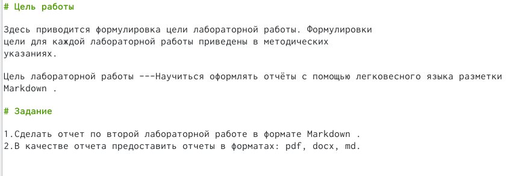

---
## Front matter
lang: ru-RU
title: Structural approach to the deep learning method
author: |
	Куркина Евгения Вячеславовна
institute: |
	\inst{1}RUDN University, Moscow, Russian Federation
	
date: NEC--2022, 27 April, 2022 Moscow, Moscow

## Formatting
toc: false
slide_level: 2
theme: metropolis
header-includes: 
 - \metroset{progressbar=frametitle,sectionpage=progressbar,numbering=fraction}
 - '\makeatletter'
 - '\beamer@ignorenonframefalse'
 - '\makeatother'
aspectratio: 43
section-titles: true
---

# Лабораторная работа №3

## Работа с Markdown

- 1). Записали и оформили цель и задачи лабораторной работы 3

- 2).Данная лабораторная работа основана на лабораторной работе 2, следовательно главные моменты берем из своего отчета для прошлой  лабораторной работы. (рис.[-@fig:1 ])

{ #fig:01 width=70% }

## Оформления хода работы

- 1).Полностью описываем алгоритм лабораторной работы №2 (рис.[-@fig:2 ])

 { #fig:02 width=70% }

- 2).Оформляем скриншоты ( указываем полную ссылку на каждый сриншот) (рис.[-@fig:3 ])

{ #fig:03 width=70% }

## Выполнение лабораторной работы 

- На следующий скриншотах представлен процесс выполнения лобораторной работы (рис.[-@fig:4 ]) (рис.[-@fig:5 ]) (рис.[-@fig:6 ])

 { #fig:04 width=70% }
 
 { #fig:05 width=70% }
 
 { #fig:06 width=70% }
 

## Создание Отчета в трех формах 

 С помощью команды make создаем два файла в формате docx и pdf.(рис.[-@fig:7 ]) (рис.[-@fig:8 ])
 
 { #fig:07 width=70% }
 
 { #fig:08 width=70% }

## {.standout}

Wer's nicht glaubt, bezahlt einen Taler
