---
## Front matter
title: "Лабораторная работа 3"
subtitle: "Отчет по лабораторной работе 3"
author: "Куркина Евгения Вячеславовна"

## Generic otions
lang: ru-RU
toc-title: "Содержание"

## Bibliography
bibliography: bib/cite.bib
csl: pandoc/csl/gost-r-7-0-5-2008-numeric.csl

## Pdf output format
toc: true # Table of contents
toc-depth: 2
lof: true # List of figures
lot: true # List of tables
fontsize: 12pt
linestretch: 1.5
papersize: a4
documentclass: scrreprt
## I18n polyglossia
polyglossia-lang:
  name: russian
  options:
	- spelling=modern
	- babelshorthands=true
polyglossia-otherlangs:
  name: english
## I18n babel
babel-lang: russian
babel-otherlangs: english
## Fonts
mainfont: PT Serif
romanfont: PT Serif
sansfont: PT Sans
monofont: PT Mono
mainfontoptions: Ligatures=TeX
romanfontoptions: Ligatures=TeX
sansfontoptions: Ligatures=TeX,Scale=MatchLowercase
monofontoptions: Scale=MatchLowercase,Scale=0.9
## Biblatex
biblatex: true
biblio-style: "gost-numeric"
biblatexoptions:
  - parentracker=true
  - backend=biber
  - hyperref=auto
  - language=auto
  - autolang=other*
  - citestyle=gost-numeric
## Pandoc-crossref LaTeX customization
figureTitle: "Рис."
tableTitle: "Таблица"
listingTitle: "Листинг"
lofTitle: "Список иллюстраций"
lotTitle: "Список таблиц"
lolTitle: "Листинги"
## Misc options
indent: true
header-includes:
  - \usepackage{indentfirst}
  - \usepackage{float} # keep figures where there are in the text
  - \floatplacement{figure}{H} # keep figures where there are in the text
---

# Цель работы

Здесь приводится формулировка цели лабораторной работы. Формулировки
цели для каждой лабораторной работы приведены в методических
указаниях.

Цель лабораторной работы ---Научиться оформлять отчёты с помощью легковесного языка разметки Markdown .

# Задание

1.Сделать отчет по второй лабораторной работе в формате Markdown .
2.В качестве отчета предоставить отчеты в форматах: pdf, docx, md.

# Выполнение лабораторной работы

1). Зарегистрировалась на Github (рис.[-@fig:1]).

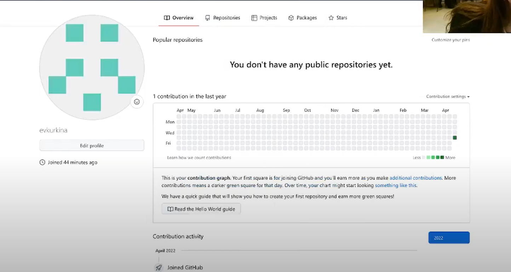{ #fig:1 width=70% }

2).Провела Базовую настройку git с помощью консоли и команд:
  2.1) git config --global user.name "Name Surname"- задаем имя владельца репозитория(Evgenya Kurkina)
  2.2)git config--global user.email "work@mail"- задаем email (evgeshakurkina@yandex.ru)
  2.3) git config --global core.quotepath false -Настроила ytf-8 в воде сообщений git.
  2.4) git config --global init.defaultBranch master- задала имя начальной ветки( master)
  2.5) git config --global core.autocrlf input- задала параметр autocrlf
  2.6) git config --global core.safecrlf warn-задала параметр safecrlf (рис.[-@fig:2])
  
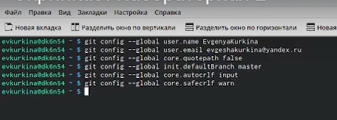{ #fig:2 width=70% }

3).Создала ключи SSH:
  3.1)Командой - ssh-keygen -t rsa -b 4096 -по алгоритму rsa с ключем размером 4096 бит (рис.[-@fig:3])
  
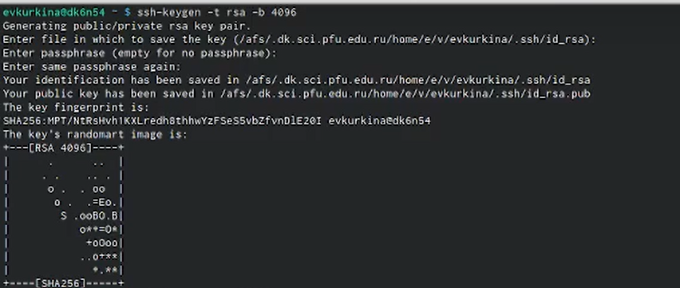{ #fig:3 width=70% }

  3.2) Командой-ssh-keygen -t ed25519- по алгоритму ed25519 (рис.[-@fig:4])
  
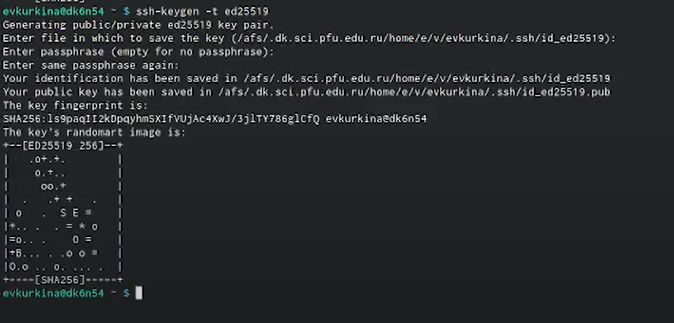{ #fig:4 width=70% }

4).Создание ключа PGP:
  4.1) Командой-gpg --full-generate-key – сгенерировала ключ
  4.2) Поочередно выбираем необходимые параметры:
     – тип RSA and RSA;
     – размер 4096;
     – выберите срок действия; значение по умолчанию— 0 (срок действия не истекает никогда).
     – GPG запросит личную информацию, которая сохранится в ключе: –Имя (не менее 5 символов)(Evgenya)
     – Адрес электронной почты. (evgeshakurkina@yandex.ru)
  4.3)Нажимаем “o” для принятия ( рис.[-@fig:5])
  
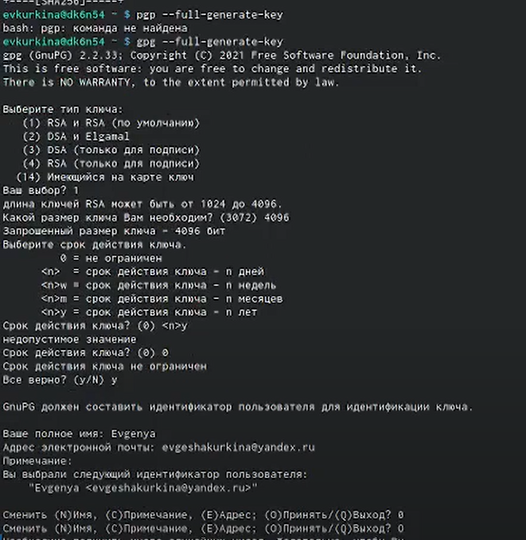{ #fig:5 width=70% }

5).Создала репозиторий с названием “Lab2” ( рис.6) и скопировала его ссылку ( рис.[-@fig:7])

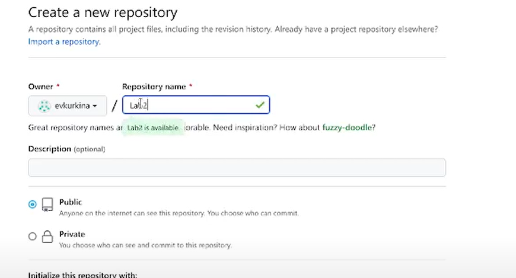{ #fig:6 width=70% }

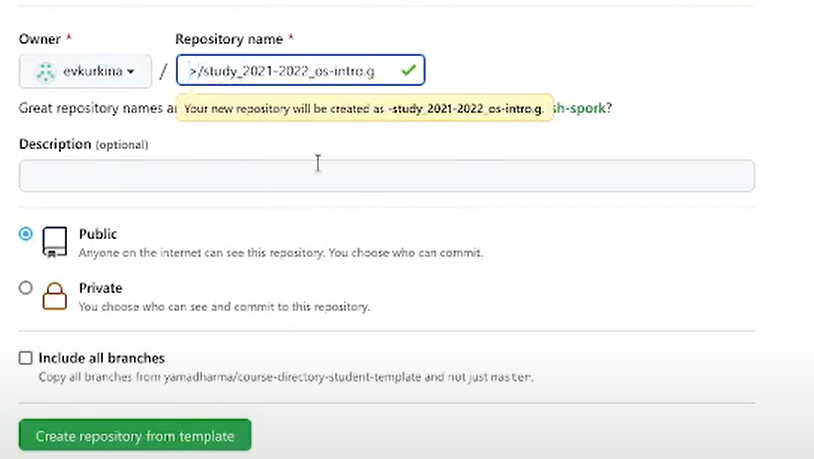{ #fig:7 width=70% }

6).Добавление созданных ключей ( в пункте 3 и 4)
  6.1) Добавление SSH ключа на Github:
    - Командой cat ~/.ssh/id_rsa.pub | xclip -sel clip – вызвали ключ, затем скопировали его и после вставили в нужное поле для ключа на github (рис.[-@fig:8])(рис.[-@fig:9])
    
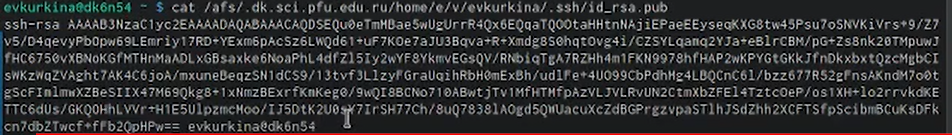{ #fig:8 width=70% }

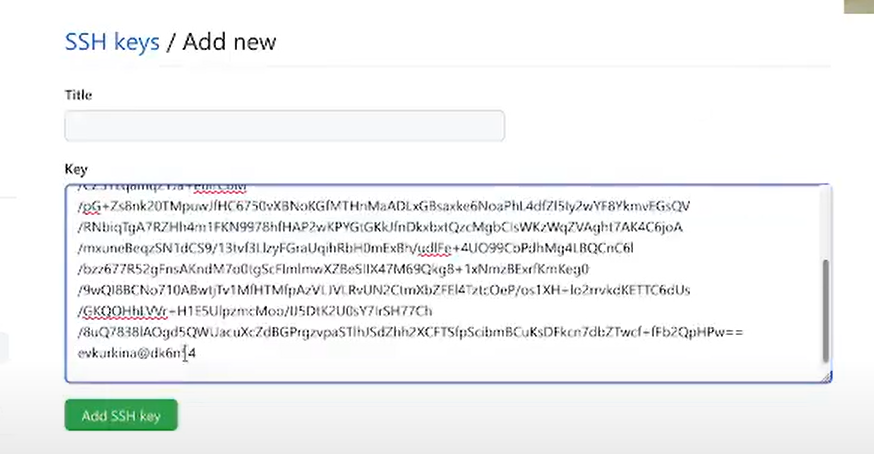{ #fig:9 width=70% }

  6.2) Добавление PGP ключа в GitHub:
    -Командой-gpg --list-secret-keys--keyid-format LONG-вызывала и копировала отпечаток приватного ключа, а затем скопировала в поле на github (рис.[-@fig:10 ]). Результат добавление приватного ключа (рис.[-fig:11]).
    
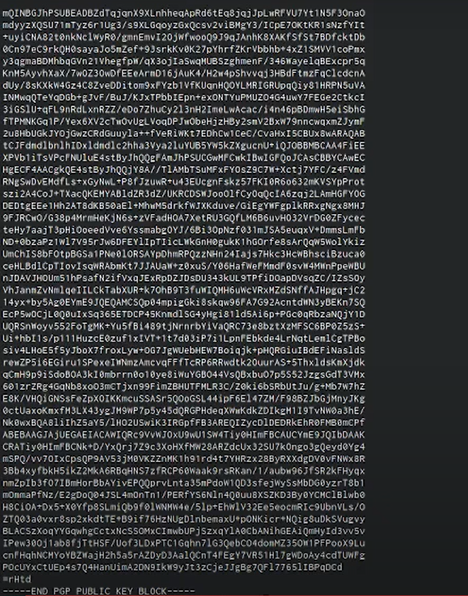{ #fig:10 width=70% }

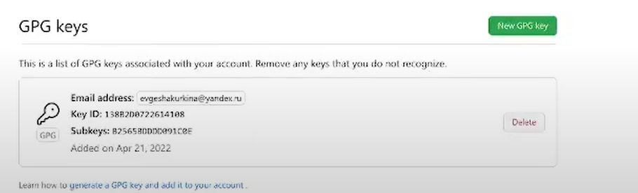{ #fig:11 width=70% }

7).Выполнение основные команды git
  7.1) Git init- создала основное дерево репозитория
  7.2) git pull-получила обновления текущего древа из центрального репозитория
  7.3) git push- отправила все произведённые изменения локального дерева в центральный репозиторий (рис.[-@fig:12]) (рис.[-@fig:13])
  
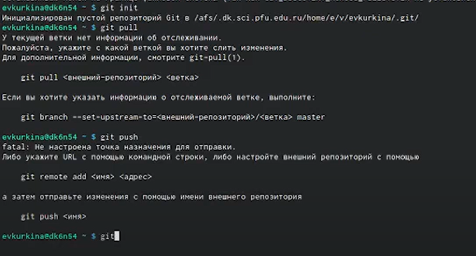{ #fig:12 width=70% }

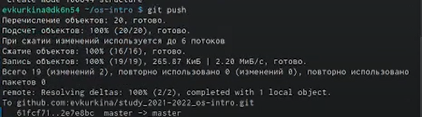{ #fig:13 width=70% }

8).Настроила автоматические подписи коммитов git (рис.[-@fig:14])

{ #fig:14 width=70% }

9).Создание репозитория курса на основе шаблона:
  9.1) Командами -mkdir -p ~/work/study/2021-2022/"Операционные системы" cd ~/work/study/2021-2022/"Операционные системы"  gh repo create study_2021-2022_os-intro--template=yamadharma/course-
directory-student-template --public 4, git clone --recursive git@github.com:/study_2021-2022_os-intro.git os-intr - создала шаблон рабочего пространства. –для 2021–2022 учебного года и предмета «Операционные системы» (код предмета os-intro). ( рис.[-@fig:15])

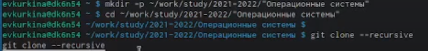{ #fig:15 width=70% }

  9.2) Показан процесс копирования репозитория в свой github (рис.[-@fig:16 ]) (рис.[-@fig:17]).Появившаяся папка Labs( рис.[-@fig:18])
  
{ #fig:16 width=70% }

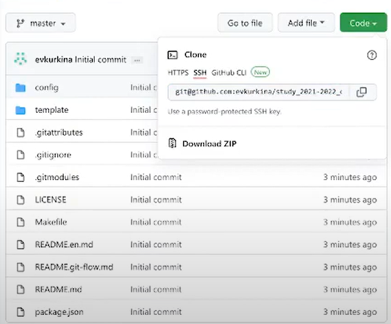{ #fig:17 width=70% }

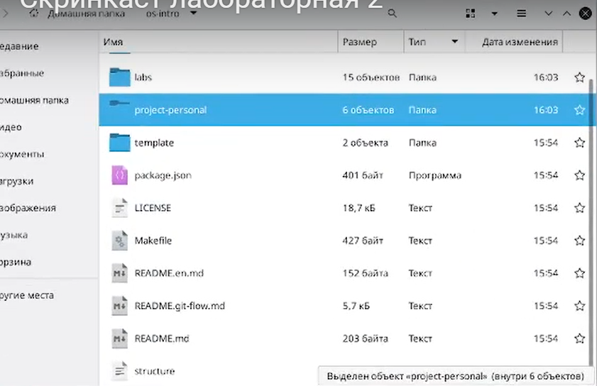{ #fig:18 width=70% }

10).Настроила каталог курса:Перешла в ранее созданный каталог курса, соединила необходимые каталоги, а затем отправила все на сервер ( рис.[-@fig:19]) (рис.[-@fig:20])

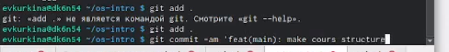{ #fig:19 width=70% }

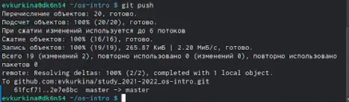{ #fig:20 width=70% }

11).Ответы на вопросы:

  1).VCS-программное обеспечение для работы с изменяющейся информацией, позволяет хранить несколько версий одного и того же документа и возвращаться к более ранним версиям.
  
  2). 2.1Хранилище-репозиторий файлов и папок, изменения которых отслеживаются2.2.commit-объект, в котором содержится описание изменений, которые были внесены в код Git.
  
    2.3) История- VCS-хранит все изменения и копии
    2.4)Рабочая копия- каталог на компьютере пользователя, в котором происходит работа над проектом.
  3). Централизованные системы контроля версий представляют собой приложения типа клиент-сервер, когда репозиторий проекта существует в единственном экземпляре и хранится на сервере. Доступ к нему осуществлялся через специальное клиентское приложение. В качестве примеров таких программных продуктов можно привести CVS, Subversion.Распределенные системы контроля версий (Distributed Version Control System,DVCS) позволяют хранить репозиторий (его копию) у каждого разработчика,работающего с данной системой. При этом можно выделить центральный репозиторий (условно), в который будут отправляться изменения из локальных и, с ним же эти локальные репозитории будут синхронизироваться. При работе с такой системой, пользователи периодически синхронизируют свои локальные репозитории с центральным и работают непосредственно со своей локальной копией. После внесения достаточного количества изменений в локальную копию они (изменения) отправляются на сервер. При этом сервер, чаще всего, выбирается условно, т.к. в большинстве DVCS нет такого понятия как “выделенный сервер с центральным репозиторием”. Большое преимущество такого подхода заключается в автономии разработчика при работе над проектом, гибкости общей системы и повышение надежности, благодаря тому, что каждый разработчик имеет локальную копию центрального репозитория. Две наиболее известные DVCS – это Git и Mercurial.
  4). Создадим локальный репозиторий. Сначала сделаем предварительную конфигурацию, указав имя и email владельца репозитория: git config --global user.name"Имя Фамилия" git config --global user.email"work@mail" и настроив utf-8 в выводе сообщенийgit: git config --global quotepath false
Для инициализации локального репозитория, расположенного, например, в каталоге ~/tutorial, необходимо ввести в командной строке: cd mkdir tutorial cd tutorial git init
  5). Для последующей идентификации пользователя на сервере репозиториев необходимо сгенерировать пару ключей (приватный и открытый): ssh-keygen -C"Имя Фамилия <work@mail>" Ключи сохраняться в каталоге~/.ssh/. Скопировав из локальной консоли ключ в буфер обмена cat ~/.ssh/id_rsa.pub | xclip -sel clip вставляем ключ в появившееся на сайте поле.
  6). У Git две основных задачи: первая — хранить информацию о всех изменениях в вашем коде, начиная с самой первой строчки, а вторая — обеспечение удобства командной работы над кодом.
  7). Основные команды git: Наиболее часто используемые команды git: – создание основного дерева репозитория:git init–получение обновлений (изменений)текущего дерева из центрального репозитория:git pull–отправка всех произведённых изменений локального дерева в центральный репози-торий:git push–просмотр списка изменённых файлов втекущей директории:git status–просмотртекущих изменения:git diff–сохранениетекущих изменений:–добавить все изменённые и/или созданные файлы и/или каталоги:git add .–добавить конкретные изменённые и/или созданные файлы и/или каталоги:git add имена_файлов – удалить файл и/или каталог из индекса репозитория (приэтомфайл и/илик аталог остаётся в локальной директории): git rm имена_файлов – сохранение добавленных изменений: – сохранить все добавленные изменения и все изменённые файлы: git commit -am 'Описание коммита'–сохранить добавленные изменения с внесением комментария через встроенный редактор:git commit–создание новой ветки, базирующейся натекущей: git checkout -b имя_ветки–переключение на некоторую ветку: git checkout имя_ветки (при переключении на ветку, которой ещё нет в локальном репозитории, она будет создана и связана с удалённой) – отправка изменений конкретной ветки в центральный репозиторий: git push origin имя_ветки– слияние ветки стекущим деревом:git merge --no-ff имя_ветки–удаление ветки:
    – удаление локальной уже слитой с основным деревом ветки:git branch -d имя_ветки–принудительное удаление локальной ветки:git branch -D имя_ветки–удаление ветки с центрального репозитория: git push
origin :имя_ветки
  8). Использования git при работе с локальными репозиториями (добавления текстового документа в локальный репозиторий): git add hello.txt  git commit -am'Новый файл
  9). Проблемы, которые решают ветки git:
    · нужно постоянно создавать архивы с рабочим кодом
    · сложно "переключаться" между архивами
    · сложно перетаскивать изменения между архивами
    · легко что-то напутать или потерять
  10). Во время работы над проектомтак или иначе могутсоздаваться файлы,которые нетребуется добавлять в последствии в репозиторий.Например, временные файлы, со-здаваемые редакторами,или объектные файлы, создаваемые компиляторами.Можно прописать шаблоны игнорируемых при добавлении в репозиторийтипов файлов в файл.gitignore с помощьюс ервисов. Для этого сначала нужно получить списоки меющихсяv шаблонов: curl -L -s https://www.gitignore.io/api/list Затем скачать шаблон,например, для C и C++ curl -L -s https://www.gitignore.io/api/c >> .gitignore curl -L -s https://www.gitignore.io/api/c++ >> .gitigno
# Выводы

Во время выполнения лабораторной работы, я научилась офрмлять отчеты с помощью легковесного языка разметки Markdown.

# Список литературы{.unnumbered}

::: {#refs}
:::

