---
## Front matter
lang: ru-RU
title: Лабораторная работа №4
author: |
	Куркина Евгения Вячеславовна 
institute: |
	\inst{1}RUDN University, Moscow, Russian Federation
	

## Formatting
toc: false
slide_level: 2
theme: metropolis
header-includes: 
 - \metroset{progressbar=frametitle,sectionpage=progressbar,numbering=fraction}
 - '\makeatletter'
 - '\beamer@ignorenonframefalse'
 - '\makeatother'
aspectratio: 43
section-titles: true
---

# Лабораторная работа №4

## Определение полного имени домашнего каталога 

- 1). Определила полное имя моего домашнего каталога.(/afs/.dk.sci.pfu.edu.ru/home/e/v/evkurki
)(рис. [-@fig:1])

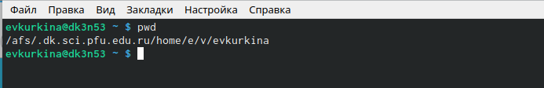{ #fig:1 width=70% }
- 2).Перешла в каталог /tmp. (рис. [-@fig:2])

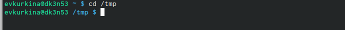{ #fig:2 width=70% }
  3).Используя команду ls с различными опциями, выводим на экран содержи-
мое каталога /tmp.(рис. [-@fig:3]) (рис. [-@fig:4]) (рис. [-@fig:5]) (рис. [-@fig:6]) (рис. [-@fig:7])

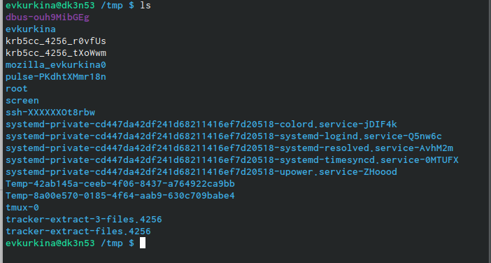{ #fig:3 width=70% }

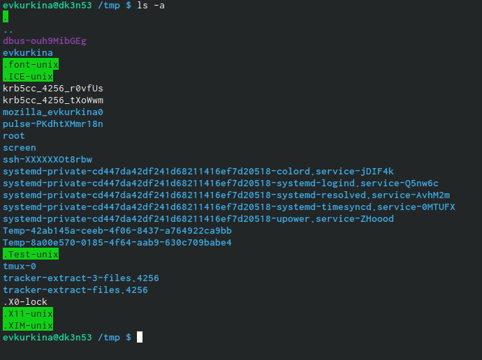{ #fig:4 width=70% }

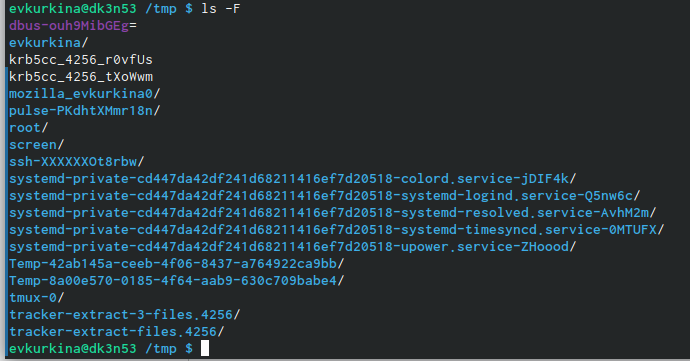{ #fig:5 width=70% }

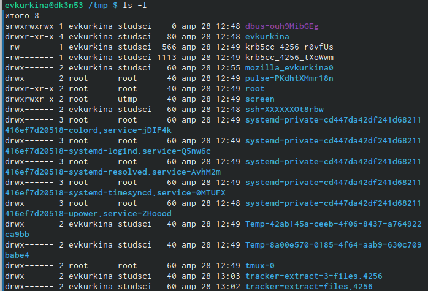{ #fig:6 width=70% }

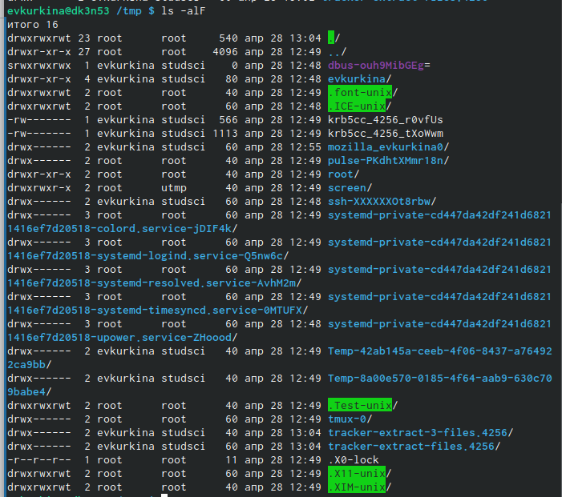{ #fig:7 width=70% }

## Наличие подкаталога в каталоге

- Определила наличие подкаталога crone в каталоге /var/spool. С помощью
команды cd/var/spool -перешла в необходимый каталог, а затем с помощью ко-
манды ls- просмотрела список подкаталогов.(рис. [-@fig:8])

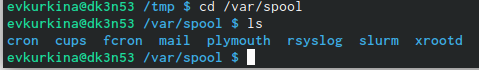{ #fig:8 width=70% }

-С помощью команды cd перешла в домашний каталог, командой ls вызвала
его содержимое. Владельцем файлов и каталогов является (evkurkina) (рис. [-@fig:9]) (рис. [-@fig:10])

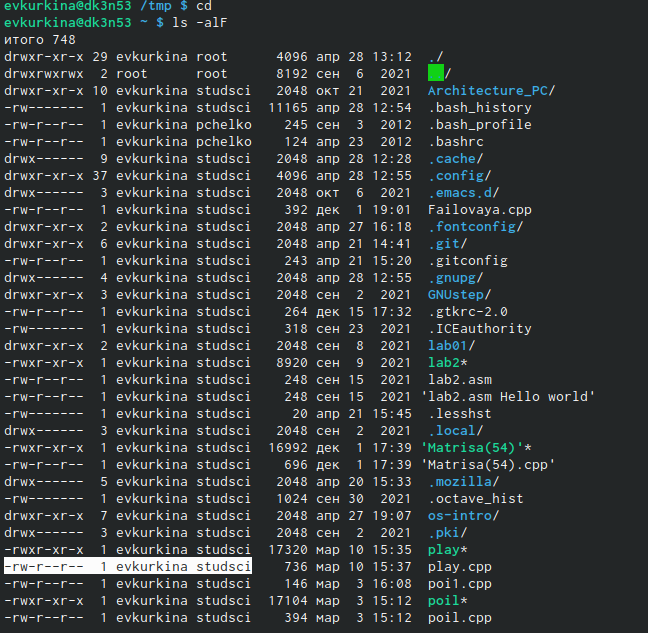{ #fig:9 width=70% }

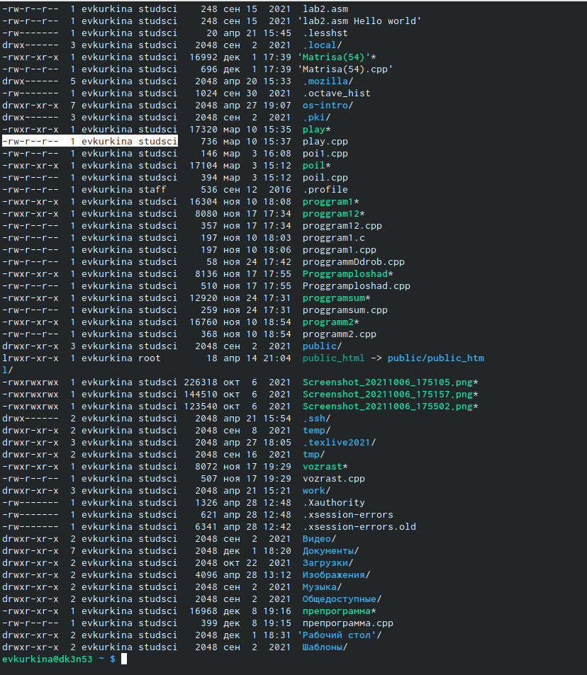{ #fig:10 width=70% }

## Создание новых каталогов

-  В домашнем каталоге создала новый каталог с именем newdi, с помощью команды mkdir(рис. [-@fig:11])
-С помощью команды mkdir создаем новый каталог с именем morefun.(рис. [-@fig:11])

{ #fig:11 width=70% }

- Одной командой mkdir создаю три новых каталога letters, memos, misk.Командой rm -r удалила данные три каталога. Командой ls просмотрела результат.(рис. [-@fig:12])
  
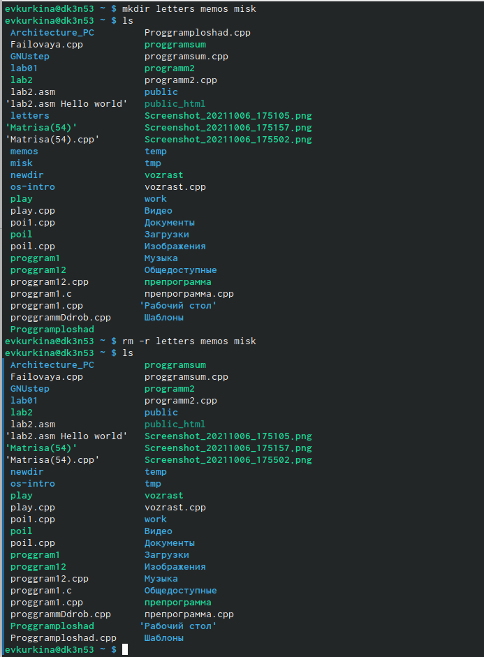{ #fig:12 width=70% }

-Я попробовала удалить созданный каталог newdir командой rm. Каталог не удалился (т.к он содержит в себе подкаталог, следовательно необхадимо использовать функцию -r).(рис. [-@fig:13])
  
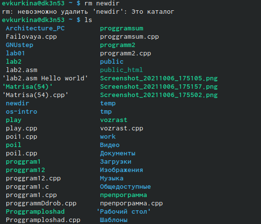{ #fig:13 width=70% }

-Удалила каталог newdire/morefan , командой rm -r. Командой ls проверила результат выполнения команды.(рис. [-@fig:14])
  
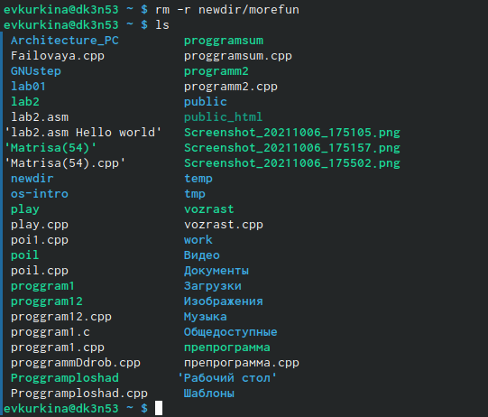{ #fig:14 width=70% } 

## Команда man для просмотра операций команд
-Используя команду man, просматриваю описания команд cd, pwd, mkdir, rmdir,rm.( команда cd не имеет дополнительный опций).(рис. [-@fig:17]) (рис. [-@fig:18]) (рис. [-@fig:19]) 
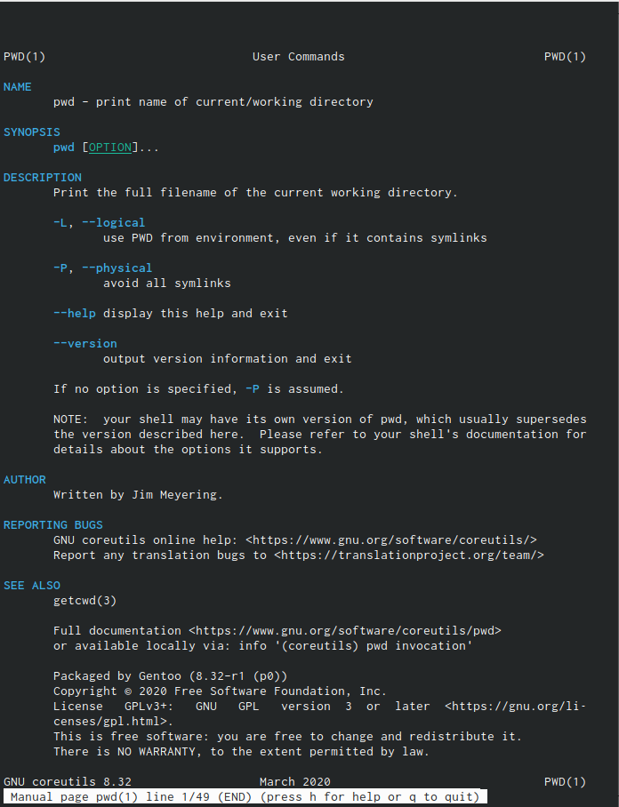{ #fig:17 width=70% } 

{ #fig:18 width=70% } 

{ #fig:19 width=70% } 

## Команда history

- Используя команду history, получила списко команд.(рис. [-@fig:22])(рис. [-@fig:23])(рис. [-@fig:24])

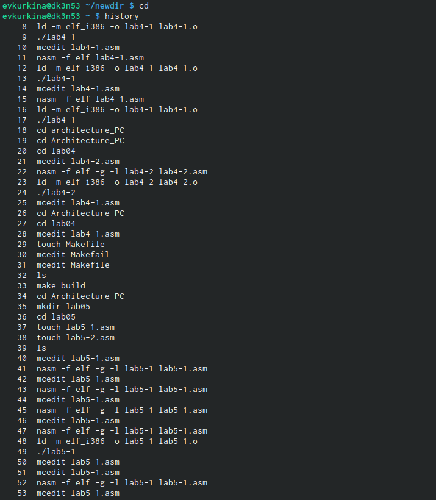{ #fig:22 width=70% } 

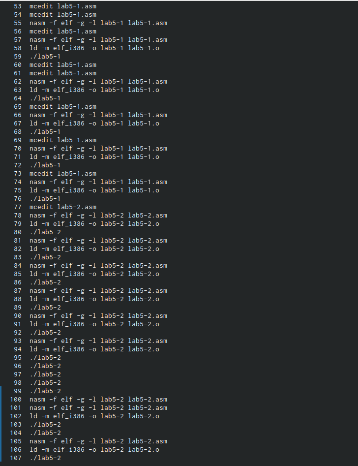{ #fig:23 width=70% } 

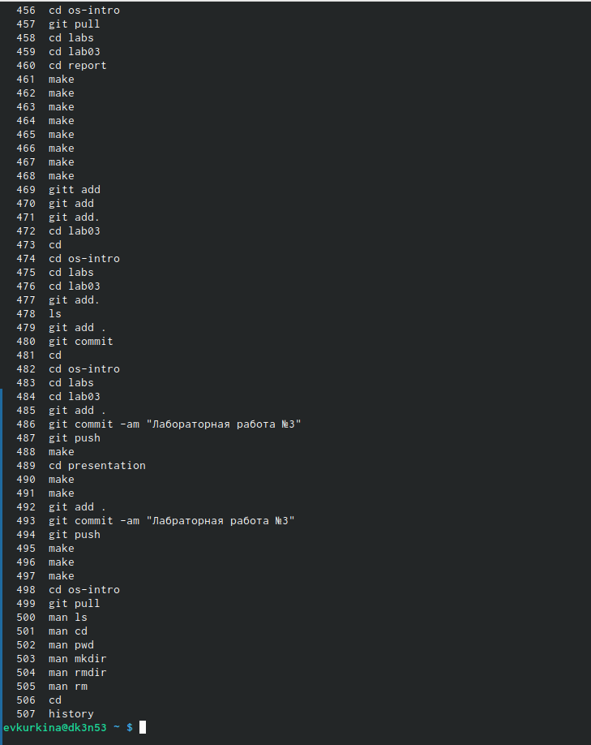{ #fig:24 width=70% }

## {.standout}

