---
## Front matter
title: "Лабораторная работа №4"
subtitle: "Отчет по лабораторной работе №4"
author: "Куркина Евгения Вячеславовна"

## Generic otions
lang: ru-RU
toc-title: "Содержание"

## Bibliography
bibliography: bib/cite.bib
csl: pandoc/csl/gost-r-7-0-5-2008-numeric.csl

## Pdf output format
toc: true # Table of contents
toc-depth: 2
lof: true # List of figures
lot: true # List of tables
fontsize: 12pt
linestretch: 1.5
papersize: a4
documentclass: scrreprt
## I18n polyglossia
polyglossia-lang:
  name: russian
  options:
	- spelling=modern
	- babelshorthands=true
polyglossia-otherlangs:
  name: english
## I18n babel
babel-lang: russian
babel-otherlangs: english
## Fonts
mainfont: PT Serif
romanfont: PT Serif
sansfont: PT Sans
monofont: PT Mono
mainfontoptions: Ligatures=TeX
romanfontoptions: Ligatures=TeX
sansfontoptions: Ligatures=TeX,Scale=MatchLowercase
monofontoptions: Scale=MatchLowercase,Scale=0.9
## Biblatex
biblatex: true
biblio-style: "gost-numeric"
biblatexoptions:
  - parentracker=true
  - backend=biber
  - hyperref=auto
  - language=auto
  - autolang=other*
  - citestyle=gost-numeric
## Pandoc-crossref LaTeX customization
figureTitle: "Рис."
tableTitle: "Таблица"
listingTitle: "Листинг"
lofTitle: "Список иллюстраций"
lotTitle: "Список таблиц"
lolTitle: "Листинги"
## Misc options
indent: true
header-includes:
  - \usepackage{indentfirst}
  - \usepackage{float} # keep figures where there are in the text
  - \floatplacement{figure}{H} # keep figures where there are in the text
---

# Цель работы

Здесь приводится формулировка цели лабораторной работы. Формулировки
цели для каждой лабораторной работы приведены в методических
указаниях.

Цель данной лабораторной работы --- Приобрести практические навыки взаимодействия с системой по средством командной строки 
# Задание

Используя командную строку, выполнить последлвательно лаборатрную работу.

# Выполнение лабораторной работы

1). Определила полное имя моего домашнего каталога.(/afs/.dk.sci.pfu.edu.ru/home/e/v/evkurkina
) (рис. [-@fig:1])

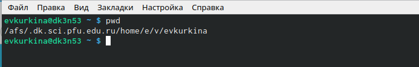{ #fig:1 width=70% }

2).Перешла в каталог /tmp.(рис. [-@fig:2])
  
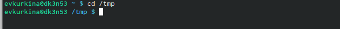{ #fig:2 width=70% }

  2.2).Используя команду ls с различными опциями, выводим на экран содержимое каталога /tmp.
     1."ls"-просмотр содержимого каталога.Вручную открываем каталог /tmp.(рис. [-@fig:3])
     
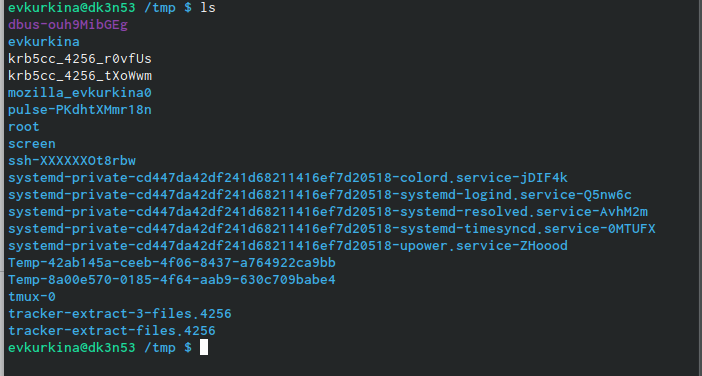{ #fig:3 width=70% }

     2."ls -a"-Отображение имен скрытых файлов.(рис. [-@fig:4])
     
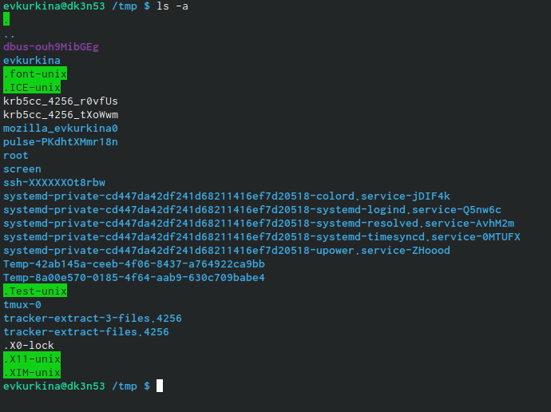{ #fig:4 width=70% }

     3."ls -F"-Отображение информации о типах файлов.В поле имени выводится символ, определяющий тип файла.(рис. [-@fig:5])

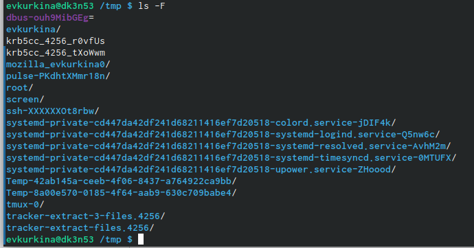{ #fig:5 width=70% }

     4."ls -l"-Отображение подробной информации офайлах и каталогах.(рис. [-@fig:6])

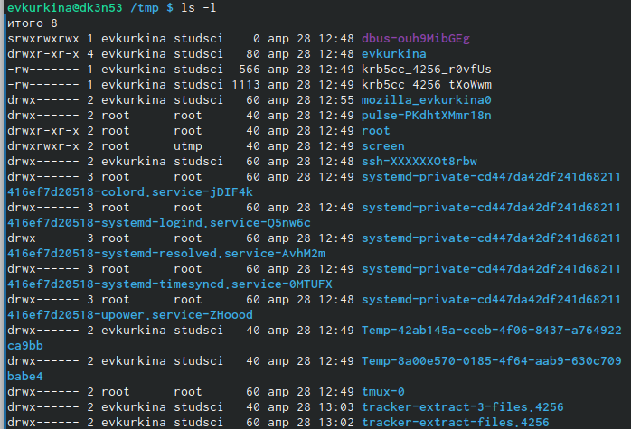{ #fig:6 width=70% }

     5."ls -alF"-Отображение всех файлов и каталогов, в том числе скрытых с подробной информацией.(рис. [-@fig:7])

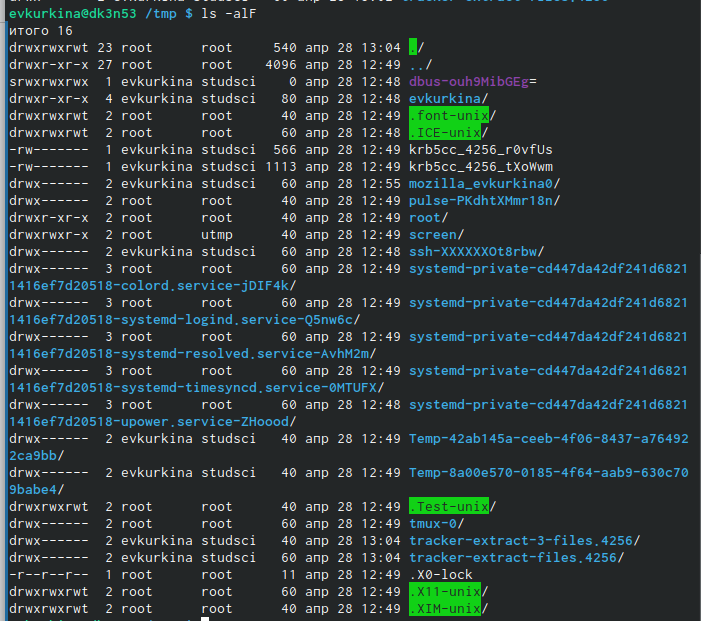{ #fig:7 width=70% }

  2.3) Определила наличие подкаталога crone в каталоге /var/spool. С помощью команды cd/var/spool -перешла в необходимый каталог, а затем с помощью команды ls- просмотрела список подкаталогов.(рис. [-@fig:8])
  
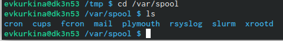{ #fig:8 width=70% }

  2.4) С помощью команды cd перешла в домашний каталог, командой ls вызвала его содержимое. Владельцем файлов и каталогов является (evkurkina). (рис. [-@fig:9]) (рис. [-@fig:10])
  
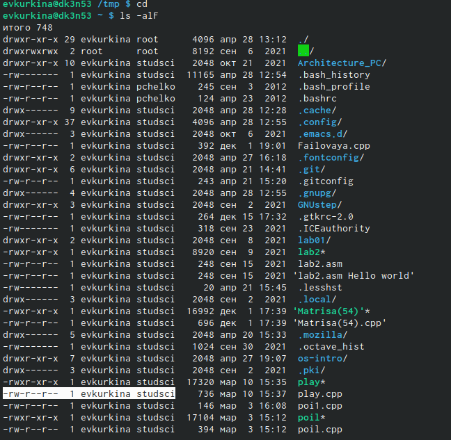{ #fig:9 width=70% }

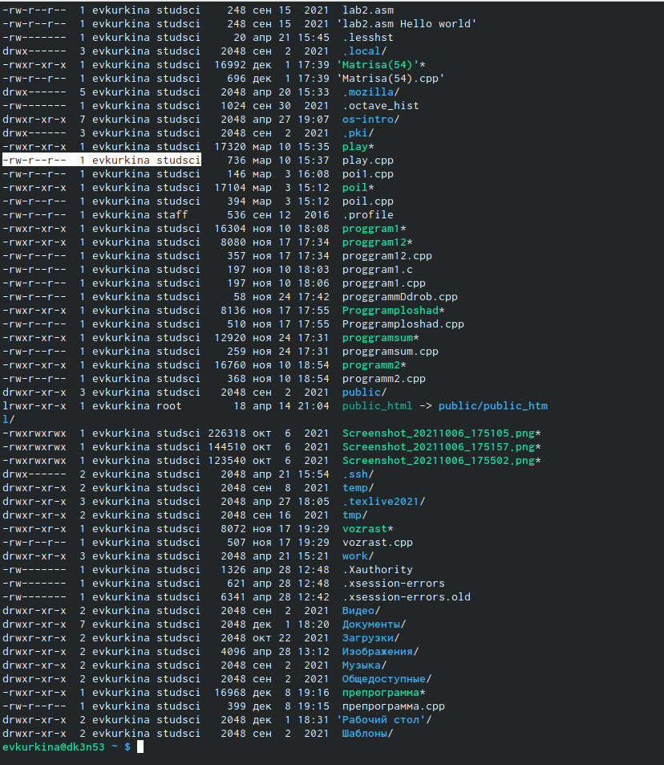{ #fig:10 width=70% }

3). В домашнем каталоге создала новый каталог с именем newdi, с помощью команды mkdir.(рис. [-@fig:11])
  3.2). С помощью команды mkdir создаем новый каталог с именем morefun.(рис. [-@fig:11])

{ #fig:11 width=70% }

  3.3). Одной командой mkdir создаю три новых каталога letters, memos, misk.Командой rm -r удалила данные три каталога. Командой ls просмотрела результат.(рис. [-@fig:12])
  
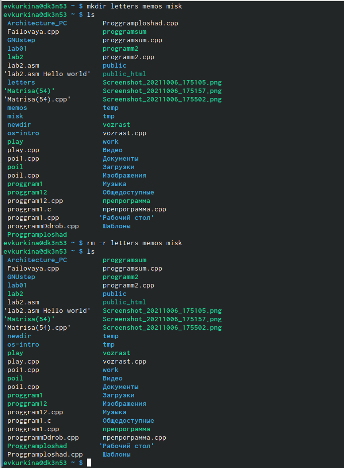{ #fig:12 width=70% }

  3.4).Я попробовала удалить созданный каталог newdir командой rm. Каталог не удалился (т.к он содержит в себе подкаталог, следовательно необхадимо использовать функцию -r).(рис. [-@fig:13])
  
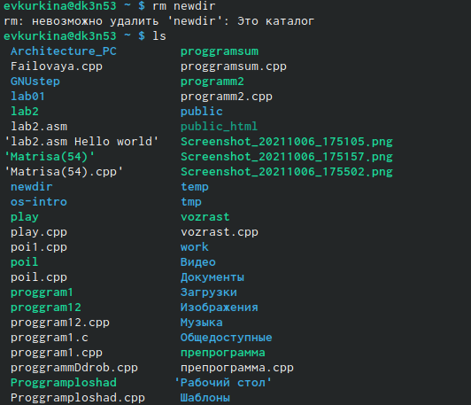{ #fig:13 width=70% }

  3.5).Удалила каталог newdire/morefan , командой rm -r. Командой ls проверила результат выполнения команды.(рис. [-@fig:14])
  
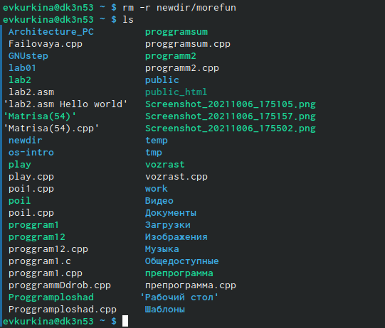{ #fig:14 width=70% } 

4). С помощью команды man, определяю какую операцию команды ls необходимо использовать для просмотра содержимого.(рис. [-@fig:15]) (рис. [-@fig:16])

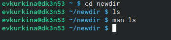{ #fig:15 width=70% } 

{ #fig:16 width=70% } 

5). Командой man определяю набо операций команды ls (рис. [-@fig:15]).

6). Используя команду man, просматриваю описания команд cd, pwd, mkdir, rmdir,rm.( команда cd не имеет дополнительный опций).
  Команда pwd:
  6.1). -L,--logical-не разыменовывать символические ссылки.Если путь их содержит,то выводить без преобразования в исходный путь.
  6.2)-P,--physical- преобразовывать символические ссылки в исходные имена. Если пусть содержит их, то преобразовывать в название исходных директорий.
  6.3)--help- показать справку по команде pwd
  6.4)--version-показать версию утилиты pwd (рис. [-@fig:17])
  
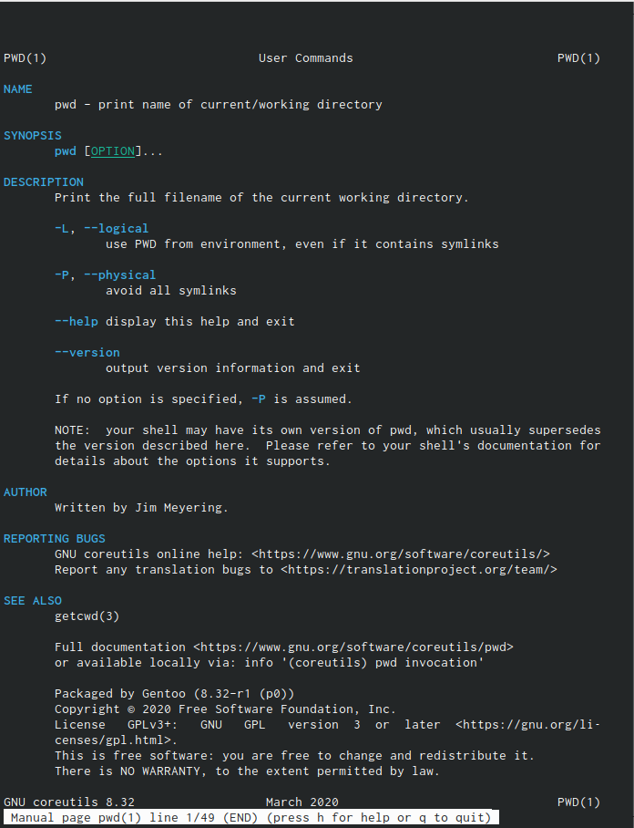{ #fig:17 width=70% } 

  Команда mkdir:
  6.5)-m,--mode=MODE - устанавливает права доступа для создаваемой директории.
  6.6)-p,--parents-создает все директории, указанные внутри пути
  6.7)-v,--verbose- выводит сообщение о каждой создаваемой директории
  6.8)-z-устанавливет контекст SELinux для создаваемой директории
  6.9)--context-устанавливает контекст для создаваемой аудитории
  6.10)--help- показывает справку по команде mkdir
  6.11)--version- показывает версию утилиты mkdir(рис. [-@fig:18])

{ #fig:18 width=70% } 

  Команда rmdir:
  6.12) --ignore-fail-on-non-empty-игнорировать директории, содержащие файлы
  6.13)-p, --parents- каждый аргумент обрабатывается как путь, з которогобудут удалены все компоненты
  6.14)-v, --verbose-отображение подробной информации каталога
  6.15)-help- показывает справку о команде rmdir
  6.16)--version- показать утилиты rmdir (рис. [-@fig:19])
  
{ #fig:19 width=70% } 

  Команда rm:
  
  6.17) -f, --force - игнорировать несуществующие файлы и аргументы. Никогда не выдавать запросы на подтверждение удаления;
  6.18)  -i - выводить запрос на подтверждение удаления каждого файла;
    -I - выдать один запрос на подтверждение удаления всех файлов, если удаляется больше трех файлов или используется рекурсивное удаление. Опция применяется, как более «щадящая» версия опции –i;
  6.19)--interactive - вместо WHEN можно использовать:never — никогда не выдавать запросы на подтверждение удаления, once — выводить запрос один раз (аналог опции -I). always —выводить запрос всегда (аналог опции -i).Если значение КОГДА не задано, то используется always;
  6.20)--one-file-system - во время рекурсивного удаления пропускать директории, которые находятся на других файловых системах;
  6.21)--no-preserve-root - если в качестве директории для удаления задан корневой раздел /, то считать, что это обычная директория и начать выполнять удаление;
  6.22)--preserve-root - если в качестве директории для удаления задан корневой раздел /, то запретить выполнять команду rm над корневым разделом. Данное поведение используется по умолчанию;
  6.23) -r, -R, --recursive - удаление директорий и их содержимого. Рекурсивное удаление;
  6.24)-d, --dir - удалять пустые директории;
  6.25)-v, --verbose - выводить информацию об удаляемых файлах;
  6.26)--help - показать справку по команде rm;
  6.27)--version - показать версию утилиты rm (рис. [-@fig:20])  (рис. [-@fig:21]) 
  
{ #fig:19 width=70% } 
{ #fig:19 width=70% } 

7).Используя команду history, получила списко команд.(рис. [-@fig:22])(рис. [-@fig:23])(рис. [-@fig:24])

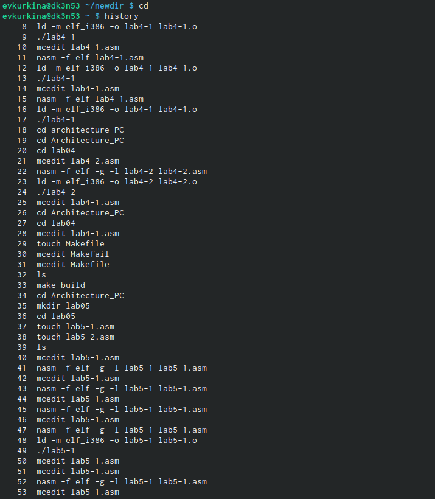{ #fig:22 width=70% } 

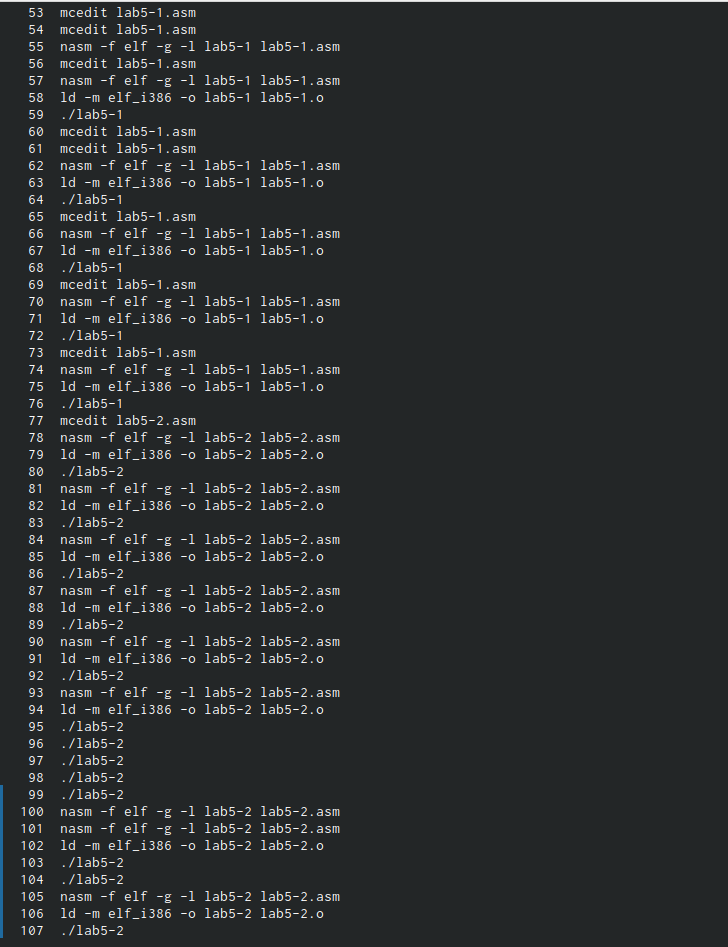{ #fig:23 width=70% } 

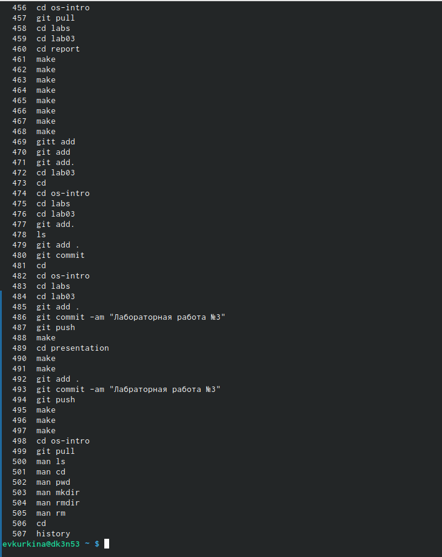{ #fig:24 width=70% } 

8). Контрольные вопросы:
1). Командная строка – специальная программа, позволяющая управлять операционной системой при помощи текстовых команд, вводимых в окне приложения. 2). Для определения абсолютного пути к текущему каталогу используется команда pwd (print working directory). Например, команда «pwd» в моем домашнем каталоге выведет: /home/tbkonovalova 3). Команда «ls-F» (или «ls-aF», тогда появятся еще скрытые файлы) выведет имена файлов в текущем каталоге и их типы. Тип каталога обозначается /, тип исполняемого файла обозначается , тип ссылки обозначается @. Пример на Рисунке 2. 4). Имена скрытых файлов начинаются с точки. Эти файлы в операционной системе скрыты от просмотра и обычно используются для настройки рабочей среды. Для того, чтобы отобразить имена скрытых файлов, необходимо использовать команду «ls –a». Пример на Рисунке 2. 5). Команда rm используется для удаления файлов и/или каталогов. Команда rm-i выдает запрос подтверждения наудаление файла. Команда rm-r необходима, чтобы удалить каталог, содержащий файлы. Без указания этой опции команда не будет выполняться. Если каталог пуст, то можно воспользоваться командой rmdir. Если удаляемый каталог содержит файлы, то команда не будет выполнена –нужно использовать «rm -r имя_каталога».Таким образом, каталог, не содержащий файлов, можно удалить и командой rm, и командой rmdir. Файл командой rmdir удалить нельзя. Примеры на Рисунке 9. 6). Чтобы определить, какие команды выполнил пользователь в сеансе работы, необходимо воспользоваться командой «history». 7). Чтобы исправить илизапустить на выполнение команду, которую пользователь уже использовал в сеансе работы, необходимо: в первом случае:воспользоваться конструкцией !<номер_команды>:s/<что_меняем>/<на_что_меняем>, во втором случае: !<номер_команды>. Примеры на Рисунке 21. 8). Чтобы записать в одной строке несколько команд, необходимо между ними поставить ; . Например, «cd /tmp; ls». 9). Символ обратного слэша позволяет использовать управляющие символы (".", "/", "$", "", "[", "]", "^", "&") без их интерпретации командной оболочкой; процедура добавления данного символа перед управляющими символами называетсяэкранированием символов. Например, команда «lsnewdir/morefun» отобразит содержимое каталога newdir/morefun. 10). Команда «ls -l» отображает список каталогов и файлов с подробной информацией о них (тип файла, право доступа, число ссылок, владелец, размер, дата последней ревизии, имя файла или каталога). 11). Полный, абсолютный путь от корня файловой системы –этот путь начинается от корня "/" и описывает весь путь к файлуили каталогу; Относительный путь – это путь к файлу относительно текущего каталога(каталога, где находится пользователь). Например, «cd/newdir/morefun» – абсолютный путь, «cdnewdir» – относительный путь. 12). Чтобы получить необходимую информацию о команде, необходимо воспользоваться конструкцией man[имя_команды], либо использовать опцию help, которая предусмотрена для некоторых команд. 13). Для автоматического дополнения вводимых команд служит клавиша Tab.

# Выводы

Во время данной лабораторной работы, я преобрела практические навыки взаимодействия с системой посредством командной строки.

# Список литературы{.unnumbered}

::: {#refs}
:::
