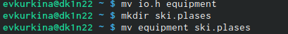

---
## Front matter
lang: ru-RU
title: Лабораторная работа 5
author: |
	Куркина Евгения Вячеславовна
institute: |
	\inst{1}RUDN University, Moscow, Russian Federation
	
## Formatting
toc: false
slide_level: 2
theme: metropolis
header-includes: 
 - \metroset{progressbar=frametitle,sectionpage=progressbar,numbering=fraction}
 - '\makeatletter'
 - '\beamer@ignorenonframefalse'
 - '\makeatother'
aspectratio: 43
section-titles: true
---

# Выполнение лабораторной работы

## Цель работы

-  Ознакомиться с с файловой системой Linux,ее структурой, именами и содрежанием каталогов. Приобрести практические навыки по применению команд для работы с файлами и каталогами, по управлению процессами по проверке использования диска и обслуживанию файловой системы.

## Задачи

1)Выполнить все примеры
2)Выполнить команды, и зафиксировать результаты
3)Определить опции команды chmod.
4)Проделать данные упражнения.

## Выполнения лабораторной работы

-Выполнение примеров.(рис. [-@fig:001]) (рис. [-@fig:002])

{ #fig:001 width=40% }

{ #fig:002 width=40% }

## Выполнение команд ( Шаг 2.1)
-Скопировала файл /usr/include/sys/io.h в домашний каталог и назовите его equipment, затем создала в домашнем каталоге директорию ski.plases. Переместила файл equipment в каталог ~/ski.plases.(рис. [-@fig:003])(рис. [-@fig:004])
  
{ #fig:003 width=40% }
  
{ #fig:004 width=40% }

## Шаг 2.2

- Переименовала файл /ski.plases/equipment в ~/ski.plases/equiplist. Создала в домашнем каталоге файл abc1 и скопировала его в каталог ~/ski.plases, назовите его equiplist2.(рис. [-@fig:005])
  
{ #fig:005 width=70% }

## Шаг 2.3

-Создала каталог с именем equipment в каталоге ~/ski.plases.Переместила файлы ~/ski.plases/equiplist и equiplist2 в каталог ~/ski.plases/equipment.Создала и переместила каталог ~/newdir в каталог ~/ski.plases и назвала его plans.(рис. [-@fig:006]) (рис. [-@fig:007])
  
{ #fig:006 width=40% }

{ #fig:007 width=40% }

## Опции команды chmod

-Создала необходимые каталоги и файлы, затем выполнила команды для присвоения определенных прав доступа.(рис. [-@fig:008])

{ #fig:008 width=70% }

# Выполнение упражнений 

## Шаг 4.1

-Просмотрела содержимое файла /etc/password.(рис. [-@fig:009])
  
{ #fig:009 width=70% }

## Шаг 4.2

- Скопировала файл ~/feathers в файл ~/file.old.
       Переместила файл ~/file.old в каталог ~/play.
       Скопировала каталог ~/play в каталог ~/fun.
       Переместила каталог ~/fun в каталог ~/play и назовите его games.(рис. [-@fig:010])
       
{ #fig:010 width=70% }

## Шаг 4.3

- Лишила владельца файла ~/feathers права на чтение.
      При попытке просмотреть файл ~/feathers командой cat, отказано в доступе
      Копируем файл ~/feathers?
      Дала владельцу файла ~/feathers право на чтение.
      Лишила владельца каталога ~/play права на выполнение.
      Перешла в каталог ~/play. 
      Дала владельцу каталога ~/play право на выполнение (рис. [-@fig:011])

{ #fig:011 width=70% }

## Команда man

- С помощью команды man  получила информацию по командам mount, fsck, mkfs, kill.(рис. [-@fig:012]) (рис. [-@fig:013]) (рис. [-@fig:014]) (рис. [-@fig:015]) (рис. [-@fig:016]).

{ #fig:012 width=40% }

{ #fig:013 width=40% }

# Справки

{ #fig:014 width=25% }

{ #fig:015 width=25% }

{ #fig:016 width=25% }

## Выводы

- При выполнении данной лабораторной работы я приобрела практические навыки по применению команды для работы с файлами и каталогами, по управлению процессами, по проверке использования диска и обслуживанию файловой системы.

## {.standout}

