---
## Front matter
title: "Лабораторная работа 5"
subtitle: "Отчет по лабораторной работе "
author: "Куркина Евгения Вячеславовна"

## Generic otions
lang: ru-RU
toc-title: "Содержание"

## Bibliography
bibliography: bib/cite.bib
csl: pandoc/csl/gost-r-7-0-5-2008-numeric.csl

## Pdf output format
toc: true # Table of contents
toc-depth: 2
lof: true # List of figures
lot: true # List of tables
fontsize: 12pt
linestretch: 1.5
papersize: a4
documentclass: scrreprt
## I18n polyglossia
polyglossia-lang:
  name: russian
  options:
	- spelling=modern
	- babelshorthands=true
polyglossia-otherlangs:
  name: english
## I18n babel
babel-lang: russian
babel-otherlangs: english
## Fonts
mainfont: PT Serif
romanfont: PT Serif
sansfont: PT Sans
monofont: PT Mono
mainfontoptions: Ligatures=TeX
romanfontoptions: Ligatures=TeX
sansfontoptions: Ligatures=TeX,Scale=MatchLowercase
monofontoptions: Scale=MatchLowercase,Scale=0.9
## Biblatex
biblatex: true
biblio-style: "gost-numeric"
biblatexoptions:
  - parentracker=true
  - backend=biber
  - hyperref=auto
  - language=auto
  - autolang=other*
  - citestyle=gost-numeric
## Pandoc-crossref LaTeX customization
figureTitle: "Рис."
tableTitle: "Таблица"
listingTitle: "Листинг"
lofTitle: "Список иллюстраций"
lotTitle: "Список таблиц"
lolTitle: "Листинги"
## Misc options
indent: true
header-includes:
  - \usepackage{indentfirst}
  - \usepackage{float} # keep figures where there are in the text
  - \floatplacement{figure}{H} # keep figures where there are in the text
---

# Цель работы

Здесь приводится формулировка цели лабораторной работы. Формулировки
цели для каждой лабораторной работы приведены в методических
указаниях.

Цель данной лабораторной работы--- Ознакомиться с с файловой системой Linux,ее структурой, именами и содрежанием каталогов. Приобрести практические навыки по применению команд для работы с файлами и каталогами, по управлению процессами по проверке использования диска и обслуживанию файловой системы.

# Задание

1)Выполнить все примеры
2)Выполнить команды, и зафиксировать результаты
3)Определить опции команды chmod.
4)Проделать данные упражнения.

# Выполнение лабораторной работы

1)Выполнение примеров.
  1.2)Копирование файла в текущем каталоге. Скопировать файл ~/abc1 в файл april и в файл may.
      Копирование нескольких файлов в каталог. Скопировать файлы april и may в каталог monthly.
      Копирование файлов в произвольном каталоге. Скопировать файл monthly/may в файл с именем june.
      Копирование каталогов в текущем каталоге. Скопировать каталог monthly в каталог monthly.00.
      Копирование каталогов в произвольном каталоге. Скопировать каталог monthly.00 в каталог /tmp.
      Переименование файлов в текущем каталоге. Изменить название файла april на july в домашнем.
      Перемещение файлов в другой каталог. Переместить файл july в каталог monthly.00.
      Переименование каталогов в текущем каталоге. Переименовать каталог monthly.00 в monthly.01.
      Перемещение каталога в другой каталог. Переместить каталог monthly.01в каталог reports.
      Переименование каталога, не являющегося текущим. Переименовать каталог reports/monthly.01 в reports/monthly. (рис. [-@fig:001])

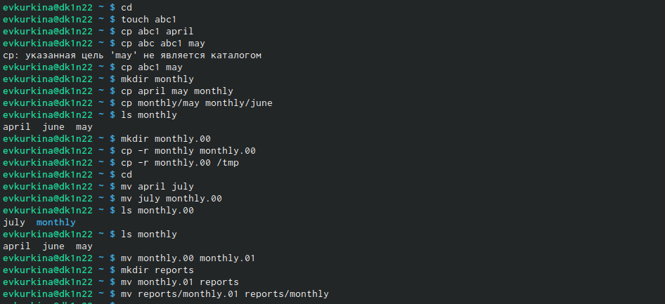{ #fig:001 width=70% }

  1.3)Требуется создать файл ~/may с правом выполнения для владельца.
      Требуется лишить владельца файла ~/may права на выполнение.
      Требуется создать каталог monthly с запретом на чтение для членов группы и всех остальных пользователей.
      Требуется создать файл ~/abc1 с правом записи для членов группы.(рис. [-@fig:002])
      
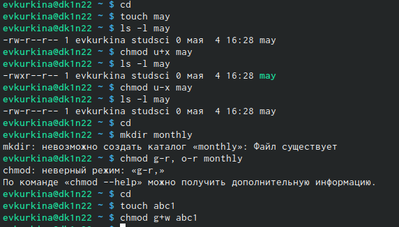{ #fig:002 width=70% }

2) 
  2.1)Скопировала файл /usr/include/sys/io.h в домашний каталог и назовите его equipment, затем создала в домашнем каталоге директорию ski.plases. Переместила файл equipment в каталог ~/ski.plases.(рис. [-@fig:003])(рис. [-@fig:004])
  
{ #fig:003 width=70% }
  
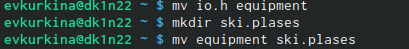{ #fig:004 width=70% }

  2.2)Переименовала файл /ski.plases/equipment в ~/ski.plases/equiplist. Создала в домашнем каталоге файл abc1 и скопировала его в каталог ~/ski.plases, назовите его equiplist2.(рис. [-@fig:005])
  
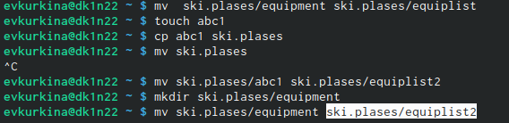{ #fig:005 width=70% }
  
  2.3) Создала каталог с именем equipment в каталоге ~/ski.plases.Переместила файлы ~/ski.plases/equiplist и equiplist2 в каталог ~/ski.plases/equipment.Создала и переместила каталог ~/newdir в каталог ~/ski.plases и назвала его plans.(рис. [-@fig:006]) (рис. [-@fig:007])
  
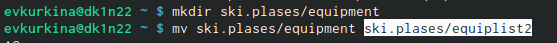{ #fig:006 width=70% }

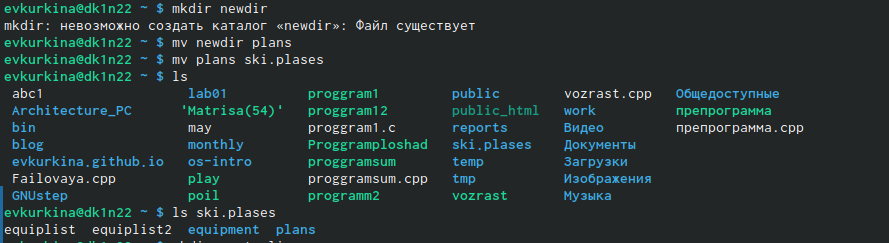{ #fig:007 width=70% }

3)Создала необходимые каталоги и файлы, затем выполнила команды для присвоения определенных прав доступа.(рис. [-@fig:008])

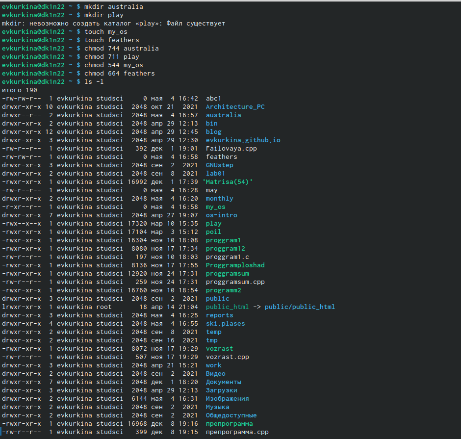{ #fig:008 width=70% }

4)
  4.1) Просмотрела содержимое файла /etc/password.(рис. [-@fig:009])
  
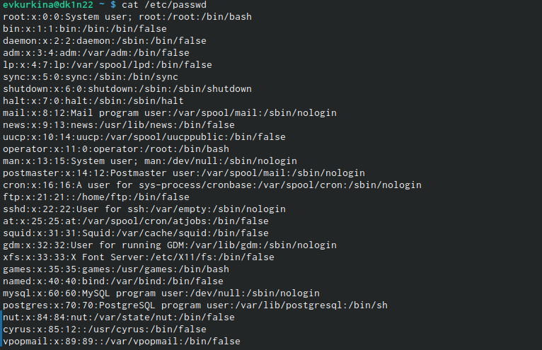{ #fig:009 width=70% }
  
  4.2) Скопировала файл ~/feathers в файл ~/file.old.
       Переместила файл ~/file.old в каталог ~/play.
       Скопировала каталог ~/play в каталог ~/fun.
       Переместила каталог ~/fun в каталог ~/play и назовите его games.(рис. [-@fig:010])
       
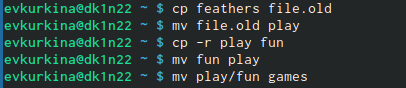{ #fig:010 width=70% }
       
  4.3)Лишила владельца файла ~/feathers права на чтение.
      При попытке просмотреть файл ~/feathers командой cat, отказано в доступе
      Копируем файл ~/feathers?
      Дала владельцу файла ~/feathers право на чтение.
      Лишила владельца каталога ~/play права на выполнение.
      Перешла в каталог ~/play. 
      Дала владельцу каталога ~/play право на выполнение (рис. [-@fig:011])

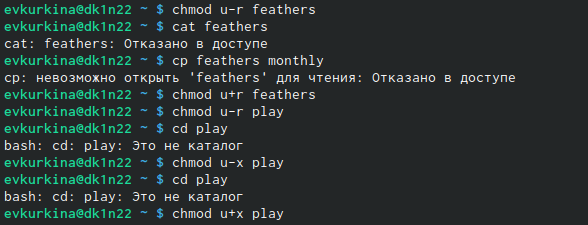{ #fig:011 width=70% }
      
5) С помощью команды man  получила информацию по командам mount, fsck, mkfs, kill.(рис. [-@fig:012]) (рис. [-@fig:013]) (рис. [-@fig:014]) (рис. [-@fig:015]) (рис. [-@fig:016]).

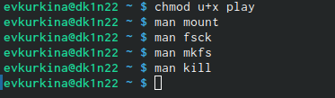{ #fig:012 width=70% }

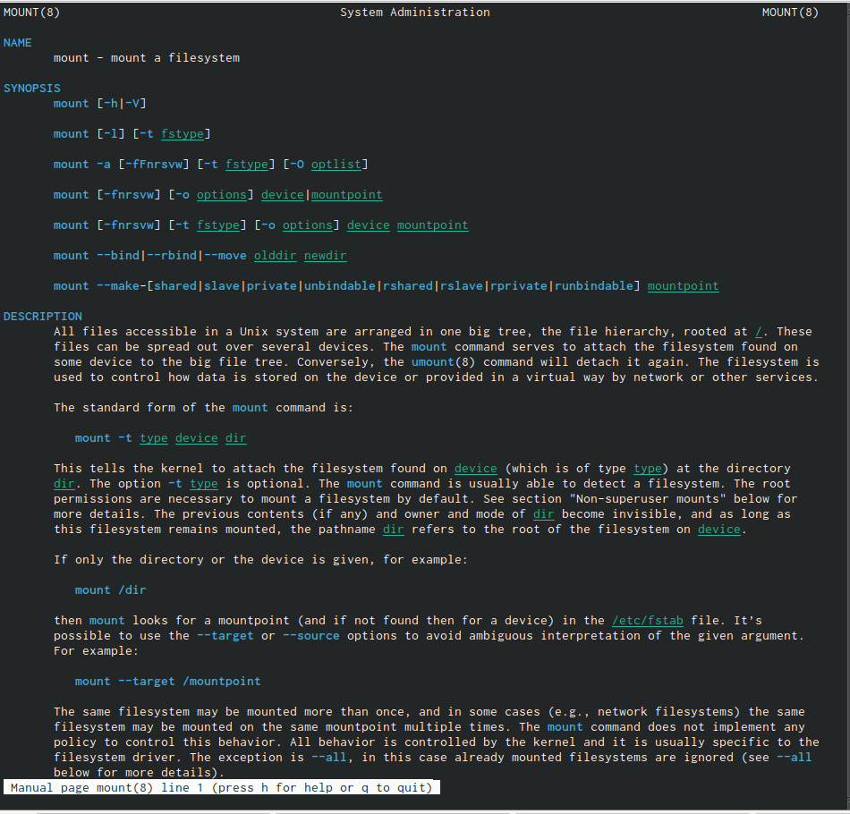{ #fig:013 width=70% }

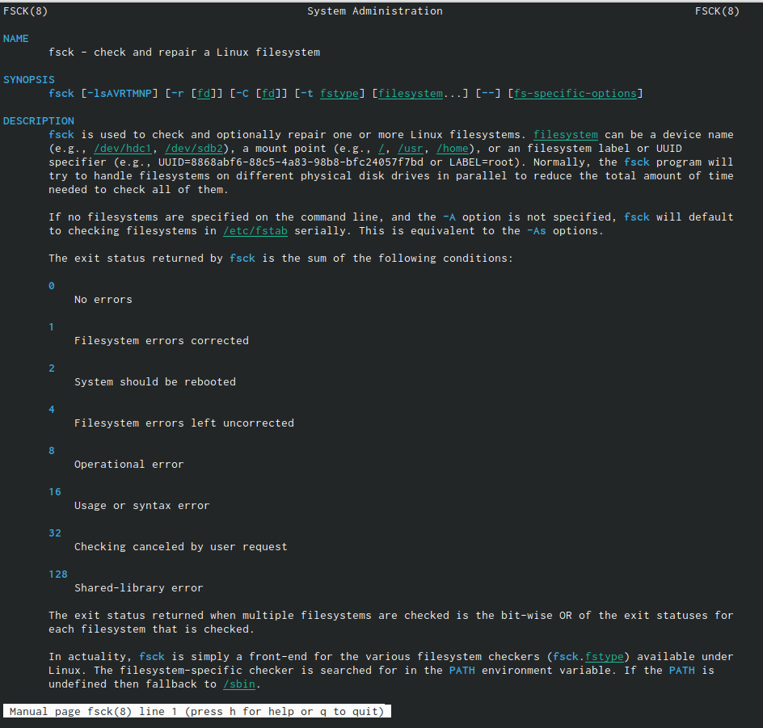{ #fig:014 width=70% }

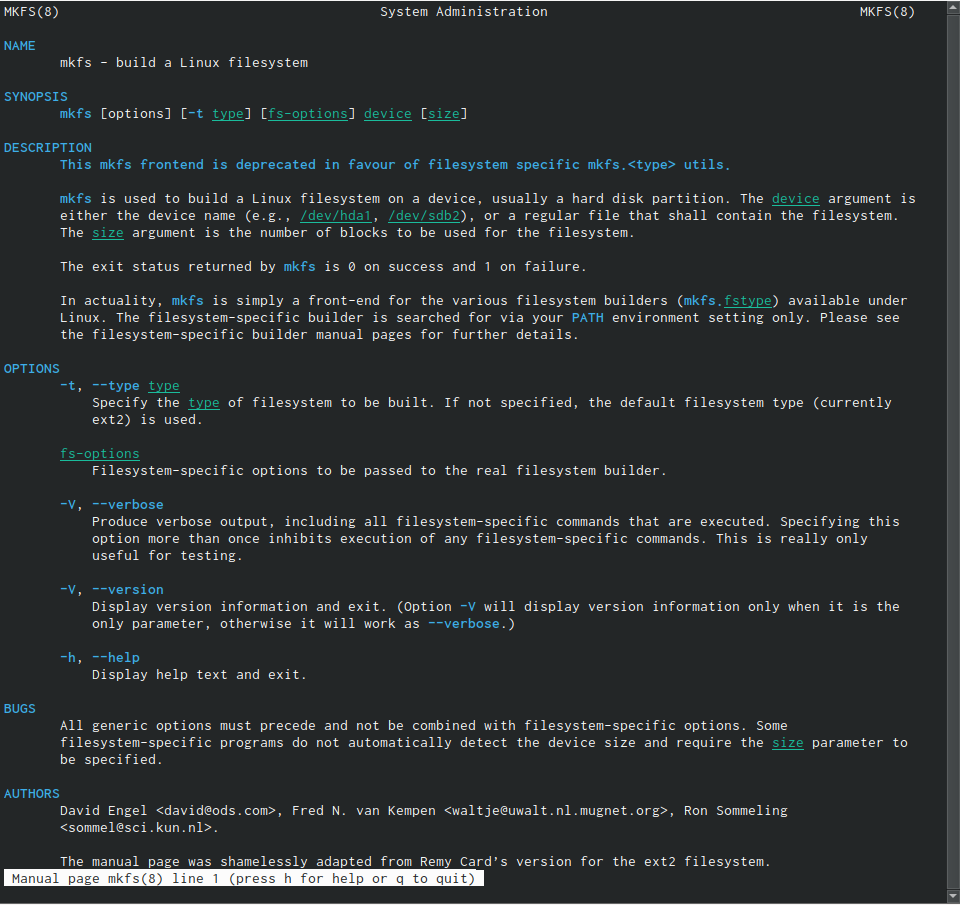{ #fig:015 width=70% }

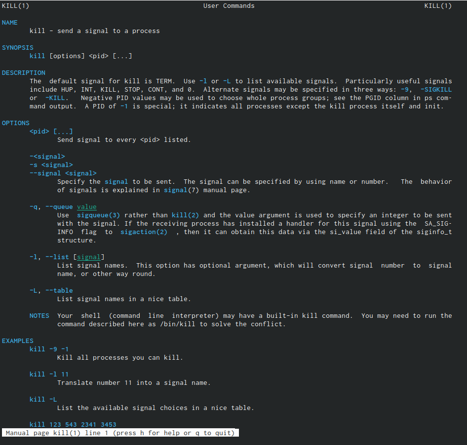{ #fig:016 width=70% }

# Выводы

При выполнении данной лабораторной работы я приобрела практические навыки по применению команды для работы с файлами и каталогами, по управлению процессами, по проверке использования диска и обслуживанию файловой системы.

# Список литературы{.unnumbered}

::: {#refs}
:::
