---
## Front matter
lang: ru-RU
title: Лабораторная работа 6
author: |
	Куркина евгения Вячеславовна
institute: |
	\inst{1}RUDN University, Moscow, Russian Federation
	

## Formatting
toc: false
slide_level: 2
theme: metropolis
header-includes: 
 - \metroset{progressbar=frametitle,sectionpage=progressbar,numbering=fraction}
 - '\makeatletter'
 - '\beamer@ignorenonframefalse'
 - '\makeatother'
aspectratio: 43
section-titles: true
---

# Лабораторная работа 6

##

- Цель данной лабораторной работы --- Ознакомиться с инструментам поиска файлов и фильтрации текстовых данных. Приобрести практические навыки по управлению процессами по проверке использования диска и обслуживанию файловых систем 

## Задачи

- С помощью необходимых команд выполнить вывод требуемых файлов, запустить команду в фоновом режиме,определить индетификатор процесса.

## Выполнение лабораторной работы

## Шаг 1

- Зашла в систему под своим пользователем.

## Шаг 2
- Записала в файл file.txt названия файлов,содержащихся в каталоге/etc. (рис. [-@fig:001]) (рис. [-@fig:002])

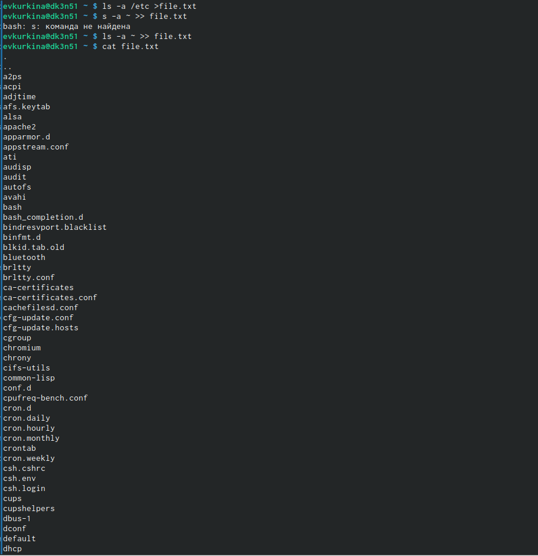{ #fig:001 width=40% }

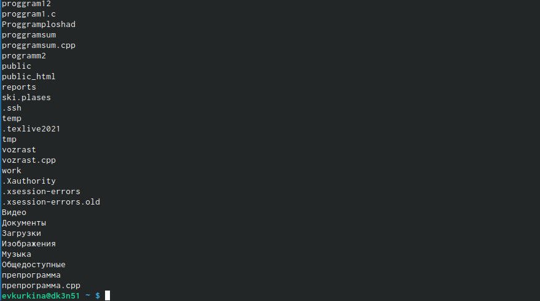{ #fig:002 width=40% }

## Шаг 3

- Вывела имена всех файлов из file.txt,имеющих расширение.conf,после чего запишисала их в новый текстовой файл conf.txt.(рис. [-@fig:003])

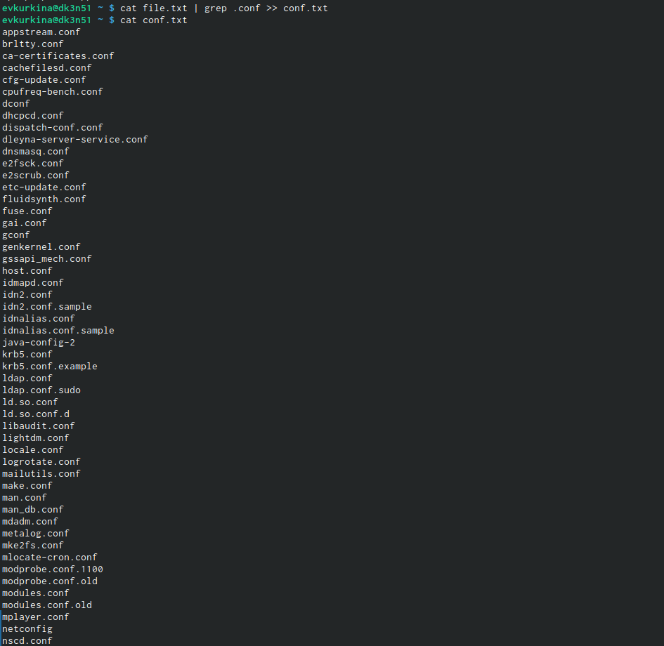{ #fig:003 width=70% }

## Шаг 4

- Вывела на экран файлы, названия которые в моем домашнем каталоге начинаются с "C" (рис. [-@fig:004])

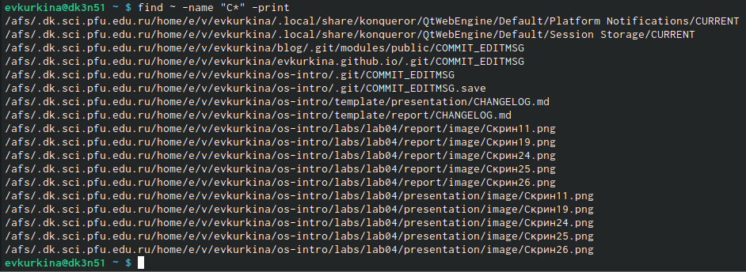{ #fig:004 width=70% }

## Шаг 5

- Вывела на экран имена файлов из каталога etc, имена которых начнаются на h.(рис. [-@fig:005])

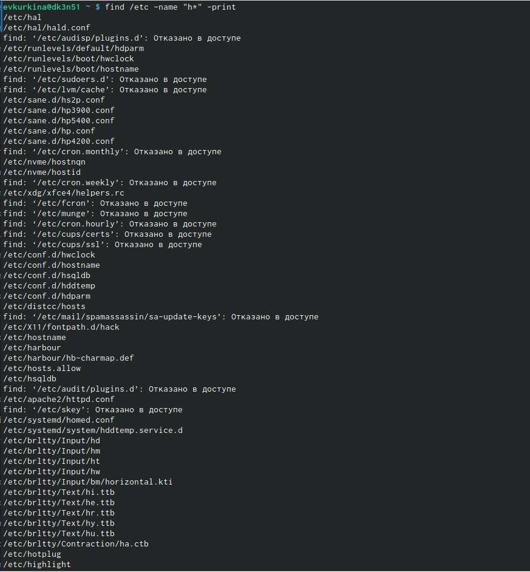{ #fig:005 width=70% }

## Шаг 6

-Командой find / -name "log*" > logfile, запустила в фоновом режиме процесс, который записывает в файл logfile, файлы с именами на log.(рис. [-@fig:006])(рис. [-@fig:007])

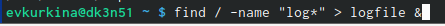{ #fig:006 width=40% }

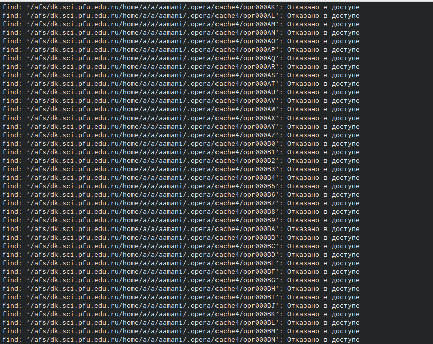{ #fig:007 width=40% }

## Шаг 7

- Командой rm  удалила файл logfile.(рис. [-@fig:008]) 

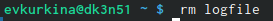{ #fig:008 width=70% }

## Шаг 8

- Запускаю в фоновом режиме редактор gedit.(рис. [-@fig:009]) 

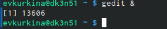{ #fig:009 width=70% }

## Шаг 9

- Командой ps определила индетификатор процесса gedit, конвейер и фильтр grep.(рис. [-@fig:010])

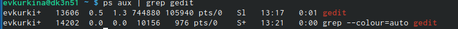{ #fig:010 width=70% } 

## Шаг 10

- Прочитала справку команды kill (рис. [-@fig:011]),а после завершила процесс git.(рис. [-@fig:012])

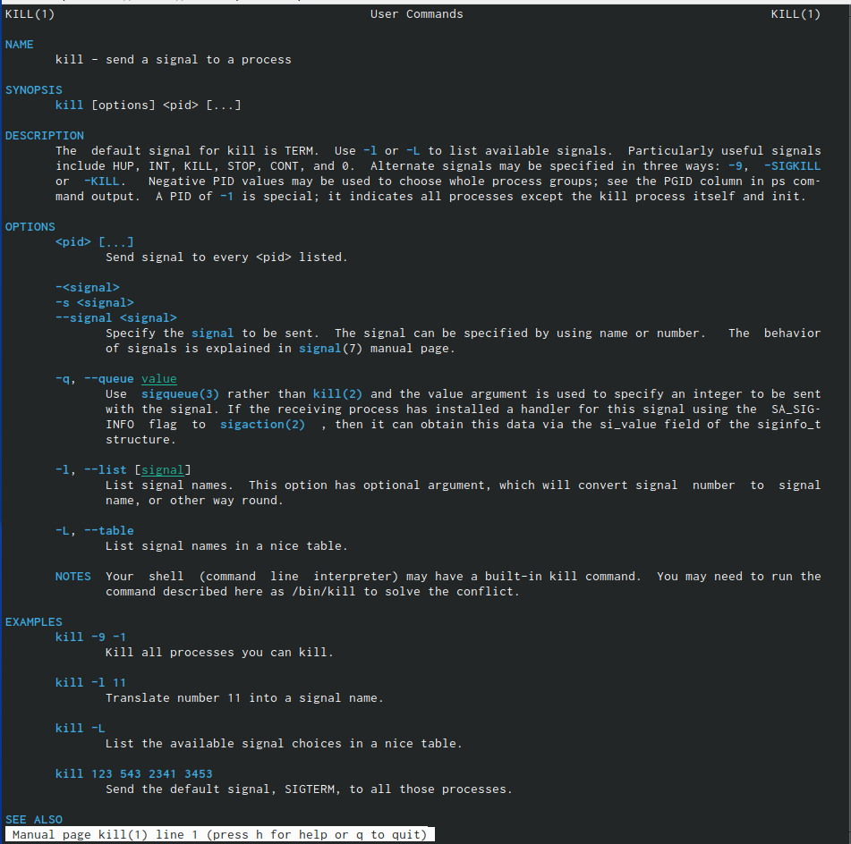{ #fig:011 width=40% } 

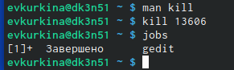{ #fig:012 width=40% } 

## Шаг 11

-  Получила справку по командам df du (рис. [-@fig:013]) (рис. [-@fig:014]), а затем выполнила их.(рис. [-@fig:015])(рис. [-@fig:016]) (рис. [-@fig:017]).

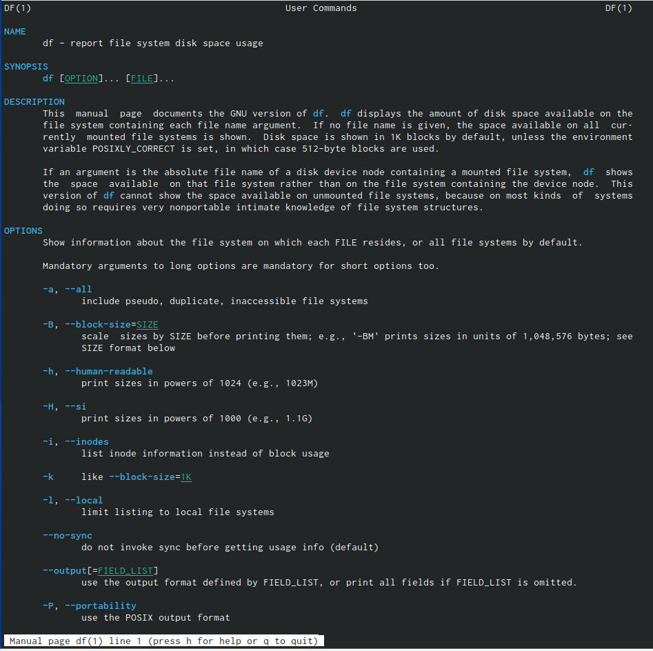{ #fig:013 width=40% } 

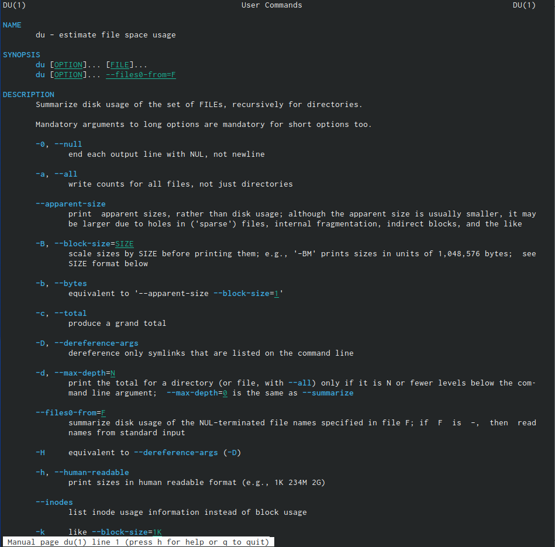{ #fig:014 width=40% } 

 
## Шаг 11.2

- 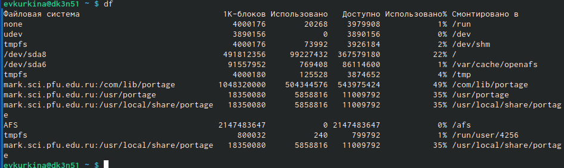{ #fig:015 width=30% } 

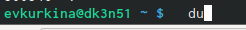{ #fig:016 width=30% } 

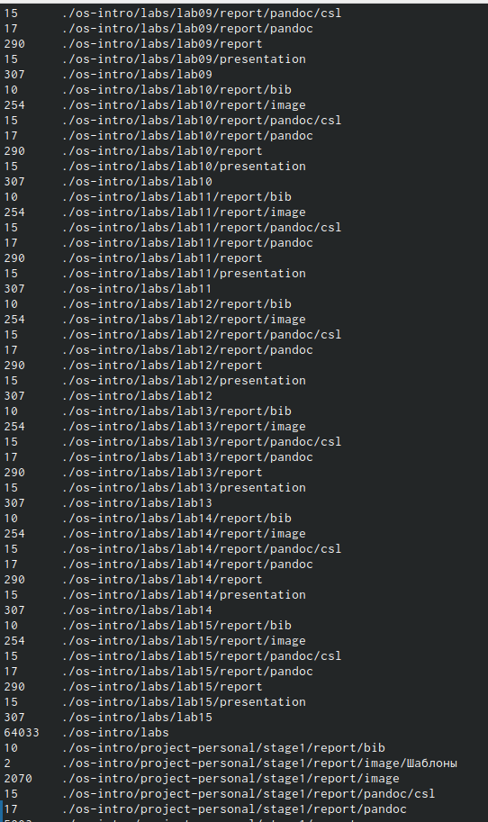{ #fig:017 width=30% }

## Шаг 12

- Прочитала справку команды find (рис. [-@fig:018]), вывела имена всех директорий, которые имеютсяв домашнем каталоге. (рис. [-@fig:019]).(рис. [-@fig:020]).

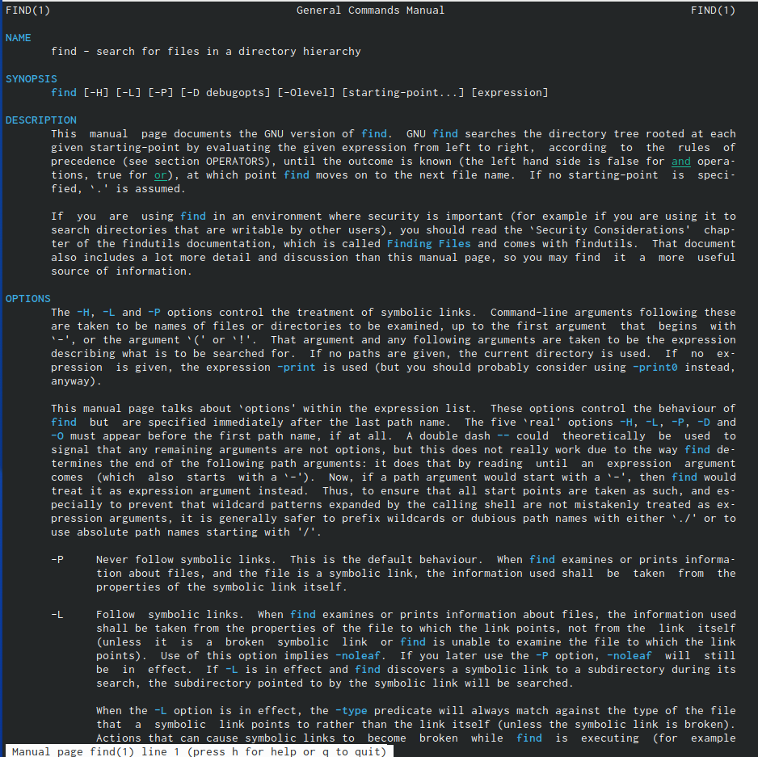{ #fig:018 width=30% } 

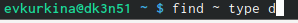{ #fig:019 width=30% } 

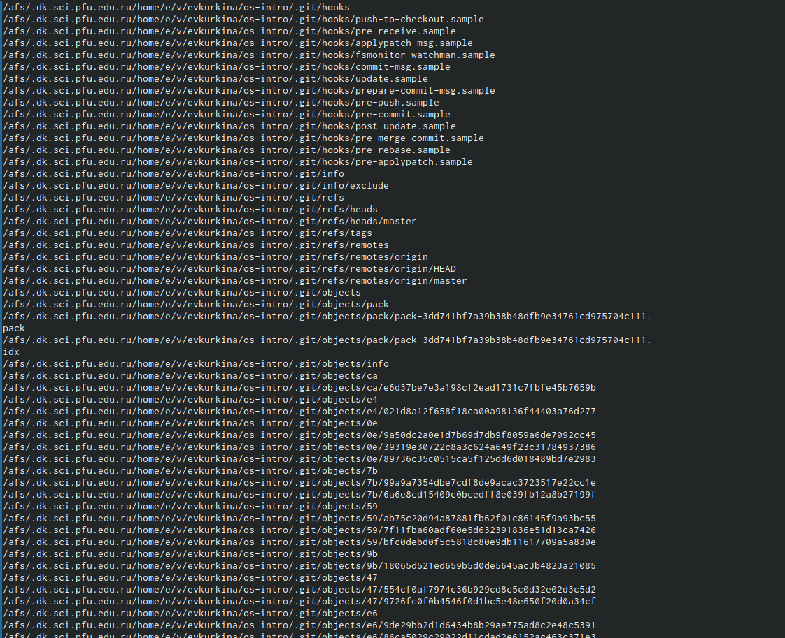{ #fig:020 width=30% } 

## Вывод

- Во время выполнения данной лабораторной работы, я ознакомилась с инструментами пойска фалов и фильтрации текстовых данных, пробрела практические навыки по управлению процессами по проверке использования диска и обслуживанию файловых систем.

## {.standout}

Wer's nicht glaubt, bezahlt einen Taler
