---
## Front matter
title: "Лабораторная работа 6"
subtitle: "Отчет лабораторной работы 6"
author: "Куркина Евгения Вячеславовна"

## Generic otions
lang: ru-RU
toc-title: "Содержание"

## Bibliography
bibliography: bib/cite.bib
csl: pandoc/csl/gost-r-7-0-5-2008-numeric.csl

## Pdf output format
toc: true # Table of contents
toc-depth: 2
lof: true # List of figures
lot: true # List of tables
fontsize: 12pt
linestretch: 1.5
papersize: a4
documentclass: scrreprt
## I18n polyglossia
polyglossia-lang:
  name: russian
  options:
	- spelling=modern
	- babelshorthands=true
polyglossia-otherlangs:
  name: english
## I18n babel
babel-lang: russian
babel-otherlangs: english
## Fonts
mainfont: PT Serif
romanfont: PT Serif
sansfont: PT Sans
monofont: PT Mono
mainfontoptions: Ligatures=TeX
romanfontoptions: Ligatures=TeX
sansfontoptions: Ligatures=TeX,Scale=MatchLowercase
monofontoptions: Scale=MatchLowercase,Scale=0.9
## Biblatex
biblatex: true
biblio-style: "gost-numeric"
biblatexoptions:
  - parentracker=true
  - backend=biber
  - hyperref=auto
  - language=auto
  - autolang=other*
  - citestyle=gost-numeric
## Pandoc-crossref LaTeX customization
figureTitle: "Рис."
tableTitle: "Таблица"
listingTitle: "Листинг"
lofTitle: "Список иллюстраций"
lotTitle: "Список таблиц"
lolTitle: "Листинги"
## Misc options
indent: true
header-includes:
  - \usepackage{indentfirst}
  - \usepackage{float} # keep figures where there are in the text
  - \floatplacement{figure}{H} # keep figures where there are in the text
---

# Цель работы

Здесь приводится формулировка цели лабораторной работы. Формулировки
цели для каждой лабораторной работы приведены в методических
указаниях.

Цель данной лабораторной работы --- Ознакомиться с инструментам поиска файлов и фильтрации текстовых данных. Приобрести практические навыки по управлению процессами по проверке использования диска и обслуживанию файловых систем 
# Задачи

С помощью необходимых команд выполнить вывод требуемых файлов, запустить команду в фоновом режиме,определить индетификатор процесса.

# Выполнение лабораторной работы

1). Зашла в систему под своим пользователем.

2).Записала в файл file.txt названия файлов,содержащихся в каталоге/etc. (рис. [-@fig:001]) (рис. [-@fig:002])

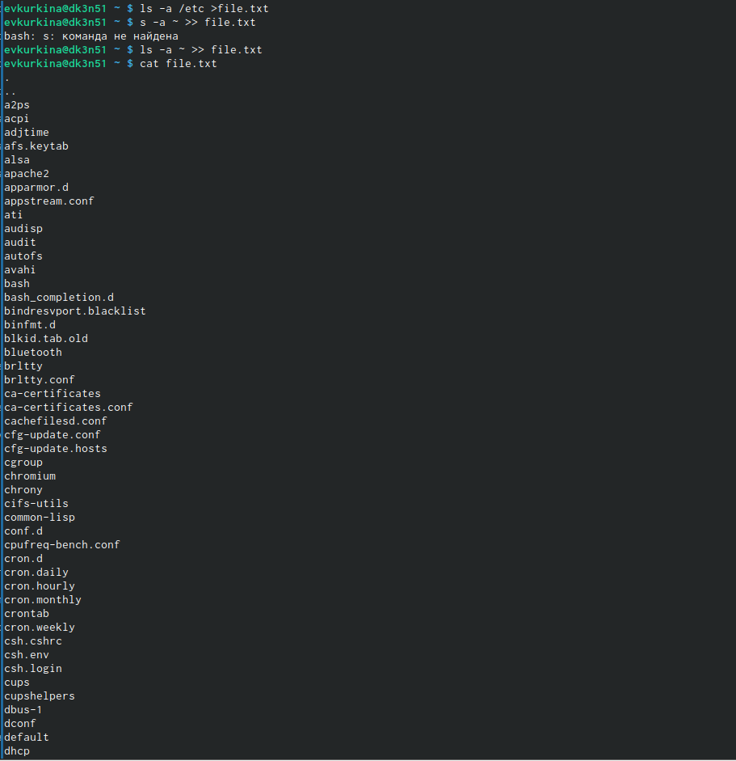{ #fig:001 width=70% }

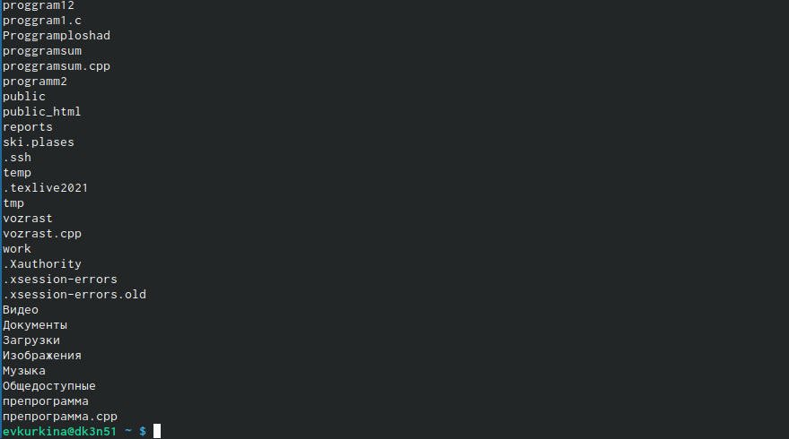{ #fig:002 width=70% }

3). Вывела имена всех файлов из file.txt,имеющих расширение.conf,после чего запишисала их в новый текстовой файл conf.txt.(рис. [-@fig:003])

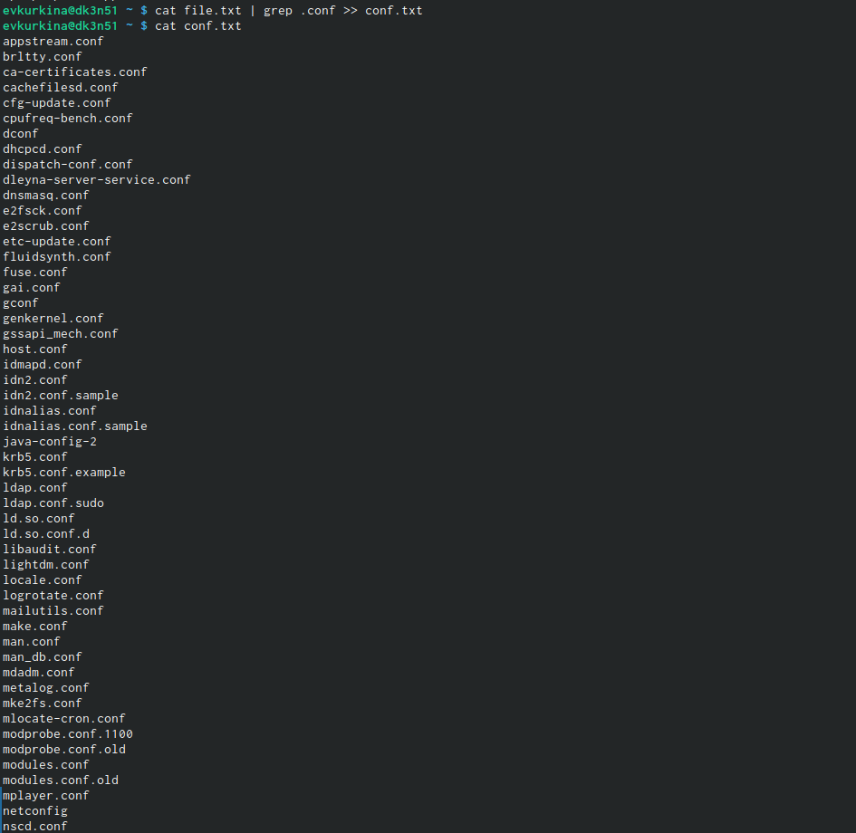{ #fig:003 width=70% }

4). Вывела на экран файлы, названия которые в моем домашнем каталоге начинаются с "C" (рис. [-@fig:004])

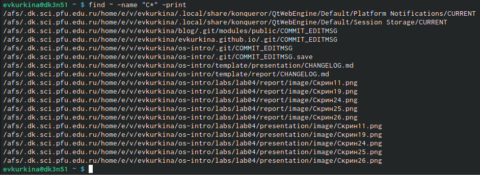{ #fig:004 width=70% }

5).Вывела на экран имена файлов из каталога etc, имена которых начнаются на h.(рис. [-@fig:005])

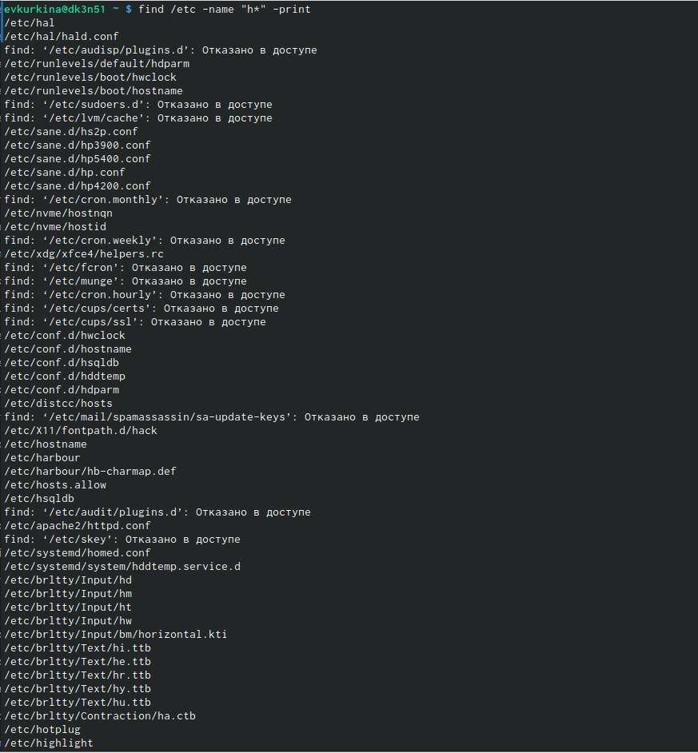{ #fig:005 width=70% }

6). Командой find / -name "log*" > logfile, запустила в фоновом режиме процесс, который записывает в файл logfile, файлы с именами на log.(рис. [-@fig:006])(рис. [-@fig:007])

{ #fig:006 width=70% }

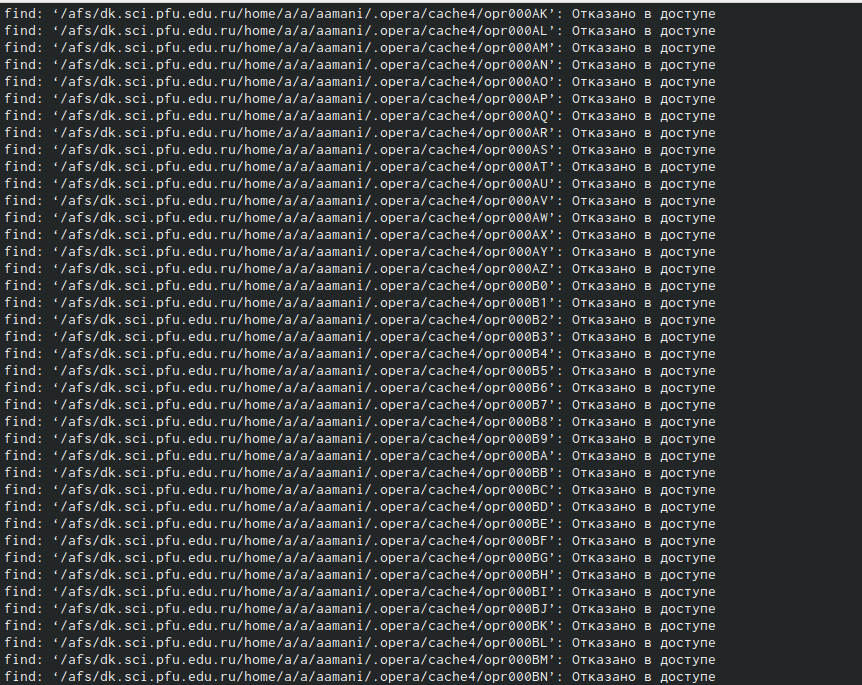{ #fig:007 width=70% }

7).Командой rm  удалила файл logfile.(рис. [-@fig:008]) 

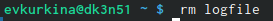{ #fig:008 width=70% }

8).Запускаю в фоновом режиме редактор gedit.(рис. [-@fig:009]) 

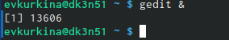{ #fig:009 width=70% }

9). Командой ps определила индетификатор процесса gedit, конвейер и фильтр grep.(рис. [-@fig:010])

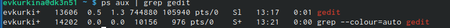{ #fig:010 width=70% } 

10). Прочитала справку команды kill (рис. [-@fig:011]),а после завершила процесс git.(рис. [-@fig:012])

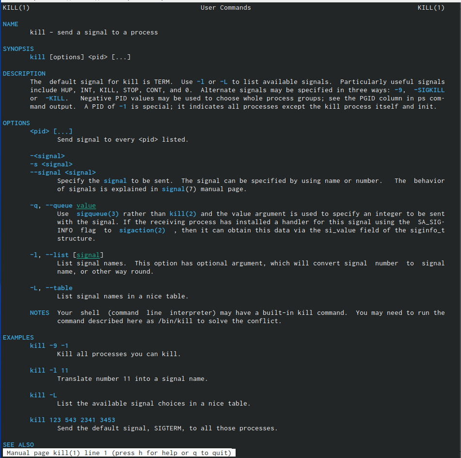{ #fig:011 width=70% } 

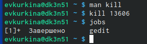{ #fig:012 width=70% } 

11). Получила справку по командам df du (рис. [-@fig:013]) (рис. [-@fig:014]), а затем выполнила их.(рис. [-@fig:015])(рис. [-@fig:016]) (рис. [-@fig:017]).

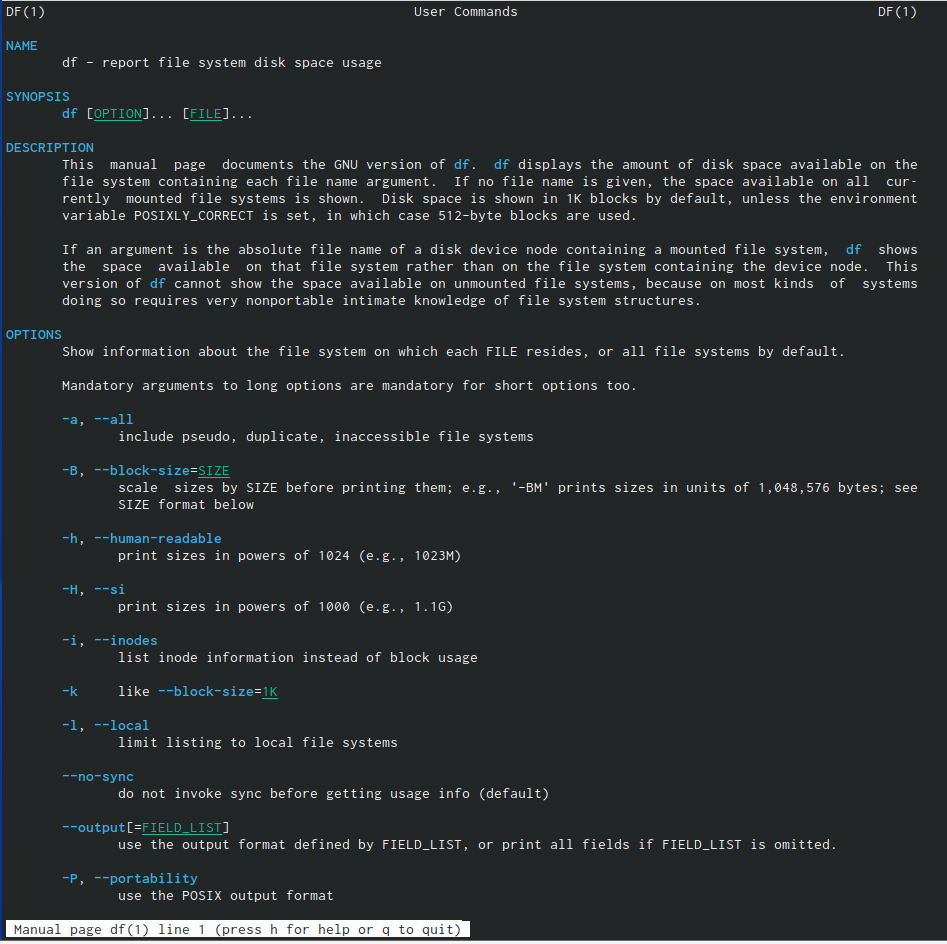{ #fig:013 width=70% } 

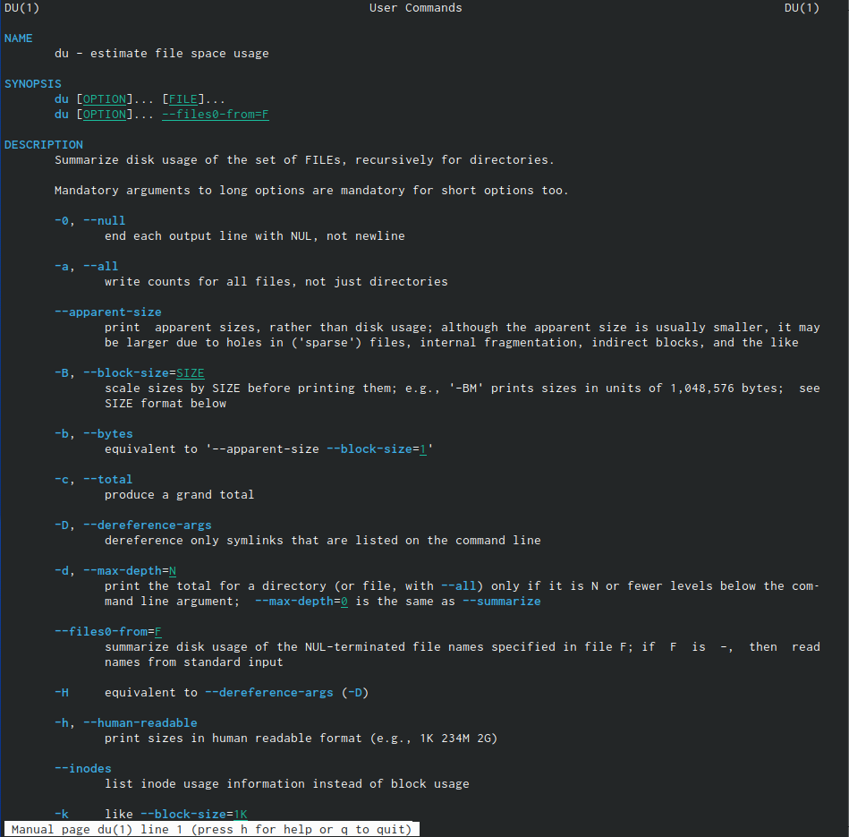{ #fig:014 width=70% } 

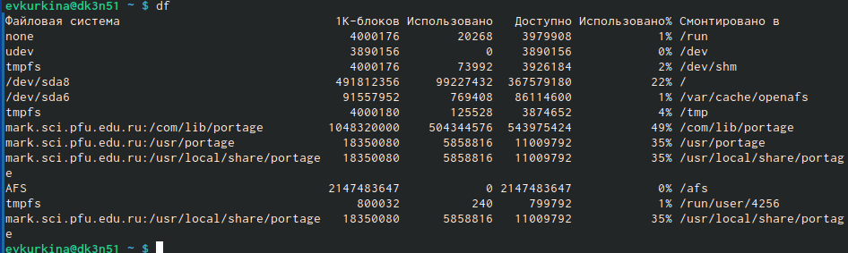{ #fig:015 width=70% } 

{ #fig:016 width=70% } 

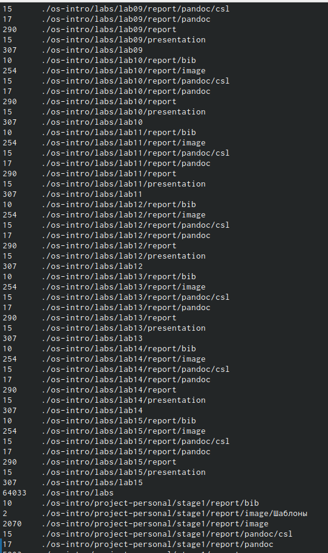{ #fig:017 width=70% } 

12).Прочитала справку команды find (рис. [-@fig:018]), вывела имена всех директорий, которые имеютсяв домашнем каталоге. (рис. [-@fig:019]).(рис. [-@fig:020]).

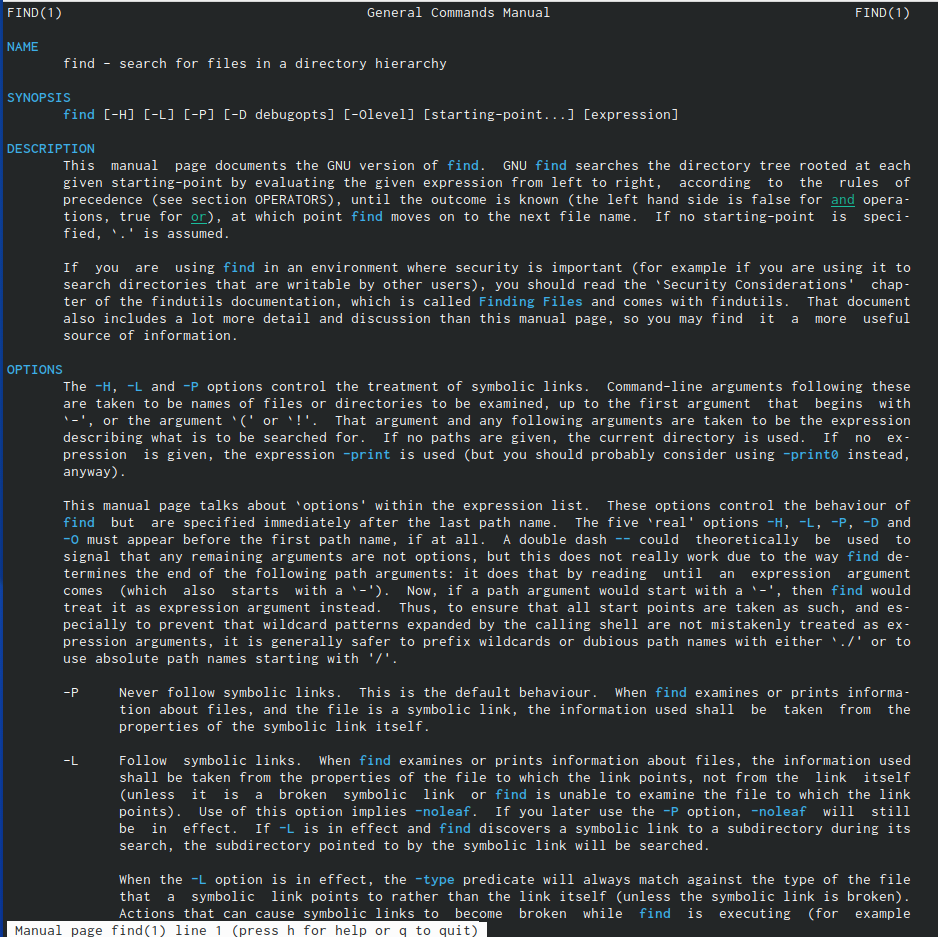{ #fig:018 width=70% } 

{ #fig:019 width=70% } 

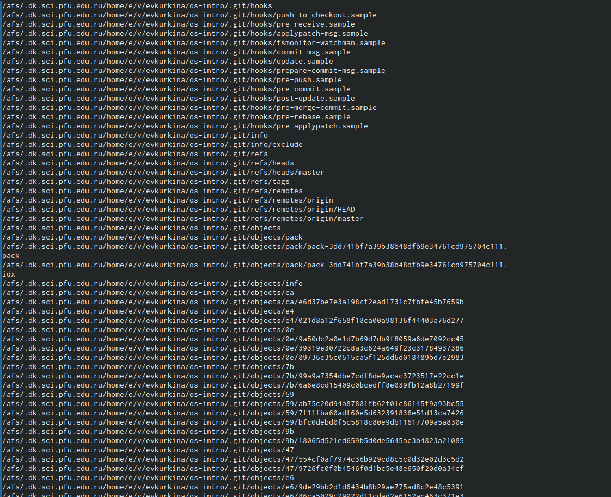{ #fig:020 width=70% } 

13)Ответы на контрольные вопросы:

13.1). В системе по умолчанию открыто три специальных потока:

–stdin − стандартный поток ввода (по умолчанию: клавиатура), файловый дескриптор 0;

–stdout − стандартный поток вывода (по умолчанию: консоль), файловый дескриптор 1;

-stderr − стандартный поток вывод сообщений об ошибках (поумолчанию: консоль), файловый дескриптор 2.

Большинство используемых в консоли команд и программ записывают результаты своей работы в стандартный поток вывода stdout.

13.2). '>' Перенаправление вывода в файл

'»' Перенаправление вывода в файл и открытие файла в режиме добавления (данные добавляются в конец файла)/

13.3). Конвейер (pipe) служит для объединения простых команд или утилит в цепочки, в которых результат работы предыдущей команды передаётся последующей.

Синтаксис следующий:

команда1|команда2 (это означает, что вывод команды 1 передастся на ввод команде 2)

13.4). Процесс рассматривается операционной системой как заявка на потребление всех видов ресурсов, кроме одного − процессорного времени. Этот последний важнейший ресурс распределяется операционной системой между другими единицами работы − потоками, которые и получили свое название благодаря тому, что они представляют собой последовательности (потоки выполнения) команд.

Процесс − это выполнение программы. Он считается активной сущностью и реализует действия, указанные в программе.

Программа представляет собой статический набор команд, а процесс это набор ресурсов и данных, использующихся при выполнении программы.

13.5). pid: идентификатор процесса (PID) процесса (processID), к которому вызывают метод

gid: идентификатор группы UNIX, в котором работает программа.

13.6). Любую выполняющуюся в консоли команду или внешнюю программу можно запустить в фоновом режиме. Для этого следует в конце имени команды указать знак амперсанда &.

Запущенные фоном программы называются задачами (jobs). Ими можно управлять с помощью команды jobs, которая выводит список запущенных в данный момент задач.

13.7). top − это консольная программа, которая показывает список работающих процессов в системе. Программа в реальном времени отсортирует запущенные процессы по их нагрузке на процессор.

htop − это продвинутый консольный мониторинг процессов. Утилита выводит постоянно меняющийся список системных процессов, который сортируется в зависимости от нагрузки на ЦПУ. Если делать сравнение сtop, то htop показывает абсолютно все процессы в системе, время их непрерывного использования, загрузку процессоров и расход оперативной памяти.

13.8). find − это команда для поиска файлов и каталогов на основе специальных условий. Ее можно использовать в различных обстоятельствах, например, для поиска файлов по разрешениям, владельцам, группам, типу, размеру и другим подобным критериям.

Команда find имеет такой синтаксис:

find[папка][параметры] критерий шаблон [действие]

Папка − каталог в котором будем искать

Параметры − дополнительные параметры, например, глубина поиска, и т д.

Критерий − по какому критерию будем искать: имя, дата создания, права, владелец и т д.

Шаблон – непосредственно значение по которому будем отбирать файлы.

Основные параметры:

-P никогда не открывать символические ссылки

-L - получает информацию о файлах по символическим ссылкам. Важно для дальнейшей обработки, чтобы обрабатывалась не ссылка, а сам файл.

-maxdepth - максимальная глубина поиска по подкаталогам,для поиска только в текущем каталоге установите 1.

-depth - искать сначала в текущем каталоге, а потом в подкаталогах

-mount искать файлы только в этой файловой системе.

-version - показать версию утилиты find

-print - выводить полные имена файлов

-typef - искать только файлы

-typed - поиск папки в Linux

Основные критерии:

-name - поиск файлов по имени

-perm - поиск файлов в Linux по режиму доступа

-user - поиск файлов по владельцу

-group - поиск по группе

-mtime - поиск по времени модификации файла

-atime - поиск файлов по дате последнего чтения

-nogroup - поиск файлов, не принадлежащих ни одной группе

-nouser - поиск файлов без владельцев

-newer - найти файлы новее чем указанный

-size - поиск файлов в Linux по их размеру

Примеры:

find~ -type d поиск директорий в домашнем каталоге

find~ -type f -name ".*" поиск скрытых файлов в домашнем каталоге

13.9). Файл по его содержимому можно найти с помощью команды grep: «grep -r" слово/выражение, которое нужно найти"».

13.10). Утилита df, позволяет проанализировать свободное пространство на всех подключенных к системе разделах.

13.11). При выполнении команды du (без указания папки и опции) можно получить все файлы и папки текущей директории с их размерами. Для домашнего каталога: du ~/

13.12). Основные сигналы (каждый сигнал имеет свой номер), которые используются для завершения процесса:

    SIGINT–самый безобидный сигнал завершения, означает Interrupt. Он отправляется процессу, запущенному из терминала с помощью сочетания клавиш Ctrl+C. Процесс правильно завершает все свои действия и возвращает управление;

    SIGQUIT–это еще один сигнал, который отправляется с помощью сочетания клавиш, программе, запущенной в терминале. Он сообщает ей что нужно завершиться и программа может выполнить корректное завершение или проигнорировать сигнал. В отличие от предыдущего, она генерирует дамп памяти. Сочетание клавиш Ctrl+/;

    SIGHUP–сообщает процессу, что соединение с управляющим терминалом разорвано, отправляется, в основном, системой при разрыве соединения с интернетом;

    SIGTERM–немедленно завершает процесс, но обрабатывается программой, поэтому позволяет ей завершить дочерние процессы и освободить все ресурсы;

    SIGKILL–тоже немедленно завершает процесс, но, в отличие от предыдущего варианта, он не передается самому процессу, а обрабатывается ядром. Поэтому ресурсы и дочерние процессы остаются запущенными.

Также для передачи сигналов процессам в Linux используется утилита kill, её синтаксис: kill [-сигнал] [pid_процесса] (PID – уникальный идентификатор процесса). Сигнал представляет собой один из выше перечисленных сигналов для завершения процесса.

Перед тем, как выполнить остановку процесса, нужно определить его PID. Для этого используют команды ps и grep. Команда ps предназначена для вывода списка активных процессов в системе и информации о них. Команда grep запускается одновременно с ps (вканале) и будет выполнять поиск по результатам команды ps.

Утилита pkill – это оболочка для kill, она ведет себя точно так же, и имеет тот же синтаксис, только в качестве идентификатора процесса ей нужно передать ег оимя.

killall работает аналогично двум предыдущим утилитам. Она тоже принимает имя процесса в качестве параметра и ищет его PID в директории /proc. Но эта утилита обнаружит все процессы с таким именем и завершит их.

# Выводы

Во время выполнения данной лабораторной работы, я ознакомилась с инструментами пойска фалов и фильтрации текстовых данных, пробрела практические навыки по управлению процессами по проверке использования диска и обслуживанию файловых систем.

# Список литературы{.unnumbered}

::: {#refs}
:::
