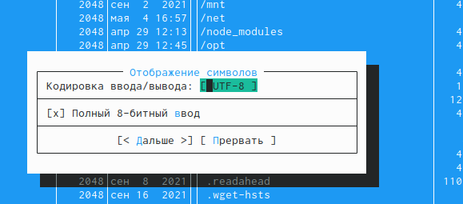

---
## Front matter
lang: ru-RU
title: Лабораторная работа 7 
author: |
	Куркина Евгения Вячеславовна
	
institute: |
	\inst{1}RUDN University, Moscow, Russian Federation
	
## Formatting
toc: false
slide_level: 2
theme: metropolis
header-includes: 
 - \metroset{progressbar=frametitle,sectionpage=progressbar,numbering=fraction}
 - '\makeatletter'
 - '\beamer@ignorenonframefalse'
 - '\makeatother'
aspectratio: 43
section-titles: true
---

# Лабораторная работа 7 

## Цель работы

Цель данной лабораторной работы --- Освоить основные возможности командной оболочки  Midnight Commander.Приобрести навыки практической работы по просмотру каталогов и файлов, манипуляций с ними.

## Шаг 1

- 1)Командой man получила информацию о mc.(рис. [-@fig:001])(рис. [-@fig:002])

{ #fig:001 width=40% }

{ #fig:002 width=40% }

## Шаг 2

- 2)Запустила mc из командной строки и изучила его структуру и меню. (ход показан на скриншотах).(рис. [-@fig:003])(рис. [-@fig:004])(рис. [-@fig:005])(рис. [-@fig:006])(рис. [-@fig:007])(рис. [-@fig:008])(рис. [-@fig:009])

{ #fig:003 width=40% }

{ #fig:004 width=40% }

## шаг 2.2

{ #fig:005 width=40% }

{ #fig:006 width=40% }

## Шаг 2.3

{ #fig:007 width=30% }

{ #fig:008 width=30% }

{ #fig:009 width=30% }

## Шаг 3

- Выполнила несколько операций в mc, используя управляющие клавиши.Выделилаи отменила выделение файлов (рис. [-@fig:0010])(рис. [-@fig:011]),копировала и переместила файл (рис. [-@fig:012])(рис. [-@fig:013]),получила необходимую информацию о размере и правах доступа (рис. [-@fig:014])(рис. [-@fig:015])(рис. [-@fig:016])(рис. [-@fig:017])(рис. [-@fig:018])(рис. [-@fig:019])

{ #fig:010 width=40% }

{ #fig:011 width=40% }

## Шаг 3.2

{ #fig:012 width=40% }

{ #fig:013 width=40% }

## Шаг 3.3

{ #fig:014 width=40% }

{ #fig:015 width=40% }

## шаг 3.4
{ #fig:016 width=40% }

{ #fig:017 width=40% }

## Шаг 3.5

{ #fig:018 width=40% }

{ #fig:019 width=40% }

## Шаг 4

- Выполнила основные команды правой панели.(рис. [-@fig:020])(рис. [-@fig:021])(рис. [-@fig:022])(рис. [-@fig:023])(рис. [-@fig:024])(рис. [-@fig:025])

{ #fig:020 width=40% }

{ #fig:021 width=40% }

## Шаг 4.2

{ #fig:022 width=40% }

{ #fig:023 width=40% }

## Шаг 4.3

{ #fig:024 width=40% }

{ #fig:025 width=40% }

## Шаг 5

- Используя возможности подменю файл, просмотрела содержимое текстового файла(рис. [-@fig:026])(рис. [-@fig:027]),редактировала содержимое файла, безх сохранения(рис. [-@fig:028])(рис. [-@fig:029])(рис. [-@fig:030]),создала каталог(рис. [-@fig:031])(рис. [-@fig:032])(рис. [-@fig:033]),копировала файл в созданный каталог (рис. [-@fig:034]).

{ #fig:026 width=40% }

{ #fig:027 width=40% }

## Шаг 5.2

{ #fig:028 width=40% }

{ #fig:029 width=40% }

## Шаг 5.3

{ #fig:030 width=40% }

{ #fig:031 width=40% }

## Шаг 5.4

{ #fig:032 width=30% }

{ #fig:033 width=30% }

{ #fig:034 width=30% }

## Шаг 6

- С помощью средств подменю Команда осущиствила поиск в файловой системе с раширением .с  (рис. [-@fig:035])(рис. [-@fig:036]) (рис. [-@fig:037]),повторила одну из предыдущих команд, перешла в домашний каталог (рис. [-@fig:038]) (рис. [-@fig:039]),провела анализ файла меню и файла расширений (рис. [-@fig:040]) (рис. [-@fig:041]) (рис. [-@fig:042]).

{ #fig:035 width=40% }

{ #fig:036 width=40% }

## Шаг 6.2

{ #fig:037 width=40% }

{ #fig:038 width=40% }

## Шаг 6.3
{ #fig:039 width=40% }

{ #fig:040 width=40% }

## Шаг 6.4
{ #fig:041 width=40% }

{ #fig:042 width=40% }

## Шаг 7

- Вызвала подменю Настройки, проделала операции, определяющие структура экрана mc.(рис. [-@fig:043])(рис. [-@fig:044])(рис. [-@fig:045])(рис. [-@fig:046])(рис. [-@fig:047])(рис. [-@fig:048])(рис. [-@fig:049])(рис. [-@fig:050])(рис. [-@fig:051])(рис. [-@fig:052]).

{ #fig:043 width=30% }

{ #fig:044 width=30% }

{ #fig:045 width=30% }

## Шаг 7.2
{ #fig:046 width=30% }

{ #fig:047 width=30% }

{ #fig:048 width=30% }

## Шаг 7.3
{ #fig:049 width=30% }

{ #fig:050 width=30% }

{ #fig:051 width=30% }

## Шаг 7.4

{ #fig:052 width=70% }

## Шаг 8
Создала текстовый файл text.txt.(рис. [-@fig:053])

{ #fig:053 width=70% }

## Шаг 9

Открыла его с помощью mc.(рис. [-@fig:054])

{ #fig:054 width=70% }

## Шаг 10

Вставила небольшой фрагмент текста в файл.(рис. [-@fig:055])

{ #fig:055 width=70% }

## Шаг 11
Удалила строку текста (рис. [-@fig:056]),выделила фрагмент текста и скопировала его на новую строку,(рис. [-@fig:057]), перенесла текст на новую строку(рис. [-@fig:058]),отменила последнее действие(рис. [-@fig:059]),сохранила файл(рис. [-@fig:060]),добавила текст в начало и конец файла (рис. [-@fig:061])(рис. [-@fig:062]), сохранила и закрыла файл.

{ #fig:056 width=40% }

{ #fig:057 width=40% }

## Шаг 11.2
{ #fig:058 width=30% }

{ #fig:059 width=30% }

{ #fig:060 width=30% }

## Шаг 11.3
{ #fig:061 width=40% }

{ #fig:062 width=40% }

## Шаг 12

12)Использовала меню редактора, чтобы выключить подстветку синтаксиса.(рис. [-@fig:063])(рис. [-@fig:064])

{ #fig:063 width=40% }

{ #fig:064 width=40% }

## Вывод
Во время выполнения данной лабораторной работы я освоила основные возможности командной оболочки Midnight Commander,приобрела навыки работы по просмотру каталогов и файлов.

## {.standout}

