---
## Front matter
lang: ru-RU
title: Лабораторная работа 8 
author: |
	Куркина Евгения Вячеславовна
institute: |
	\inst{1}RUDN University, Moscow, Russian Federation
	

## Formatting
toc: false
slide_level: 2
theme: metropolis
header-includes: 
 - \metroset{progressbar=frametitle,sectionpage=progressbar,numbering=fraction}
 - '\makeatletter'
 - '\beamer@ignorenonframefalse'
 - '\makeatother'
aspectratio: 43
section-titles: true
---

# Лабораторная работа 8 

## Цель работы

- Цель данной лабораторной работы--- Познакомиться с операционной системой Linux, получить практические навыки работы с редактором vi.

## Шаг 1

Создала каталог с именем ~/work/os/lab06.Перешла в только что созданный каталог и вызвала vi для создания файла hello.sh.(рис. [-@fig:001])

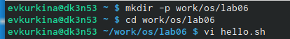{ #fig:001 width=70% }

## Шаг 2

Нажала клавишу "i", перешла в режм вставка и ввела необходимый текст.(рис. [-@fig:002])

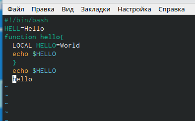{ #fig:002 width=70% }

## Шаг 3

Нажала "Esc" для перехода в командный режим, затем нажала ":", перешла в режим последней строки и получила преглашение в виде двоеточия.(рис. [-@fig:003])

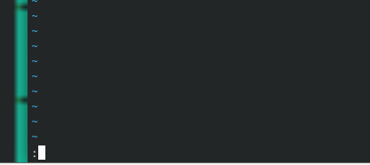{ #fig:003 width=70% }

## Шаг 4

 Ввела "w" для записи и  "q" для выхода, затем "Enter" для сохранения текста и завершения работы.(рис. [-@fig:004])

{ #fig:004 width=70% }

## Шаг 5

Сделала файл исполняемым, с помощью команды:chmod +x hello.sh.(рис. [-@fig:005])

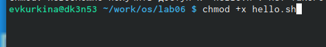{ #fig:005 width=70% }

## Шаг 6

Вызвала vi на редактирование файла командой vi ~/work/os/lab06/hello.sh.(рис. [-@fig:006])

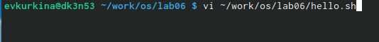{ #fig:006 width=70% }

## Шаг 7

Установила курсор в конец слова HELL второй строки.(рис. [-@fig:007])

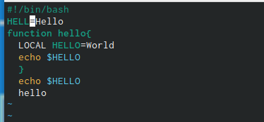{ #fig:007 width=70% }

## Шаг 8

Перешла в режим вставки и заменила на HELLO, вышла в командный режим.(рис. [-@fig:008])

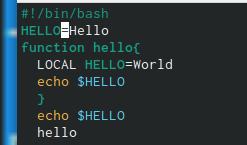{ #fig:008 width=70% }

## Шаг 9

Установила курсор на четвертуюстроку и удалила слово LOCAL.(рис. [-@fig:009])

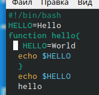{ #fig:009 width=70% }

## Шаг 10

Перешла в режим вставки, ввела слово local, вернулась в командный режим.(рис. [-@fig:010])

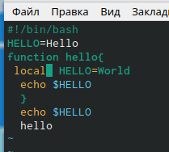{ #fig:010 width=70% }

## Шаг 11

Установила курсорна последней строке файла.Вставила после неё строку:echo $HELLO.(рис. [-@fig:011])

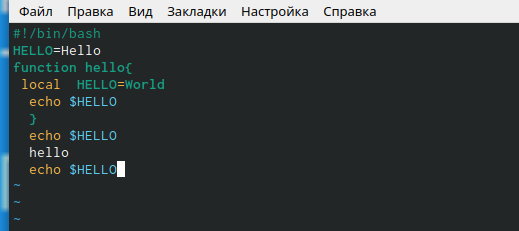{ #fig:011 width=70% }

## Шаг 12

Удалила последнюю строку.(рис. [-@fig:012])

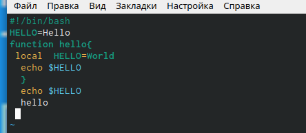{ #fig:012 width=70% }

## Шаг 13

Ввела команду u и отменила последнее действие, затем записала и сохранила файл.(рис. [-@fig:013])

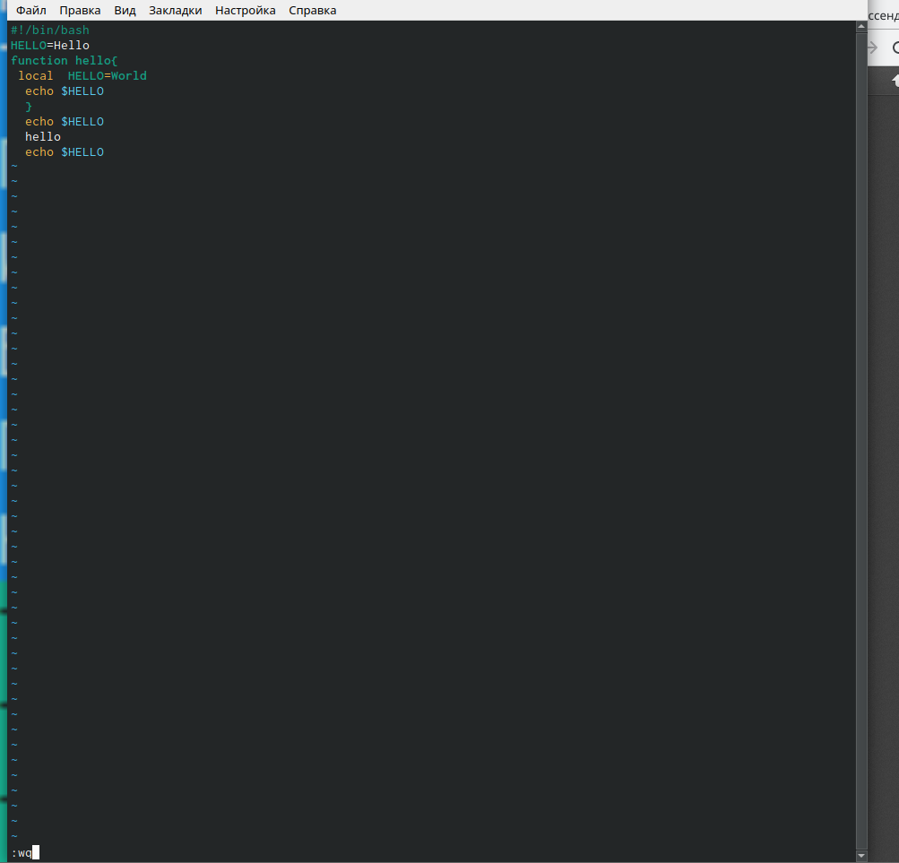{ #fig:013 width=70% }

## Вывод

Во время выполнения данной лабораторной работы, я познакомилась с операционной системой Linux, получила практические навыки работы с редактором vi.

## {.standout}

