---
## Front matter
title: "Отчет лабораторной работы 8"
subtitle: "Лабораторная работа 8"
author: "Куркина Евгения Вячеславовна"

## Generic otions
lang: ru-RU
toc-title: "Содержание"

## Bibliography
bibliography: bib/cite.bib
csl: pandoc/csl/gost-r-7-0-5-2008-numeric.csl

## Pdf output format
toc: true # Table of contents
toc-depth: 2
lof: true # List of figures
lot: true # List of tables
fontsize: 12pt
linestretch: 1.5
papersize: a4
documentclass: scrreprt
## I18n polyglossia
polyglossia-lang:
  name: russian
  options:
	- spelling=modern
	- babelshorthands=true
polyglossia-otherlangs:
  name: english
## I18n babel
babel-lang: russian
babel-otherlangs: english
## Fonts
mainfont: PT Serif
romanfont: PT Serif
sansfont: PT Sans
monofont: PT Mono
mainfontoptions: Ligatures=TeX
romanfontoptions: Ligatures=TeX
sansfontoptions: Ligatures=TeX,Scale=MatchLowercase
monofontoptions: Scale=MatchLowercase,Scale=0.9
## Biblatex
biblatex: true
biblio-style: "gost-numeric"
biblatexoptions:
  - parentracker=true
  - backend=biber
  - hyperref=auto
  - language=auto
  - autolang=other*
  - citestyle=gost-numeric
## Pandoc-crossref LaTeX customization
figureTitle: "Рис."
tableTitle: "Таблица"
listingTitle: "Листинг"
lofTitle: "Список иллюстраций"
lotTitle: "Список таблиц"
lolTitle: "Листинги"
## Misc options
indent: true
header-includes:
  - \usepackage{indentfirst}
  - \usepackage{float} # keep figures where there are in the text
  - \floatplacement{figure}{H} # keep figures where there are in the text
---

# Цель работы

Здесь приводится формулировка цели лабораторной работы. Формулировки
цели для каждой лабораторной работы приведены в методических
указаниях.

Цель данной лабораторной работы--- Познакомиться с операционной системой Linux, получить практические навыки работы с редактором vi.

# Задание

Выполнить 2 задания 

# Выполнение лабораторной работы

1) Создала каталог с именем ~/work/os/lab06.Перешла в только что созданный каталог и вызвала vi для создания файла hello.sh.(рис. [-@fig:001])

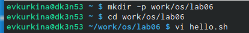{ #fig:001 width=70% }

2)Нажала клавишу "i", перешла в режм вставка и ввела необходимый текст.(рис. [-@fig:002])

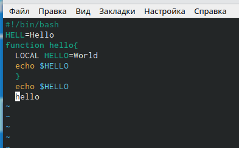{ #fig:002 width=70% }

3)Нажала "Esc" для перехода в командный режим, затем нажала ":", перешла в режим последней строки и получила преглашение в виде двоеточия.(рис. [-@fig:003])

{ #fig:003 width=70% }

4) Ввела "w" для записи и  "q" для выхода, затем "Enter" для сохранения текста и завершения работы.(рис. [-@fig:004])

{ #fig:004 width=70% }

5) Сделала файл исполняемым, с помощью команды:chmod +x hello.sh.(рис. [-@fig:005])

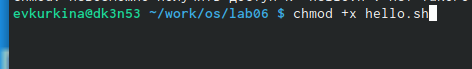{ #fig:005 width=70% }

6) Вызвала vi на редактирование файла командой vi ~/work/os/lab06/hello.sh.(рис. [-@fig:006])

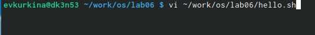{ #fig:006 width=70% }

7) Установила курсор в конец слова HELL второй строки.(рис. [-@fig:007])

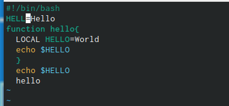{ #fig:007 width=70% }

8) Перешла в режим вставки и заменила на HELLO, вышла в командный режим.(рис. [-@fig:008])

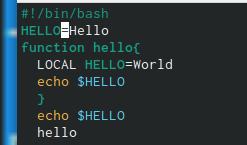{ #fig:008 width=70% }

9) Установила курсор на четвертуюстроку и удалила слово LOCAL.(рис. [-@fig:009])

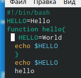{ #fig:009 width=70% }

10) Перешла в режим вставки, ввела слово local, вернулась в командный режим.(рис. [-@fig:010])

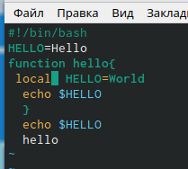{ #fig:010 width=70% }

11)Установила курсорна последней строке файла.Вставила после неё строку:echo $HELLO.(рис. [-@fig:011])

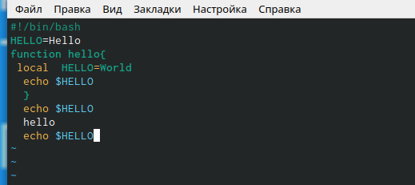{ #fig:011 width=70% }

12) Удалила последнюю строку.(рис. [-@fig:012])

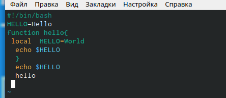{ #fig:012 width=70% }

13)Ввела команду u и отменила последнее действие, затем записала и сохранила файл.(рис. [-@fig:013])

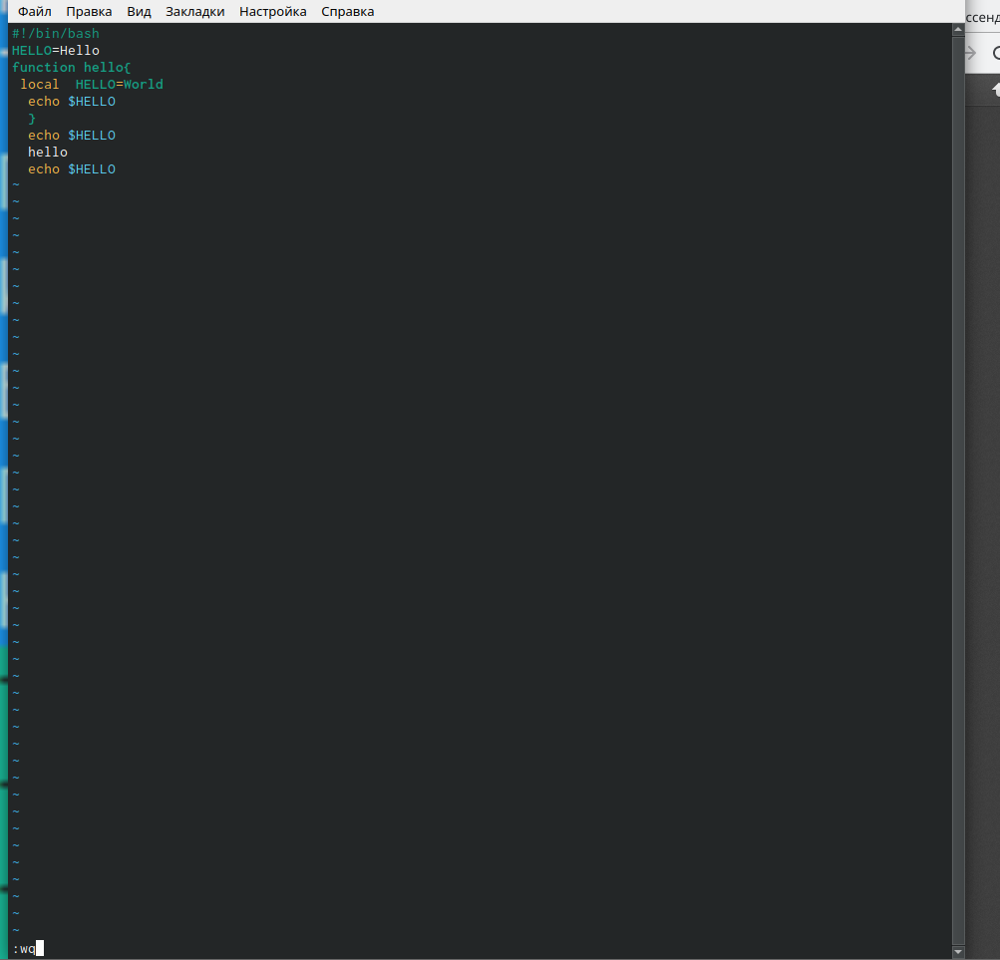{ #fig:013 width=70% }

# Выводы

Во время выполнения данной лабораторной работы, я познакомилась с операционной системой Linux, получила практические навыки работы с редактором vi.

# Список литературы{.unnumbered}

::: {#refs}
:::
