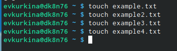

---
## Front matter
lang: ru-RU
title: Презентация по 9 лабораторной работе
author: |
	Куркина Евгения Вячеславовна
institute: |
	\inst{1}RUDN University, Moscow, Russian Federation
	

## Formatting
toc: false
slide_level: 2
theme: metropolis
header-includes: 
 - \metroset{progressbar=frametitle,sectionpage=progressbar,numbering=fraction}
 - '\makeatletter'
 - '\beamer@ignorenonframefalse'
 - '\makeatother'
aspectratio: 43
section-titles: true
---

# Цель работы
- Цель данной лабораторной работы--- Познакомиться с операционной системой Linux.Получить практические навыки работы с редактором Emacs.

## Задания

1)Ознакомиться стеоретическим материалом.
2).Ознакомиться с редактором emacs.
3). Выполнить упражнения.
4). Ответить на контрольные вопросы

## Шаг 1

Открыла emacs(рис. [-@fig:001])

{ #fig:001 width=70% }

## Шаг 2 и 3

Создала файл lab07.sh с помощью комбинации(C-x C-f).(рис. [-@fig:002]) Набрала необходимый текст (рис. [-@fig:003])

{ #fig:002 width=40% }

{ #fig:003 width=40% }

## шаг 4 и 5

Сохранила файл с помощью комбинации(C-x C-s).(рис. [-@fig:004]) Вырезала 4ую строку (С-k).(рис. [-@fig:005])

{ #fig:004 width=40% }

{ #fig:005 width=40% }

## Шаг 6 и 7

Вставила даную строку в конец файла (C-y).(рис. [-@fig:006])Выделила область текста(C-space).(рис. [-@fig:007])

{ #fig:006 width=40% }

{ #fig:007 width=40% }

## Шаг 8 и 9

Скопировала область в буфер обмена и вставила ее в конец файла.(рис. [-@fig:008])Выделила эту же область и выразела ее.(рис. [-@fig:009])

{ #fig:008 width=40% }

{ #fig:009 width=40% }

## Шаг 10 

Отменила последнее действие (рис. [-@fig:010])

{ #fig:010 width=70% }

## Шаг 11

Командами:(C-a),(C-e),(M-<),(M->). Премещала курс в начало и конец строки, начало и конец буфера.(рис. [-@fig:011])(рис. [-@fig:012])

{ #fig:011 width=40% }

{ #fig:012 width=40% }

## Шаг 12 и 13

Вывела список активных буферов на экран  (C-x C-b).(рис. [-@fig:013])
Переместилась на вновь открытое окно о списком открытых буферов и переключилась на другой буфер.(рис. [-@fig:014])

{ #fig:013 width=70% }

{ #fig:014 width=70% }

## шаг 14

После снова переключилась между буферами,но уже без вывода их списка наэкран (C-x b).(рис. [-@fig:015])

{ #fig:015 width=70% }

## Шаг 15

Поделила фрейм на 4 части, снчала на 2 окна по вертикали, а затем каждое на 2 окна по горизонтали(рис. [-@fig:016])(рис. [-@fig:017])

{ #fig:016 width=40% }

{ #fig:017 width=40% }

## Шаг 16

Создала файлы через консоль,затем в каждыйх из 4ех окон открыла новый файл и ввела в них несколько строк.(рис. [-@fig:018])

{ #fig:018 width=70% }

## Шаг 17

Перешла в режим поиска и нашла несколько слов, которые находтся в тексте, затем переключилась между результатами поиска.(рис. [-@fig:019])(рис. [-@fig:020])(рис. [-@fig:021])

{ #fig:019 width=30% }

{ #fig:020 width=30% }

{ #fig:021 width=30% }

## Шаг 18

Вышла из режима поиска.(рис. [-@fig:022])

{ #fig:022 width=70% }

## шаг 19

19) Перешла в режим замены, и заменила сочетание букв на слова.(рис. [-@fig:023])(рис. [-@fig:024])

{ #fig:023 width=40% }

{ #fig:024 width=40% }

## Вывод

Во время данной лабораторной работы, я познакомилась с опперационной системой Linux. Получила практические навыки по работе с редактором Emacs.

## {.standout}

