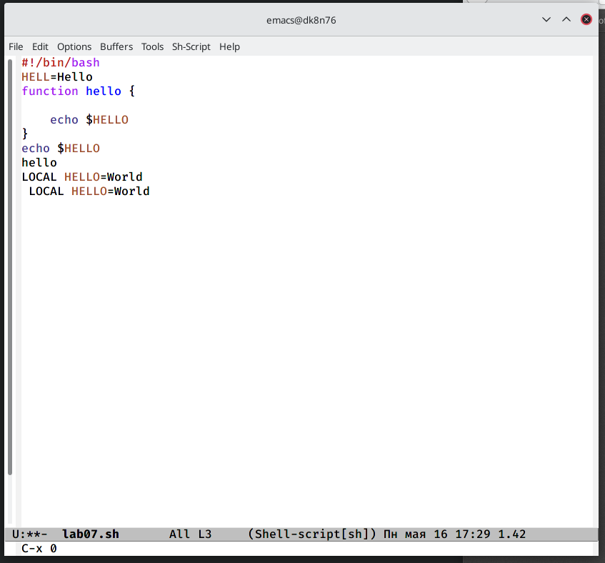

---
## Front matter
title: "Отчет по лабораторной работе 9"
subtitle: " Лабораторная работа 9"
author: "Куркина Евгения Вячеславовна"

## Generic otions
lang: ru-RU
toc-title: "Содержание"

## Bibliography
bibliography: bib/cite.bib
csl: pandoc/csl/gost-r-7-0-5-2008-numeric.csl

## Pdf output format
toc: true # Table of contents
toc-depth: 2
lof: true # List of figures
lot: true # List of tables
fontsize: 12pt
linestretch: 1.5
papersize: a4
documentclass: scrreprt
## I18n polyglossia
polyglossia-lang:
  name: russian
  options:
	- spelling=modern
	- babelshorthands=true
polyglossia-otherlangs:
  name: english
## I18n babel
babel-lang: russian
babel-otherlangs: english
## Fonts
mainfont: PT Serif
romanfont: PT Serif
sansfont: PT Sans
monofont: PT Mono
mainfontoptions: Ligatures=TeX
romanfontoptions: Ligatures=TeX
sansfontoptions: Ligatures=TeX,Scale=MatchLowercase
monofontoptions: Scale=MatchLowercase,Scale=0.9
## Biblatex
biblatex: true
biblio-style: "gost-numeric"
biblatexoptions:
  - parentracker=true
  - backend=biber
  - hyperref=auto
  - language=auto
  - autolang=other*
  - citestyle=gost-numeric
## Pandoc-crossref LaTeX customization
figureTitle: "Рис."
tableTitle: "Таблица"
listingTitle: "Листинг"
lofTitle: "Список иллюстраций"
lotTitle: "Список таблиц"
lolTitle: "Листинги"
## Misc options
indent: true
header-includes:
  - \usepackage{indentfirst}
  - \usepackage{float} # keep figures where there are in the text
  - \floatplacement{figure}{H} # keep figures where there are in the text
---

# Цель работы

Здесь приводится формулировка цели лабораторной работы. Формулировки
цели для каждой лабораторной работы приведены в методических
указаниях.

Цель данной лабораторной работы--- Познакомиться с операционной системой Linux.Получить практические навыки работы с редактором Emacs.

# Задание

1)Ознакомиться стеоретическим материалом.
2). Ознакомиться с редактором emacs.
3). Выполнить упражнения.
4). Ответить на контрольные вопросы

# Выполнение лабораторной работы

1)Открыла emacs(рис. [-@fig:001])

{ #fig:001 width=70% }

2)Создала файл lab07.sh с помощью комбинации(C-x C-f).(рис. [-@fig:002])

{ #fig:002 width=70% }

3)Набрала необходимый текст (рис. [-@fig:003])

{ #fig:003 width=70% }

4)Сохранила файл с помощью комбинации(C-x C-s).(рис. [-@fig:004])

{ #fig:004 width=70% }

5) Вырезала 4ую строку (С-k).(рис. [-@fig:005])

{ #fig:005 width=70% }

6)Вставила даную строку в конец файла (C-y).(рис. [-@fig:006])

{ #fig:006 width=70% }

7)Выделила область текста(C-space).(рис. [-@fig:007])

{ #fig:007 width=70% }

8) Скопировала область в буфер обмена и вставила ее в конец файла.(рис. [-@fig:008])

{ #fig:008 width=70% }

9)Выделила эту же область и выразела ее.(рис. [-@fig:009])

{ #fig:009 width=70% }

10) Отменила последнее действие (рис. [-@fig:010])

{ #fig:010 width=70% }

11) Командами:(C-a),(C-e),(M-<),(M->). Премещала курс в начало и конец строки, начало и конец буфера.(рис. [-@fig:011])(рис. [-@fig:012])

{ #fig:011 width=70% }

{ #fig:012 width=70% }

12) Вывела список активных буферов на экран  (C-x C-b).(рис. [-@fig:013])

{ #fig:013 width=70% }

13)Переместилась на вновь открытое окно о списком открытых буферов и переключилась на другой буфер.(рис. [-@fig:014])

{ #fig:014 width=70% }

14)После снова переключилась между буферами,но уже без вывода их списка наэкран (C-x b).(рис. [-@fig:015])

{ #fig:015 width=70% }

15)Поделила фрейм на 4 части, снчала на 2 окна по вертикали, а затем каждое на 2 окна по горизонтали(рис. [-@fig:016])(рис. [-@fig:017])

{ #fig:016 width=70% }

{ #fig:017 width=70% }

16) Создала файлы через консоль,затем в каждыйх из 4ех окон открыла новый файл и ввела в них несколько строк.(рис. [-@fig:018])

{ #fig:018 width=70% }

17)Перешла в режим поиска и нашла несколько слов, которые находтся в тексте, затем переключилась между результатами поиска.(рис. [-@fig:019])(рис. [-@fig:020])(рис. [-@fig:021])

{ #fig:019 width=70% }

{ #fig:020 width=70% }

{ #fig:021 width=70% }

18)Вышла из режима поиска.(рис. [-@fig:022])

{ #fig:022 width=70% }

19) Перешла в режим замены, и заменила сочетание букв на слова.(рис. [-@fig:023])(рис. [-@fig:024])

{ #fig:023 width=70% }

{ #fig:024 width=70% }

20)Ответы на контрольные вопросы:

1). Emacs − один из наиболее мощных и широко распространённых редакторов, используемых в мире Unix. По популярности он соперничает с редактором vi и его клонами. В зависимости от ситуации, Emacs может быть текстовым редактором; программой для чтения почты и новостей Usenet; интегрированной средой разработки (IDE); операционной системой и т.д.Всё это разнообразие достигается благодаря архитектуре Emacs, которая позволяет расширять возможности редактора при помощи языка Emacs Lisp. На языке C написаны лишь самые базовые и низкоуровневые части Emacs, включая полнофункциональный. интерпретатор языка Lisp. Таким образом, Emacs имеет встроенный язык программирования, который может использоваться для настройки, расширения и изменения поведения редактора. В действительности, большая часть того редактора, с которым пользователи Emacs работают в наши дни,написана на языке Lisp.

2). Основную трудность для новичков при освоенииданного редактора могутсоставлять большое количество команд, комбинаций клавиш, которые не получится все запомнить с первого раза и поэтоупридется часто обращаться к справочным материалам.

3). Буфер –это объект, представляющий собой текст. Если имеется несколько буферов, то редактировать можно только один. Обычно буфер считывает данные из файла или записывает в файл данные из буфера.Окно –это область экрана, отображающая буфер. При запуске редактора отображается одно окно, но при обращении к некоторым функциям могут открыться дополнительные окна. Окна Emacsи окна графической среды XWindow–разные вещи. Одно окно XWindowможет быть разбито на несколько окон в смысле Emacs, в каждом из которых отображается отдельный буфер.

4). Да, можно.

5). При запуске Emacsпо умолчанию создаются следующие буферы: «scratch»(буфер для несохраненного текста) «Messages»(журнал ошибок, включающий такжеинформацию, которая появляется в области EchoArea) «GNUEmacs»(справочный буфер о редакторе).

6). C-c |сначала, удерживая «ctrl»,нажимаю «c»,после –отпускаюобе клавишии нажимаю «|» C-cC-|сначала, удерживая «ctrl»,нажимаю «с», после –отпускаю обе клавиши и, удерживая «ctrl», нажимаю «|».

7). Чтобы поделить окно на две части необходимо воспользоваться комбинацией «Ctrl-x 3»(по вертикали) или «Ctrl-x 2» (по горизонтали).

8). Настройки Emacsхранятся в файле .emacs.

9). По умолчанию клавиша «←» удаляет символперед курсором, нов редакторе её можно переназначить. Для этого необхдимоизменить конфигурацию файла .emacs.

10). Более удобным я считаю редактор emacs, потому чтов нем проще открывать другие файлы, можно использовать сразу несколько окон, нет «Командногорежима», «Режима ввода», «Режима командной строки», которые являются немного непривычными и в какой-то степени неудобным.

# Выводы

Во время данной лабораторной работы, я познакомилась с опперационной системой Linux. Получила практические навыки по работе с редактором Emacs.

# Список литературы{.unnumbered}

::: {#refs}
:::
