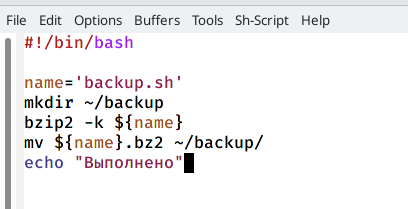
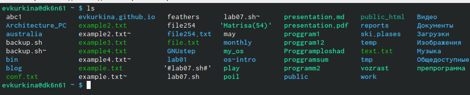

---
## Front matter
lang: ru-RU
title: Лабораторная работа 10
author: |
	Кукина Евгения Вячеславовна
institute: |
	\inst{1}RUDN University, Moscow, Russian Federation
	

## Formatting
toc: false
slide_level: 2
theme: metropolis
header-includes: 
 - \metroset{progressbar=frametitle,sectionpage=progressbar,numbering=fraction}
 - '\makeatletter'
 - '\beamer@ignorenonframefalse'
 - '\makeatother'
aspectratio: 43
section-titles: true
---

# Лабораторная работа 10

## Цель работы 

Цель данной лабораторной работы --- Изучить основы программирования в оболочке  OC UNIX/Linux. Научиться писать небольшие командные файлы.

## Шаг 1

Получила справки по командам zip bzip2 tar, с помощью команды man.(рис. [-@fig:001])(рис. [-@fig:002])(рис. [-@fig:003])(рис. [-@fig:004])

{ #fig:001 width=40% }

{ #fig:002 width=40% }

## Шаг 1.2

{ #fig:003 width=40% }

{ #fig:004 width=40% }

## Шаг 2

Создала файлы, в котором буду писать первый скрипт, назвала его backup.sh. Затем перешла в emacs(рис. [-@fig:005]), перешла в только что созданный файл(рис. [-@fig:006]).

{ #fig:005 width=70% }

{ #fig:006 width=70% }

## Шаг 2.2

Написала необходимый скрипт(рис. [-@fig:007]), затем сохранила его(рис. [-@fig:008]).

{ #fig:007 width=70% }

{ #fig:008 width=70% }

## Шаг 2.3

Перешла в консоль, дала право на выполнение, а после проверила работу скрипта. Убедились в том, что скрипт работает коректно.(рис. [-@fig:009])(рис. [-@fig:010])(рис. [-@fig:011])(рис. [-@fig:012]).

{ #fig:009 width=40% }

{ #fig:010 width=40% }

## Шаг 2.4

{ #fig:011 width=70% }

{ #fig:012 width=70% }

## Шаг 3

Создала новый файл с названием prog2.sh, для второго скрипта, запустила emacs (рис. [-@fig:013]). Перешла в созданный файл (рис. [-@fig:014]).

{ #fig:013 width=70% }

{ #fig:014 width=70% }

## Шаг 3.2

Ввела текст скрипта (рис. [-@fig:015]), сохранила файл (рис. [-@fig:016]).

{ #fig:015 width=70% }

{ #fig:016 width=70% }

## ДШаг 3.3

Затем проверила его наличие и дала права на выполнение (рис. [-@fig:017]), проверила работу скрипта(рис. [-@fig:018])(рис. [-@fig:019]).

{ #fig:017 width=30% }

{ #fig:018 width=30% }

## Шаг 3.4

Результат работы скрипта: 

{ #fig:019 width=70% }

## Шаг 4

Создала файл с названием progls.sh для третьего скрипта, открыла его в emacs(рис. [-@fig:020]). Написала командный файл, являющимся аналогом для команды ls, для вывода необходимой информации о нужном каталоге и возможностях доступа к файлам этого каталога(рис. [-@fig:021]).

{ #fig:020 width=40% }

{ #fig:021 width=40% }

## Шаг 4.2

Сохранила файл.Далее перешла в консоль, проверила наличие файла, дала права выполнения (рис. [-@fig:022]), убедилась в коректной работе скрипта(рис. [-@fig:023]).

{ #fig:022 width=40% }

{ #fig:023 width=40% }

## Шаг 5

Для последнего скрипта создала файл с названием format.sh(рис. [-@fig:024]). Перешла в emax, в созданный файл,написала скрипт, который получает на входе формт файла, а затем считает количество таких файлов в указанной директории (рис. [-@fig:025]).

{ #fig:024 width=40% }

{ #fig:025 width=40% }

## Шаг 5.2

Затем вернулась в консоль,дала права выполнения и проверила наличие, затем проверила исправную работу скрипта (рис. [-@fig:026]).

{ #fig:026 width=70% }

## Вывод

Во время выполнения данной лабораторной работы, я изучила основы программирования в оболчке OC UNIX/Linux, найчилась писать небольшие командные файлы.

## {.standout}

