---
## Front matter
title: "Отчет по лабораторной работе 10"
subtitle: "Лабораторная работа 10"
author: "Куркина Евгения Вячеславовна "

## Generic otions
lang: ru-RU
toc-title: "Содержание"

## Bibliography
bibliography: bib/cite.bib
csl: pandoc/csl/gost-r-7-0-5-2008-numeric.csl

## Pdf output format
toc: true # Table of contents
toc-depth: 2
lof: true # List of figures
lot: true # List of tables
fontsize: 12pt
linestretch: 1.5
papersize: a4
documentclass: scrreprt
## I18n polyglossia
polyglossia-lang:
  name: russian
  options:
	- spelling=modern
	- babelshorthands=true
polyglossia-otherlangs:
  name: english
## I18n babel
babel-lang: russian
babel-otherlangs: english
## Fonts
mainfont: PT Serif
romanfont: PT Serif
sansfont: PT Sans
monofont: PT Mono
mainfontoptions: Ligatures=TeX
romanfontoptions: Ligatures=TeX
sansfontoptions: Ligatures=TeX,Scale=MatchLowercase
monofontoptions: Scale=MatchLowercase,Scale=0.9
## Biblatex
biblatex: true
biblio-style: "gost-numeric"
biblatexoptions:
  - parentracker=true
  - backend=biber
  - hyperref=auto
  - language=auto
  - autolang=other*
  - citestyle=gost-numeric
## Pandoc-crossref LaTeX customization
figureTitle: "Рис."
tableTitle: "Таблица"
listingTitle: "Листинг"
lofTitle: "Список иллюстраций"
lotTitle: "Список таблиц"
lolTitle: "Листинги"
## Misc options
indent: true
header-includes:
  - \usepackage{indentfirst}
  - \usepackage{float} # keep figures where there are in the text
  - \floatplacement{figure}{H} # keep figures where there are in the text
---

# Цель работы

Здесь приводится формулировка цели лабораторной работы. Формулировки
цели для каждой лабораторной работы приведены в методических
указаниях.

Цель данной лабораторной работы --- Изучить основы программирования в оболочке  OC UNIX/Linux. Научиться писать небольшие командные файлы.
# Задание

Здесь приводится описание задания в соответствии с рекомендациями
методического пособия и выданным вариантом.

# Выполнение лабораторной работы

1) Получила справки по командам zip bzip2 tar, с помощью команды man.(рис. [-@fig:001])(рис. [-@fig:002])(рис. [-@fig:003])(рис. [-@fig:004])

{ #fig:001 width=70% }

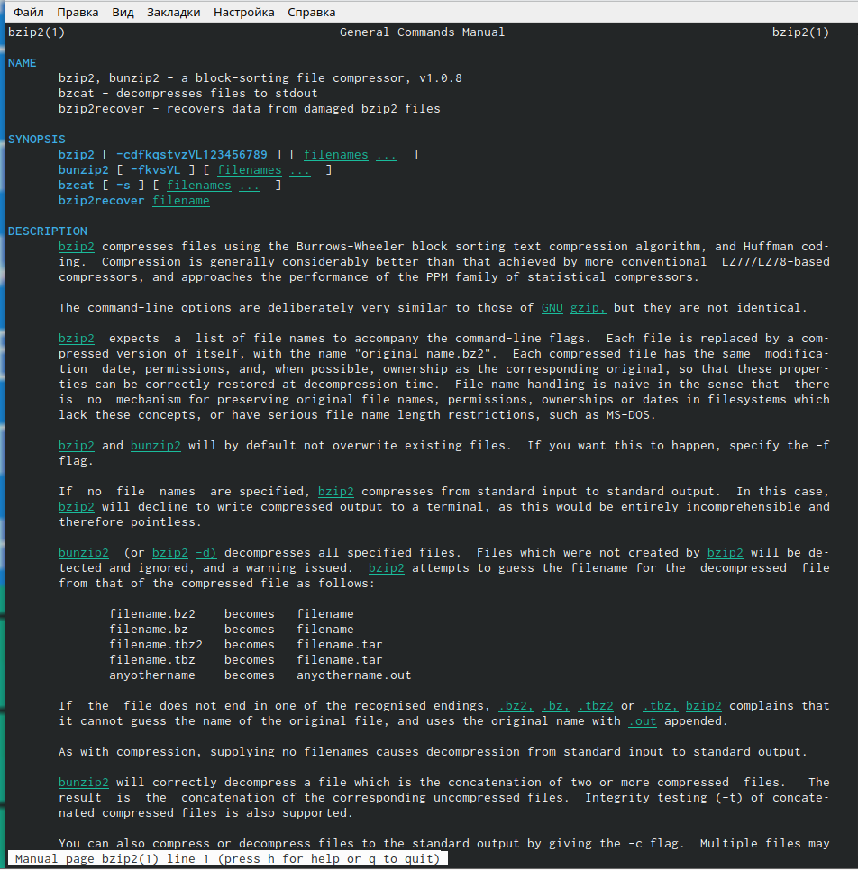{ #fig:002 width=70% }

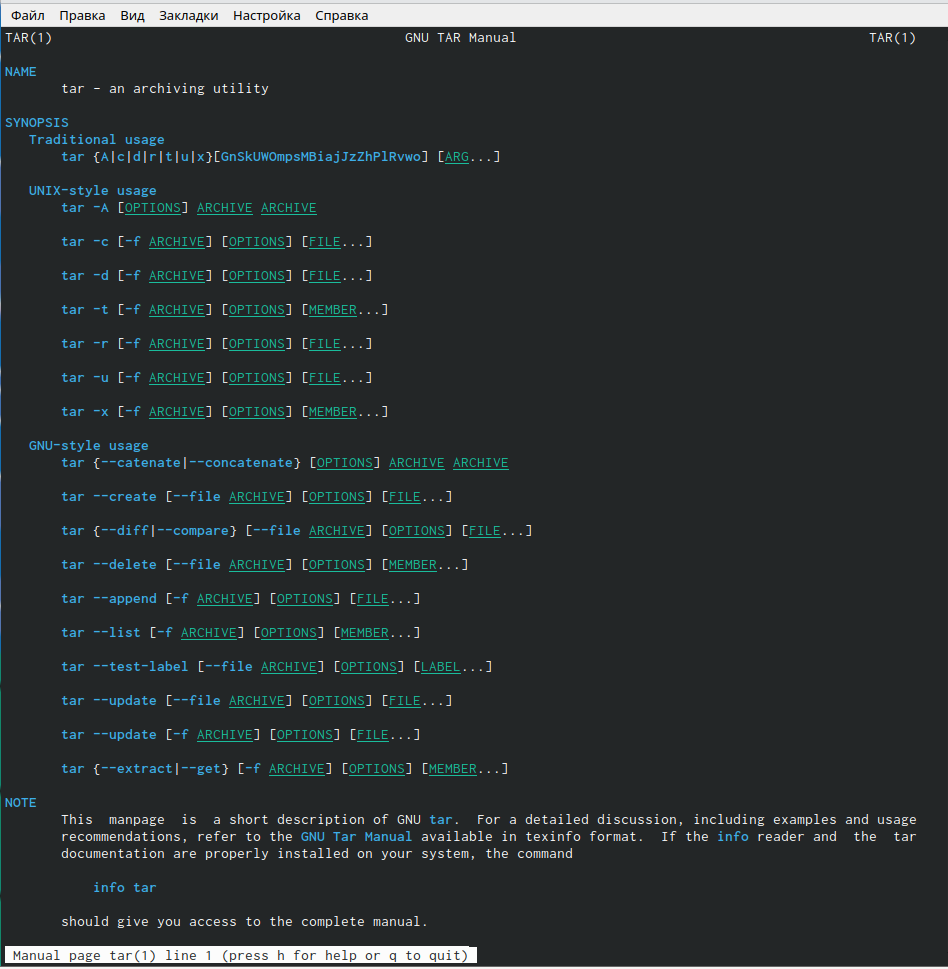{ #fig:003 width=70% }

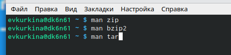{ #fig:004 width=70% }

2) Создала файлы, в котором буду писать первый скрипт, назвала его backup.sh. Затем перешла в emacs(рис. [-@fig:005]), перешла в только что созданный файл(рис. [-@fig:006]). Написала необходимый скрипт(рис. [-@fig:007]), затем сохранила его(рис. [-@fig:008]). Перешла в консоль, дала право на выполнение, а после проверила работу скрипта. Убедились в том, что скрипт работает коректно.(рис. [-@fig:009])(рис. [-@fig:010])(рис. [-@fig:011])(рис. [-@fig:012])

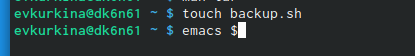{ #fig:005 width=70% }

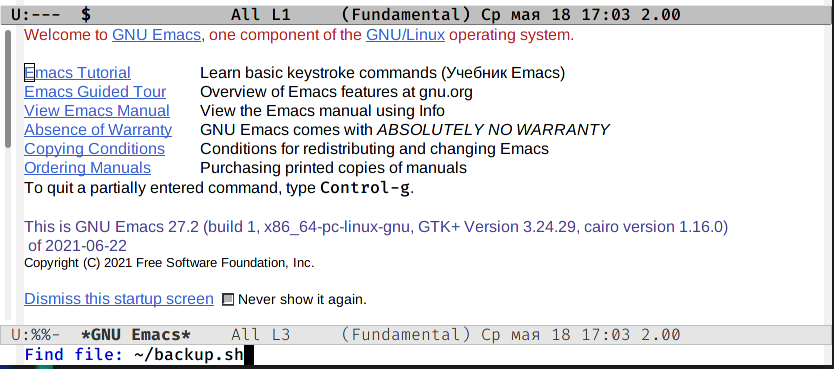{ #fig:006 width=70% }

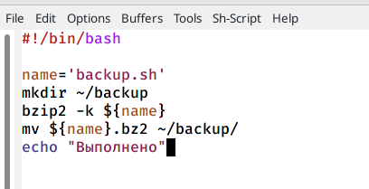{ #fig:007 width=70% }

{ #fig:008 width=70% }

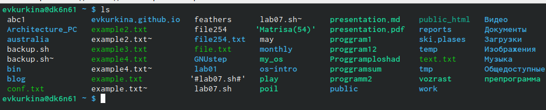{ #fig:009 width=70% }

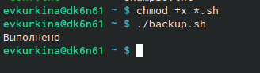{ #fig:010 width=70% }

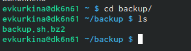{ #fig:011 width=70% }

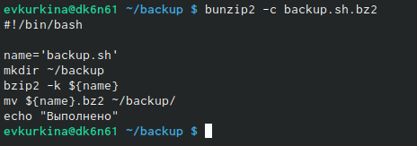{ #fig:012 width=70% }

3) Создала новый файл с названием prog2.sh, для второго скрипта, запустила emacs (рис. [-@fig:013]). Перешла в созданный файл (рис. [-@fig:014]), ввела текст скрипта (рис. [-@fig:015]), сохранила файл (рис. [-@fig:016]),затем проверила его наличие и дала права на выполнение (рис. [-@fig:017]), проверила работу скрипта(рис. [-@fig:018])(рис. [-@fig:019]).

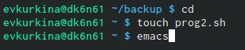{ #fig:013 width=70% }

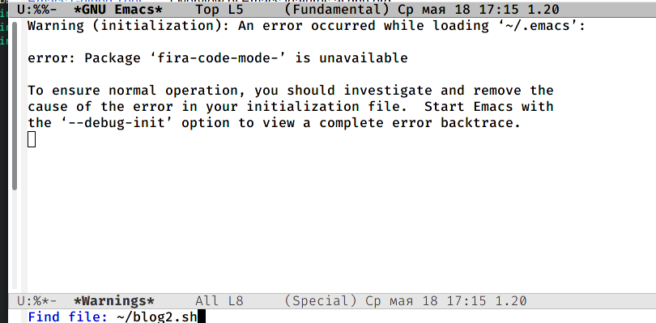{ #fig:014 width=70% }

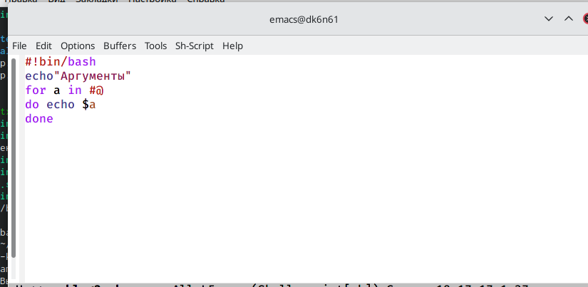{ #fig:015 width=70% }

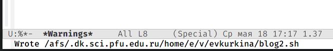{ #fig:016 width=70% }

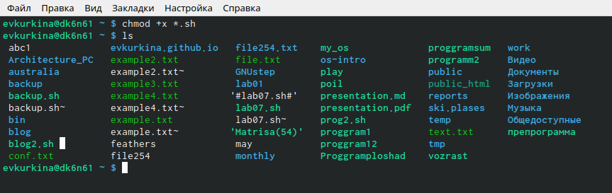{ #fig:017 width=70% }

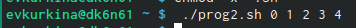{ #fig:018 width=70% }

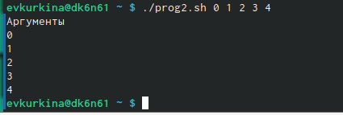{ #fig:019 width=70% }

4) Создала файл с названием progls.sh для третьего скрипта, открыла его в emacs(рис. [-@fig:020]). Написала командный файл, являющимся аналогом для команды ls, для вывода необходимой информации о нужном каталоге и возможностях доступа к файлам этого каталога(рис. [-@fig:021]), сохранила файл.Далее перешла в консоль, проверила наличие файла, дала права выполнения (рис. [-@fig:022]), убедилась в коректной работе скрипта(рис. [-@fig:023]).

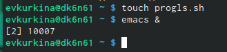{ #fig:020 width=70% }

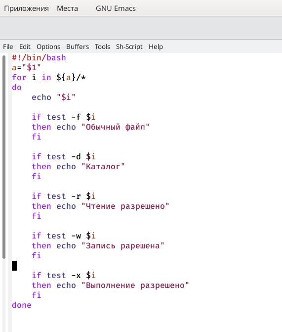{ #fig:021 width=70% }

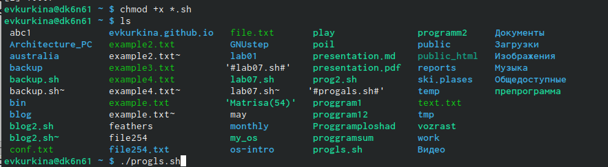{ #fig:022 width=70% }

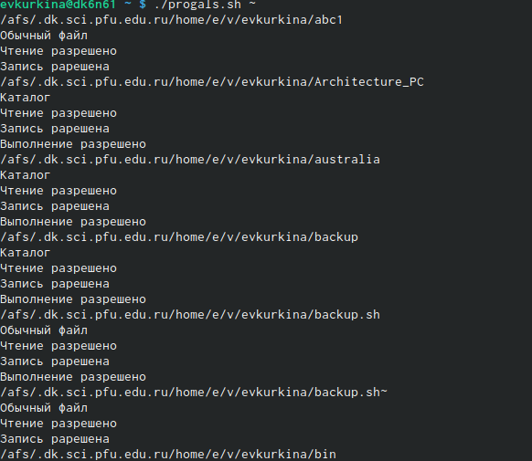{ #fig:023 width=70% }

5) Для последнего скрипта создала файл с названием format.sh(рис. [-@fig:024]). Перешла в emax, в созданный файл,написала скрипт, который получает на входе формт файла, а затем считает количество таких файлов в указанной директории (рис. [-@fig:025]). Затем вернулась в консоль,дала права выполнения и проверила наличие, затем проверила исправную работу скрипта (рис. [-@fig:026]).

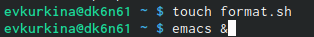{ #fig:024 width=70% }

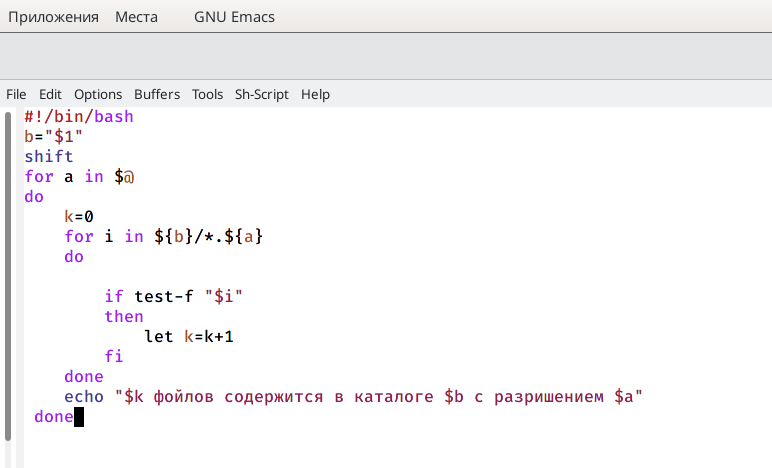{ #fig:025 width=70% }

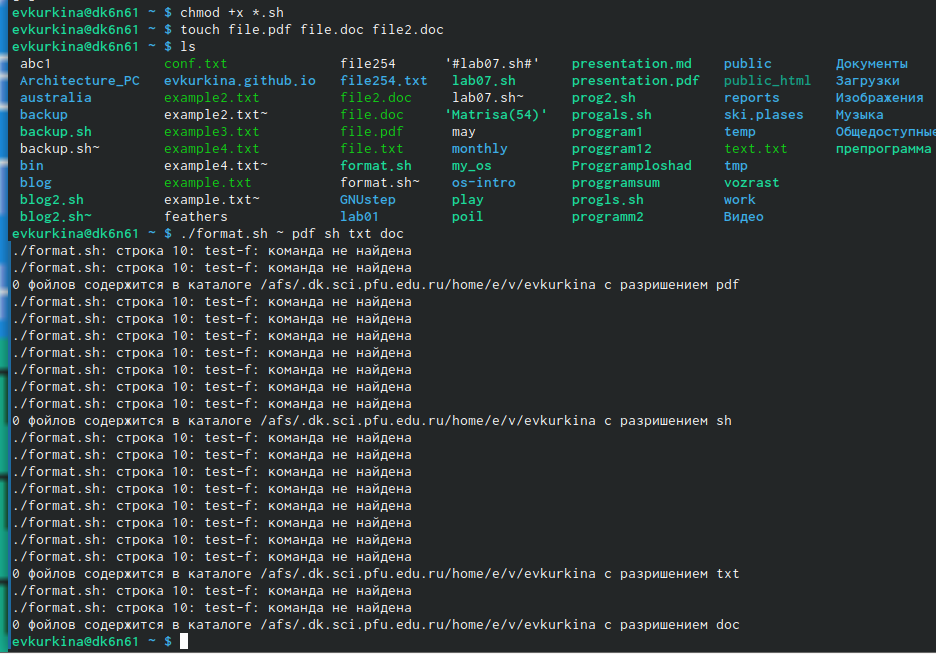{ #fig:026 width=70% }

6)Ответы на контрольные вопросы:

1). Командный процессор (командная оболочка, интерпретатор команд shell) − это программа, позволяющая пользователю взаимодействовать с операционной системой компьютера. В операционных системах типа UNIX/Linux наиболее часто используются следующие реализации командных оболочек:

    оболочка Борна (Bourneshellили sh) − стандартная командная оболочка UNIX/Linux, содержащая базовый, но при этом полный набор функций;
    С-оболочка (или csh) −надстройка на оболочкой Борна, использующая Сподобный синтаксис команд с возможностью сохранения истории выполнения команд;
    Оболочка Корна (или ksh) − напоминает оболочку С, но операторы управления программой совместимы с операторами оболочки Борна;
    BASH − сокращение от BourneAgainShell(опять оболочка Борна), в основе своей совмещает свойства оболочек С и Корна (разработка компании FreeSoftwareFoundation).

2). POSIX (Portable Operating System Interface for Computer Environments ) − набор стандартов описания интерфейсов взаимодействия операционной системы и прикладных программ. Стандарты POSIX разработаны комитетом IEEE (Institute of Electricaland Electronics Engineers) для обеспечения совместимости различных UNIX/Linux подобных операционных систем и переносимости прикладных программ на уровне исходного кода. POSIX - совместимые оболочки разработаны на базе оболочки Корна.

3). Командный процессор bash обеспечивает возможность использования переменных типа строка символов. Имена переменных могут быть выбраны пользователем. Пользователь имеет возможность присвоить переменной значение некоторой строки символов. Например, команда «mark=/usr/andy/bin» присваивает значение строки символов /usr/andy/bin переменной mark типа строка символов. Значение, присвоенное некоторой переменной, может быть впоследствии использовано. Для этого в соответствующем месте командной строки должно быть употреблено имя этой переменной, которому предшествует метасимвол $. Например, команда «mvafile${mark}» переместит файл afile из текущего каталога в каталог с абсолютным полным именем /usr/andy/bin. Оболочка bash позволяет работать с массивами. Для создания массива используется команда setс флагом -A. За флагом следует имя переменной, а затем список значений, разделённых пробелами. Например, «set -Astates Delaware Michigan "New Jersey"». Далее можно сделать добавление в массив, например, states[49]=Alaska. Индексация массивов начинается с нулевого элемента.

4). Оболочка bash поддерживает встроенные арифметические функции. Команда let является показателем того, что последующие аргументы представляют собой выражение, подлежащее вычислению. Простейшее выражение − это единичный терм (term), обычно целочисленный. Команда let берет два операнда и присваивает их переменной. Команда read позволяет читать значения переменных со стандартного ввода: «echo "Please enter Month and Day of Birth ?"» «read mon day trash». В переменные monи day будут считаны соответствующие значения, введённые с клавиатуры, а переменная trash нужна для того, чтобы отобрать всю избыточно введённую информацию и игнорировать её.

5). В языке программирования bash можно применять такие арифметические операции как сложение (+), вычитание (-), умножение (*), целочисленное деление (/) и целочисленный остаток от деления (%).

6). В (( ))можно записывать условия оболочки bash, а также внутри двойных скобок можно вычислять арифметические выражения и возвращать результат.

7). Стандартные переменные:

    PATH: значением данной переменной является список каталогов, в которых командный процессор осуществляет поиск программы или команды, указанной в командной строке, в том случае, если указанное имя программы или команды не содержит ни одного символа /. Если имя команды содержит хотя бы один символ /, то последовательность поиска, предписываемая значением переменной PATH, нарушается. В этом случае в зависимости от того, является имя команды абсолютным или относительным, поиск начинается соответственно от корневогоили текущего каталога.

    PS1 и PS2: эти переменные предназначены для отображения промптера командного процессора. PS1 − это промптер командного процессора, по умолчанию его значение равно символу $ или #. Если какая-то интерактивная программа, запущенная командным процессором, требует ввода, то используется промптер PS2. Он по умолчанию имеет значение символа >.

    HOME: имя домашнего каталога пользователя. Если команда cdвводится без аргументов, то происходит переход в каталог,указанный в этой переменной.

    IFS:последовательность символов, являющихся разделителями в командной строке, например, пробел, табуляция и перевод строки (newline).

    MAIL:командный процессор каждый раз перед выводом на экран промптера проверяет содержимое файла, имя которого указано в этой переменной, и если содержимое этого файла изменилось с момента последнего ввода из него, то перед тем как вывести на терминал промптер, командный процессор выводит на терминал сообщение Youhavemail(у Вас есть почта).

    TERM: тип используемого терминала.

    LOGNAME: содержит регистрационное имя пользователя, которое устанавливается автоматически при входе в систему.

8). Такие символы, как ' < > * ? | " &, являются метасимволами и имеют для командного процессора специальный смысл.

9). Снятие специального смысла с метасимвола называется экранированием мета символа. Экранирование может быть осуществлено с помощью предшествующего мета символу символа , который, в свою очередь, является мета символом. Для экранирования группы метасимволов нужно заключить её в одинарные кавычки. Строка, заключённая в двойные кавычки, экранирует все метасимволы, кроме $, ' , , ". Например, –echo* выведет на экран символ , –echoab’|’cd выведет на экран строку ab|*cd.

10). Последовательность команд может быть помещена в текстовый файл. Такой файл называется командным. Далее этот файл можно выполнить по команде: «bash командный_файл [аргументы]». Чтобы не вводить каждый раз последовательности символов bash, необходимо изменить код защиты этого командного файла, обеспечив доступ к этому файлу по выполнению. Это может быть сделано с помощью команды «chmod +x имя_файла». Теперь можно вызывать свой командный файл на выполнение, просто вводя его имя с терминала так, как будтоон является выполняемой программой. Командный процессор распознает, что в Вашем файле на самом деле хранится не выполняемая программа, а программа, написанная на языке программирования оболочки, и осуществить её интерпретацию.

11). Группу команд можно объединить в функцию. Для этого существует ключевое слово function, после которого следует имя функции и список команд, заключённых в фигурные скобки. Удалить функцию можно с помощью команды unsetcфлагом -f.

12). Чтобы выяснить, является ли файл каталогом или обычным файлом, необходимо воспользоваться командами «test-f [путь до файла]» (для проверки, является ли обычным файлом) и «test -d[путь до файла]» (для проверки, является ли каталогом).

13). Команду «set» можно использовать для вывода списка переменных окружения. В системах Ubuntu и Debia nкоманда «set» также выведет список функций командной оболочки после списка переменных командной оболочки. Поэтому для ознакомления со всеми элементами списка переменных окружения при работе с данными системами рекомендуется использовать команду «set| more». Команда «typeset» предназначена для наложения ограничений на переменные. Команду «unset» следует использовать для удаления переменной из окружения командной оболочки.

14). При вызове командного файла на выполнение параметры ему могут быть переданы точно таким же образом, как и выполняемой программе. С точки зрения командного файла эти параметры являются позиционными. Символ $ является метасимволом командного процессора. Он используется, в частности, для ссылки на параметры, точнее, для получения их значений в командном файле. В командный файл можно передать до девяти параметров. При использовании где-либо в командном файле комбинации символов $i, где 0 < i< 10, вместо неё будет осуществлена подстановка значения параметра с порядковым номером i, т.е. аргумента командного файла с порядковым номером i. Использование комбинации символов $0 приводит к подстановке вместо неё имени данного командного файла.

15). Специальные переменные:

    $* −отображается вся командная строка или параметры оболочки;
    $? −код завершения последней выполненной команды;
    $$ −уникальный идентификатор процесса, в рамках которого выполняется командный процессор;
    $! −номер процесса, в рамках которого выполняется последняя вызванная на выполнение в командном режиме команда;
    $-−значение флагов командного процессора;
    ${#} −возвращает целое число −количествослов, которые были результатом $;
    ${#name} −возвращает целое значение длины строки в переменной name;
    ${name[n]} −обращение к n-му элементу массива;
    ${name[*]}−перечисляет все элементы массива, разделённые пробелом;
    ${name[@]}−то же самое, но позволяет учитывать символы пробелы в самих переменных;
    ${name:-value} −если значение переменной name не определено, то оно будет заменено на указанное value;
    ${name:value} −проверяется факт существования переменной;
    ${name=value} −если name не определено, то ему присваивается значение value;
    ${name?value} −останавливает выполнение, если имя переменной не определено, и выводит value как сообщение об ошибке;
    ${name+value} −это выражение работает противоположно ${name-value}. Если переменная определена, то подставляется value;
    ${name#pattern} −представляет значение переменной name с удалённым самым коротким левым образцом (pattern);
    ${#name[*]} и ${#name[@]}−эти выражения возвращают количество элементов в массиве name.

# Выводы

Во время выполнения данной лабораторной работы, я изучила основы программирования в оболчке OC UNIX/Linux, найчилась писать небольшие командные файлы.

# Список литературы{.unnumbered}

::: {#refs}
:::
