---
## Front matter
lang: ru-RU
title: Лабораторная работа 11
author: |
	Куркина Евгения Вячеславовна
institute: |
	\inst{1}RUDN University, Moscow, Russian Federation
	
## Formatting
toc: false
slide_level: 2
theme: metropolis
header-includes: 
 - \metroset{progressbar=frametitle,sectionpage=progressbar,numbering=fraction}
 - '\makeatletter'
 - '\beamer@ignorenonframefalse'
 - '\makeatother'
aspectratio: 43
section-titles: true
---

# Лабораторная работа 11

## Цель работы 

Цель данной лабораторной работы--- Изучить основы программирования в оболочке OC UNIX. Научиться писать более сложные командные файлы с использованием логических управляющих конструкций и циклов.

## Шаг 1
Создала файл для первого скрипта, перешла в emacs(рис. [-@fig:001]). С помощью команды getopts grep, написала ткст скрипта, который анализирует строку с ключами:
-inputfile-прочитывает данные из указанного файла
-aotputfile-вывод данных в указанный файл 
-p шаблон -указать шаблон поиска 
-С- различить строчные и заглавные буквы
-n- выдть номера строк, а затем поиск указанных строк, которые определяются ключом -p.(рис. [-@fig:002]).

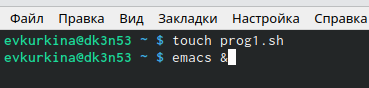{ #fig:001 width=40% }

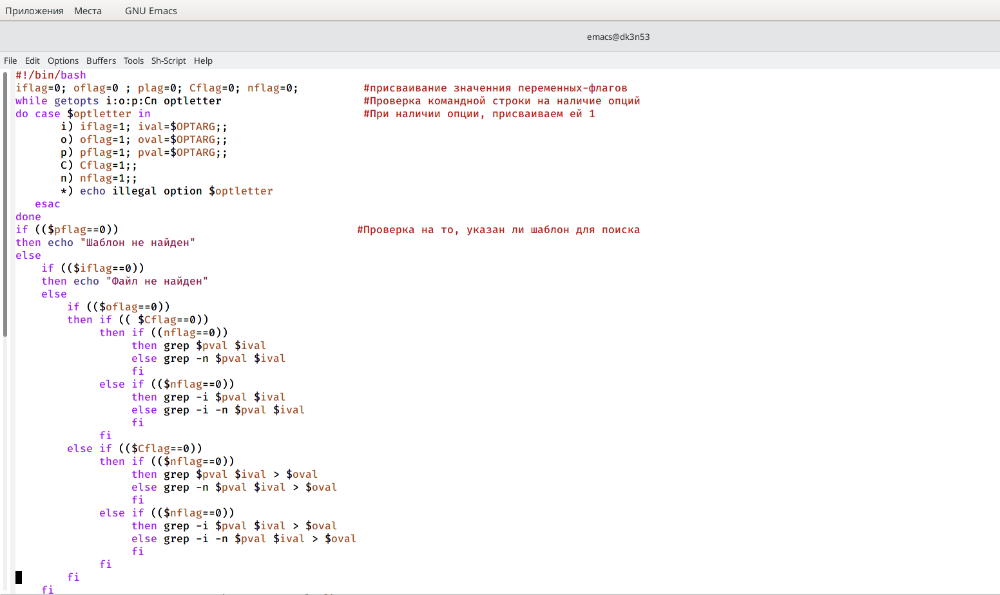{ #fig:002 width=40% }

## Шаг 1.2

Затем сохранила файл (рис. [-@fig:003]). Создала два файла, зполнила их словами(рис. [-@fig:004]) (рис. [-@fig:005]). 

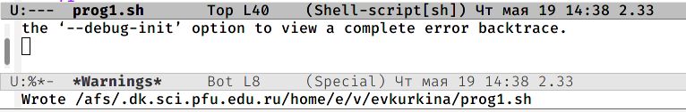{ #fig:003 width=30% }

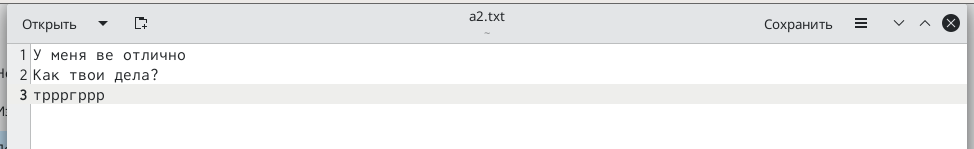{ #fig:004 width=30% }

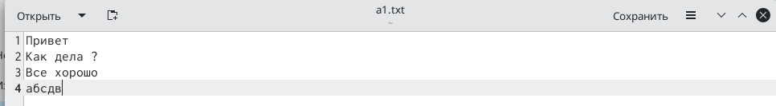{ #fig:005 width=30% }

## Шаг 1.3

Предоставила доступ на исполнение (рис. [-@fig:006]), проверила корректную работу скрипта (рис. [-@fig:007]).

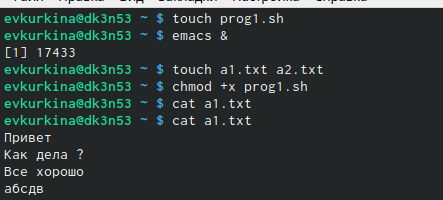{ #fig:006 width=40% }

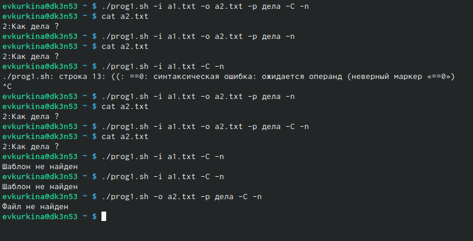{ #fig:007 width=40% }

## Шаг 2

Создала два новых файла, для второго скрипта (рис. [-@fig:008]). На языке С написала программу, которая определяет, введенное число меньше, больше или же равно нулю, затем код завершается с помощью функции exit(i)(рис. [-@fig:009]), сохранила его (рис. [-@fig:010]).

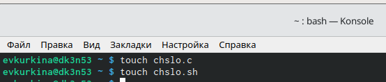{ #fig:008 width=30% }

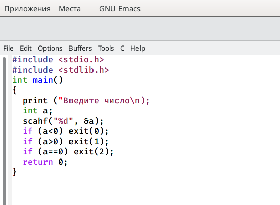{ #fig:009 width=30% }

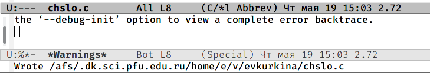{ #fig:010 width=30% }

## Шаг 2.2

После командный файл вызывает данную программу и выдает сообщение о том, какое число было введено пользователем(рис. [-@fig:011]). Перешла в консоль, дала права доступа и проверила работу кода (рис. [-@fig:012]).

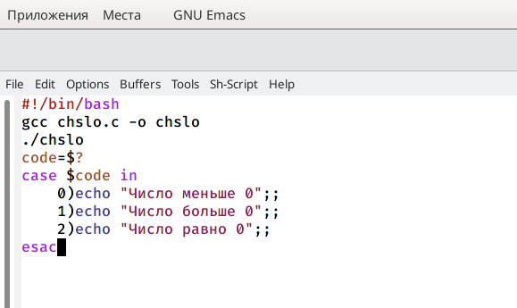{ #fig:011 width=70% }

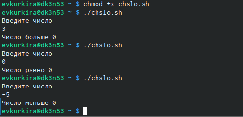{ #fig:012 width=70% }

## Шаг 3

Создала новый файл для 3его скрипта (рис. [-@fig:013]). Написала код исполняемого файла, кторый создает указанное пользователем число файлов, которые пронумерованы от 1 до N. Число файлов передается аргументом в командной строке, также этот скрипт может удалить все созданные им файлы(рис. [-@fig:014]).

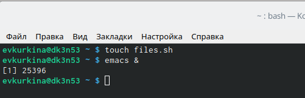{ #fig:013 width=40% }

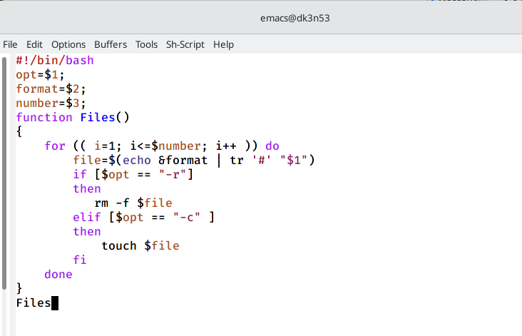{ #fig:014 width=40% }

## Шаг 3.2

Далее, я предоставила доступ к исполнению, создала три файла, а затем удалила их , с помощью кода.(рис. [-@fig:015])

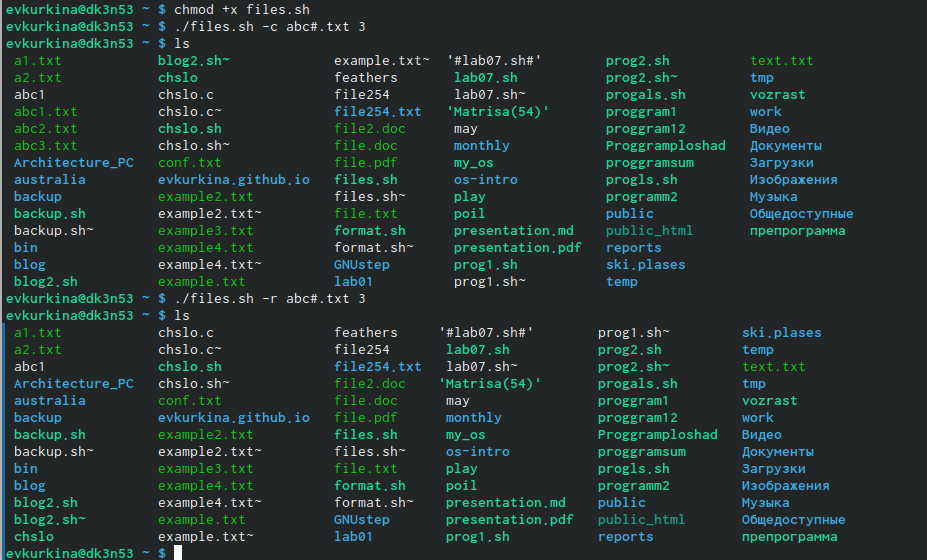{ #fig:015 width=70% }

## Шаг 4

Создала файл для последнего 4го скрипта(рис. [-@fig:016]). Написала текст исполняемого файла, который с помощью команды tar собирает в архив все файлы, которые находтся в этой директории.(рис. [-@fig:017]).

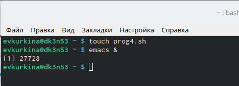{ #fig:016 width=40% }

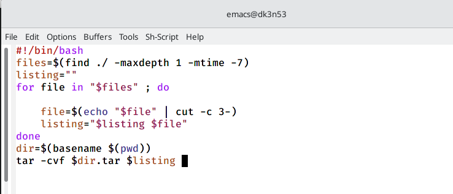{ #fig:017 width=40% }

## Шаг 4.2

Далее предоставила права доступа на выполнение, создала отдельный каталог, куда поместила файлы, а после проверила работу программы (рис. [-@fig:018]) (рис. [-@fig:019]).

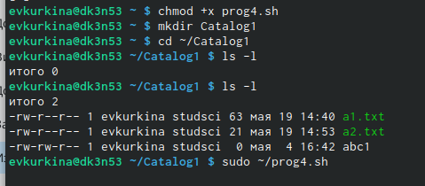{ #fig:018 width=40% }

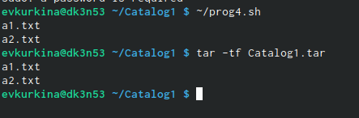{ #fig:019 width=40% }

## Вывод

Во время выполнения данной лабораторной работы я изучила основы программирования в оболочке OC UNIX.Научилась писать более сложные командные файлы с использованием логических управляющих конструкций и циклов.

## {.standout}

