---
## Front matter
title: "Лабораторная работа 11"
subtitle: "Отчет по лабораторной работе 11"
author: "Куркина Евгения Вячеславовна"

## Generic otions
lang: ru-RU
toc-title: "Содержание"

## Bibliography
bibliography: bib/cite.bib
csl: pandoc/csl/gost-r-7-0-5-2008-numeric.csl

## Pdf output format
toc: true # Table of contents
toc-depth: 2
lof: true # List of figures
lot: true # List of tables
fontsize: 12pt
linestretch: 1.5
papersize: a4
documentclass: scrreprt
## I18n polyglossia
polyglossia-lang:
  name: russian
  options:
	- spelling=modern
	- babelshorthands=true
polyglossia-otherlangs:
  name: english
## I18n babel
babel-lang: russian
babel-otherlangs: english
## Fonts
mainfont: PT Serif
romanfont: PT Serif
sansfont: PT Sans
monofont: PT Mono
mainfontoptions: Ligatures=TeX
romanfontoptions: Ligatures=TeX
sansfontoptions: Ligatures=TeX,Scale=MatchLowercase
monofontoptions: Scale=MatchLowercase,Scale=0.9
## Biblatex
biblatex: true
biblio-style: "gost-numeric"
biblatexoptions:
  - parentracker=true
  - backend=biber
  - hyperref=auto
  - language=auto
  - autolang=other*
  - citestyle=gost-numeric
## Pandoc-crossref LaTeX customization
figureTitle: "Рис."
tableTitle: "Таблица"
listingTitle: "Листинг"
lofTitle: "Список иллюстраций"
lotTitle: "Список таблиц"
lolTitle: "Листинги"
## Misc options
indent: true
header-includes:
  - \usepackage{indentfirst}
  - \usepackage{float} # keep figures where there are in the text
  - \floatplacement{figure}{H} # keep figures where there are in the text
---

# Цель работы

Здесь приводится формулировка цели лабораторной работы. Формулировки
цели для каждой лабораторной работы приведены в методических
указаниях.

Цель данной лабораторной работы--- Изучить основы программирования в оболочке OC UNIX. Научиться писать более сложные командные файлы с использованием логических управляющих конструкций и циклов.

# Задание

Здесь приводится описание задания в соответствии с рекомендациями
методического пособия и выданным вариантом.

# Выполнение лабораторной работы

1)Создала файл для первого скрипта, перешла в emacs(рис. [-@fig:001]). С помощью команды getopts grep, написала ткст скрипта, который анализирует строку с ключами:
-inputfile-прочитывает данные из указанного файла
-aotputfile-вывод данных в указанный файл 
-p шаблон -указать шаблон поиска 
-С- различить строчные и заглавные буквы
-n- выдть номера строк, а затем поиск указанных строк, которые определяются ключом -p.(рис. [-@fig:002]).
Затем сохранила файл (рис. [-@fig:003]). Создала два файла, зполнила их словами(рис. [-@fig:004]) (рис. [-@fig:005]). Предоставила доступ на исполнение (рис. [-@fig:006]), проверила корректную работу скрипта (рис. [-@fig:007]).

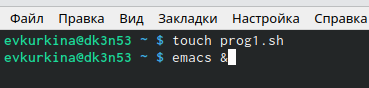{ #fig:001 width=70% }

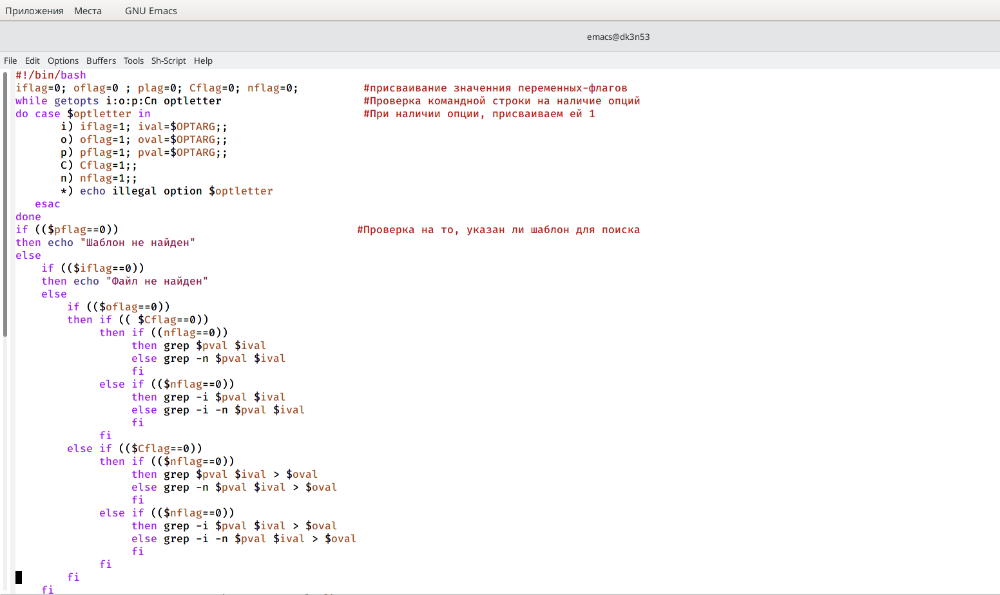{ #fig:002 width=70% }

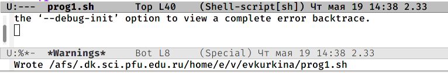{ #fig:003 width=70% }

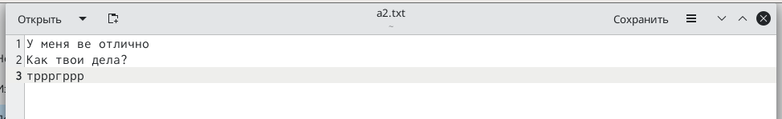{ #fig:004 width=70% }

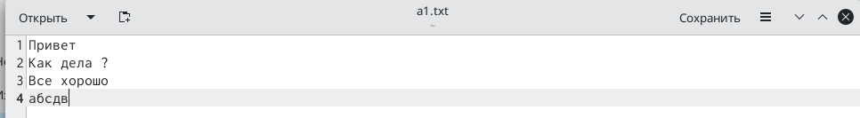{ #fig:005 width=70% }

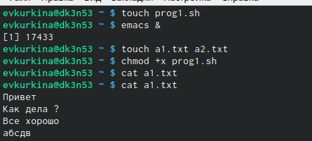{ #fig:006 width=70% }

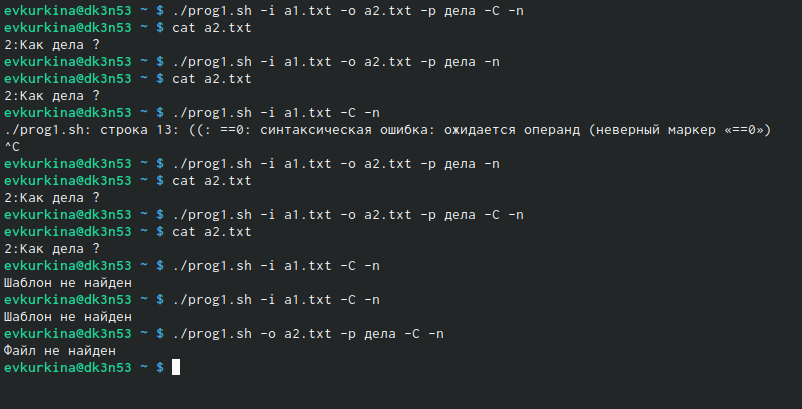{ #fig:007 width=70% }

2) Создала два новых файла, для второго скрипта (рис. [-@fig:008]). На языке С написала программу, которая определяет, введенное число меньше, больше или же равно нулю, затем код завершается с помощью функции exit(i)(рис. [-@fig:009]), сохранила его (рис. [-@fig:010]).После командный файл вызывает данную программу и выдает сообщение о том, какое число было введено пользователем(рис. [-@fig:011]). Перешла в консоль, дала права доступа и проверила работу кода (рис. [-@fig:012]).

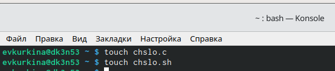{ #fig:008 width=70% }

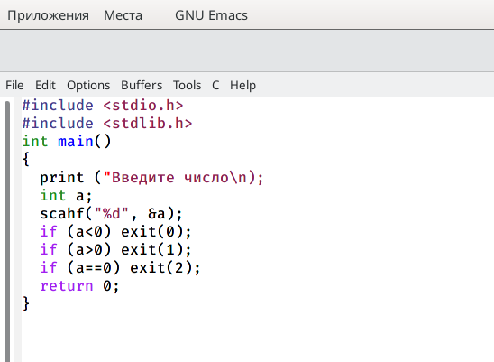{ #fig:009 width=70% }

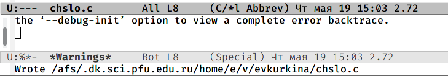{ #fig:010 width=70% }

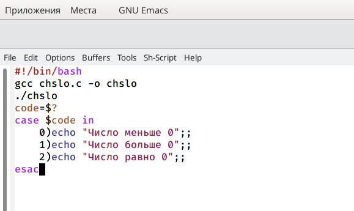{ #fig:011 width=70% }

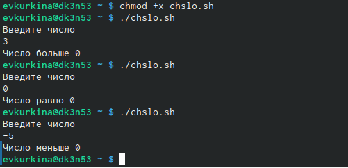{ #fig:012 width=70% }

3) Создала новый файл для 3его скрипта (рис. [-@fig:013]). Написала код исполняемого файла, кторый создает указанное пользователем число файлов, которые пронумерованы от 1 до N. Число файлов передается аргументом в командной строке, также этот скрипт может удалить все созданные им файлы(рис. [-@fig:014]). Далее, я предоставила доступ к исполнению, создала три файла, а затем удалила их , с помощью кода.(рис. [-@fig:015])

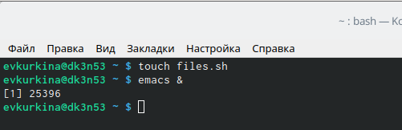{ #fig:013 width=70% }

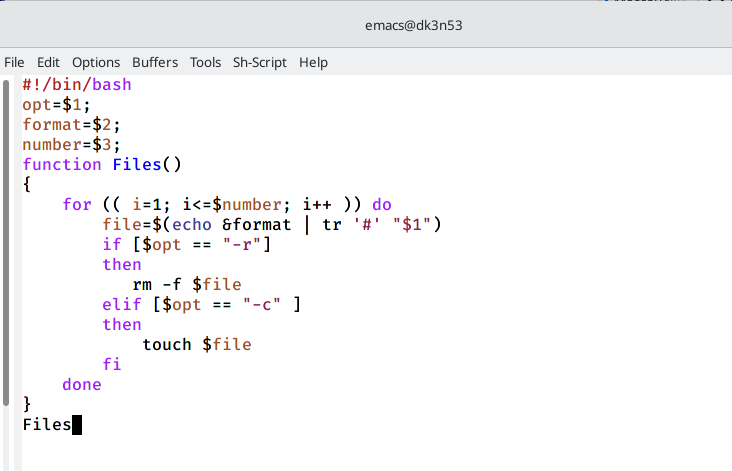{ #fig:014 width=70% }

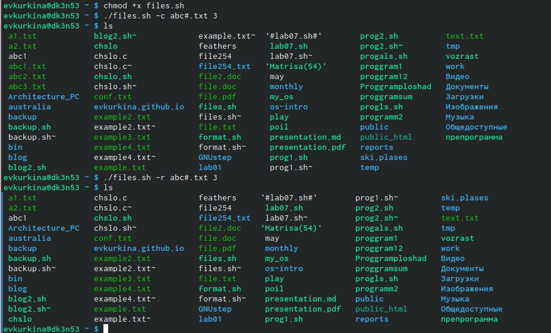{ #fig:015 width=70% }

4) Создала файл для последнего 4го скрипта(рис. [-@fig:016]). Написала текст исполняемого файла, который с помощью команды tar собирает в архив все файлы, которые находтся в этой директории.(рис. [-@fig:017]). Далее предоставила права доступа на выполнение, создала отдельный каталог, куда поместила файлы, а после проверила работу программы (рис. [-@fig:018]) (рис. [-@fig:019]).

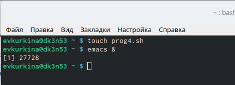{ #fig:016 width=70% }

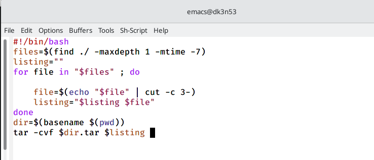{ #fig:017 width=70% }

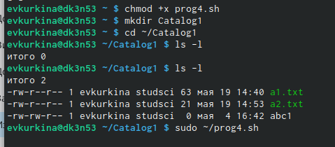{ #fig:018 width=70% }

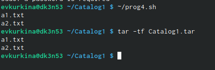{ #fig:019 width=70% }

5) Ответы на контрольные вопросы:

1). Команда getopts осуществляет синтаксический анализ командной строки, выделяя флаги, ииспользуется для объявления переменных. Синтаксис команды следующий: getopts option-string variable [arg...] Флаги − это опции командной строки, обычно помеченные знаком минус; Например,для команды ls флагом может являться -F. Строка опций option-string − эт осписок возможных букв и чисел соответствующего флага. Если ожидается, что некоторый флаг будет сопровождаться некоторым аргументом, то за символом, обозначающим этот флаг, должно следовать двоеточие. Соответствующей переменной присваивается буква данной опции. Еслик оманда getopts может распознать аргумент, то она возвращает истину. Принято включать getopts в цикл while и анализировать введённые данные с помощью оператора case. Функция getopts включает две специальные переменные среды −OPTARG и OPTIND. Если ожидается доплнительное значение,то OPTARG устанавливается в значение этого аргумента. Функция getopts также понимает переменные типа массив, следовательно, можно использовать её в функции не только для синтаксического анализа аргументов функций, но и для анализа введённых пользователем данных.

2). Приперечислении имён файлов текущего каталога можно использовать следующие символы:

    *−соответствует произвольной, в том числе и пустой строке;
    ?−соответствует любому одинарному символу;
    [c1-c2] − соответствует любому символу, лексикографически находящемуся между символами с1 и с2. Например, 1.1 echo* − выведет имена всех файлов текущего каталога, что представляет собой простейший аналог команды ls; 1.2. ls*.c−выведет все файлы с последними двумя символами, совпадающими с.c. 1.3. echoprog.?−выведет все файлы, состоящие из пяти или шести символов, первыми пятью символами которых являются prog.. 1.4.[a-z]*−соответствует произвольному имени файла в текущем каталоге, начинающемуся с любой строчной буквы латинского алфавита.

3). Часто бывает необходимо обеспечить проведение каких-либо действий циклически и управление дальнейшими действиями в зависимости от результатов проверки некоторого условия. Для решения подобных задач язык программирования bash предоставляет возможность использовать такие управляющие конструкции, как for, case, if иwhile. С точки зрения командного процессора эти управляющие конструкции являются обычными командами и могут использоваться как при создании командных файлов, так и при работе в интерактивном режиме. Команды,реализующие подобные конструкции, по сути, являются операторами языка программирования bash. Поэтому при описании языка программирования bash термин оператор будет использоваться наравне с термином команда. Команды ОСUNIX возвращают код завершения, значение которого может быть использовано для принятия решения о дальнейших действиях. Команда test, например, создана специально для использования в командных файлах. Единственная функция этой команды заключается в выработке кода завершения.

4). Два несложных способа позволяют вам прерывать циклы в оболочке bash. Команда break завершает выполнение цикла, а команда continue завершает данную итерацию блока операторов. Команда break полезна для завершения цикла while в ситуациях, когда условие перестаёт быть правильным. Команда continue используется в ситуациях, когда больше нет необходимости выполнять блок операторов, но вы можете захотеть продолжить проверять данный блок на других условных выражениях.

5). Следующие две команды ОСUNIX используются только совместно с управляющими конструкциями языка программирования bash: это команда true,которая всегда возвращает код завершения, равный нулю(т.е.истина),и команда false,которая всегда возвращает код завершения,неравный нулю(т.е.ложь).Примеры бесконечных циклов:while true do echo hello andy done until false do echo hello mike done.

6). Строка if test-fman$s/$i.$s проверяет,существует ли файл man.$s и является ли этот файл обычным файлом.Если данный файл является каталогом,то команда вернет нулевое значение (ложь).

7). Выполнение оператора цикла while сводится к тому,что сначала выполняется последовательность команд(операторов),которую задаёт список-команд в строке,содержащей служебное слово while,а затем,если последняя выполненная команда из этой последовательности команд возвращает нулевой код завершения(истина),выполняется последовательность команд(операторов),которую задаёт список-команд в строке,содержащей служебное слово do,после чего осуществляется безусловный переход на начало оператора цикла while.Выход из цикла будет осуществлён тогда,когда последняя выполненная команда из последовательности команд (операторов),которую задаёт список-команд в строке,содержащей служебное слово while, возвратит ненулевой код завершения(ложь). При замене в операторе цикла while служебного слова while на until условие,при выполнении которого осуществляется выход из цикла,меняется на противоположное.В остальном оператор цикла while и оператор цикла until идентичны.

# Выводы

Во время выполнения данной лабораторной работы я изучила основы программирования в оболочке OC UNIX.Научилась писать более сложные командные файлы с использованием логических управляющих конструкций и циклов.

# Список литературы{.unnumbered}

::: {#refs}
:::
