---
## Front matter
lang: ru-RU
title: Лабораторная работа 12
author: |
	Куркина Евгения Вячеславовна
institute: |
	\inst{1}RUDN University, Moscow, Russian Federation
	
## Formatting
toc: false
slide_level: 2
theme: metropolis
header-includes: 
 - \metroset{progressbar=frametitle,sectionpage=progressbar,numbering=fraction}
 - '\makeatletter'
 - '\beamer@ignorenonframefalse'
 - '\makeatother'
aspectratio: 43
section-titles: true
---

# Лабораторная работа 12

## Цель работы 

Цель данной лабораторной работы --- Изучить основы программирования в оболочке OC UNIX. Научиться писать более сложные командные файлы с использованием логических управляюзих конструкций и циклов.

## Шаг 1

Создала отдельный файл sem.sh(рис. [-@fig:001]). Написала командный файл, который реализует упращенный механизм семафоров.Команда должна дожидаться освобождения ресурса, выдавая об этом сообщение, а затем использовать его в течении некторого времени, также выдавая информацию об этом (рис. [-@fig:002])

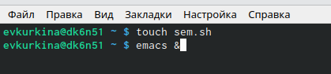{ #fig:001 width=40% }

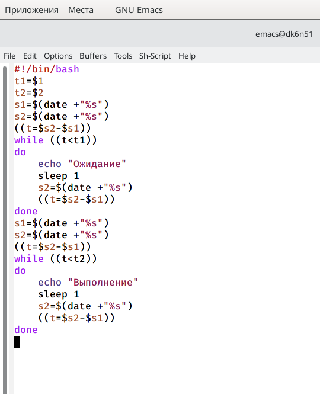{ #fig:002 width=40% }

## Шаг 1.2

Затем дала права на выполнение, а затем проверила результат работы файла (рис. [-@fig:003]).

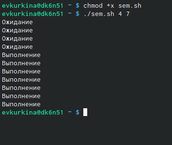{ #fig:003 width=70% }

## Шаг 2

Изменила текст скрипта так, чтобы его можно было выполнять сразу в нескольких терминалах (рис. [-@fig:004])(рис. [-@fig:005]).

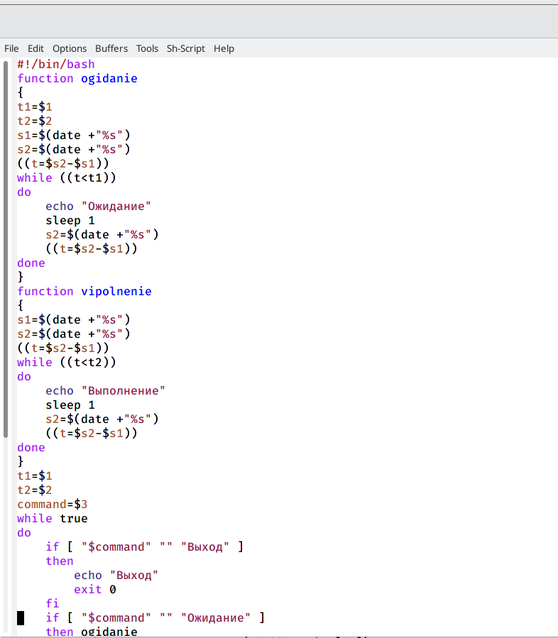{ #fig:004 width=40% }

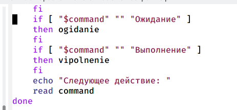{ #fig:005 width=40% }

## Шаг 2.2

Затем проверила его работу (нет прав доступа для данной команды) (рис. [-@fig:006]).

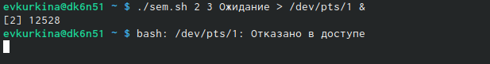{ #fig:006 width=70% }

## Шаг 3

Перешла в каталог man1 (рис. [-@fig:007]), и командой ls просмотрела содержимое (рис. [-@fig:008]).

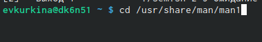{ #fig:007 width=40% }

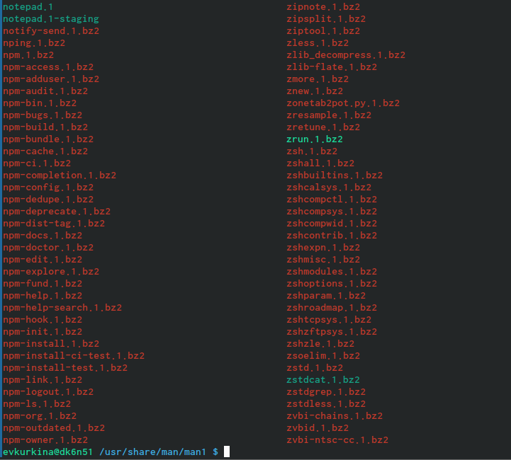{ #fig:008 width=40% }

## Шаг 3.2

Далее создала файл man.sh (рис. [-@fig:009]). Написала текст скрипта, который получает в виде аргументаназвание команды, и выдавать справку об этой команде или сообщение о том, что справка отсутствует (рис. [-@fig:010]).

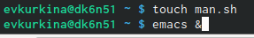{ #fig:009 width=40% }

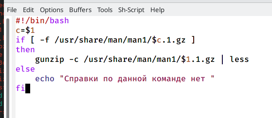{ #fig:010 width=40% }

## Шаг 3.3

Затем дала права на исполнение и проверила работу командного файла,получив справку о команде rm (рис. [-@fig:011]) (рис. [-@fig:012]).

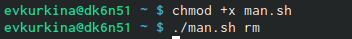{ #fig:011 width=40% }

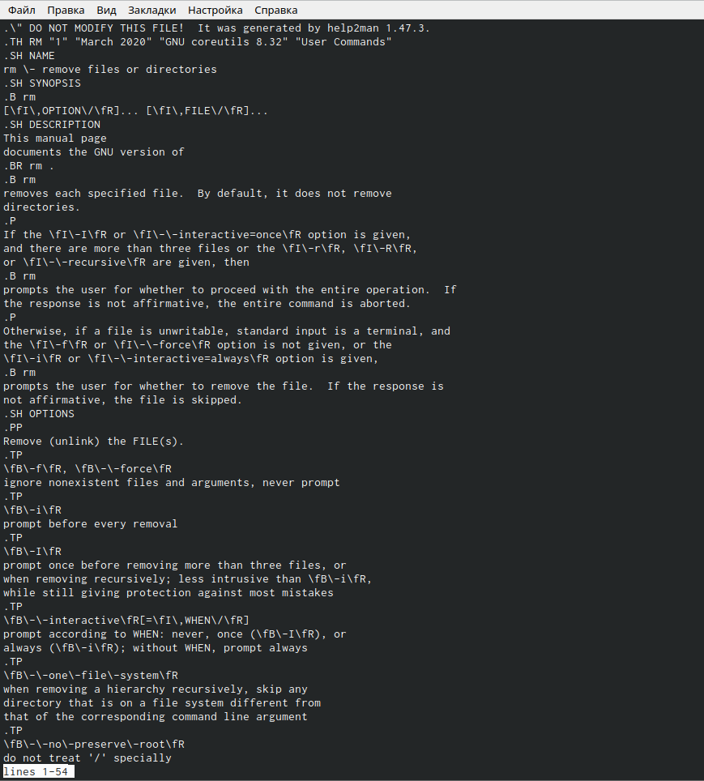{ #fig:012 width=40% }

## Шаг 4

 Создала новый файл с названием random.sh (рис. [-@fig:013]). Написала текст командного файла, кторой с помощью встроенной переменной $RANDOM генерирует случайную последовательностьбукв латинского алфавита (рис. [-@fig:014]).
 
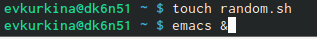{ #fig:013 width=40% }

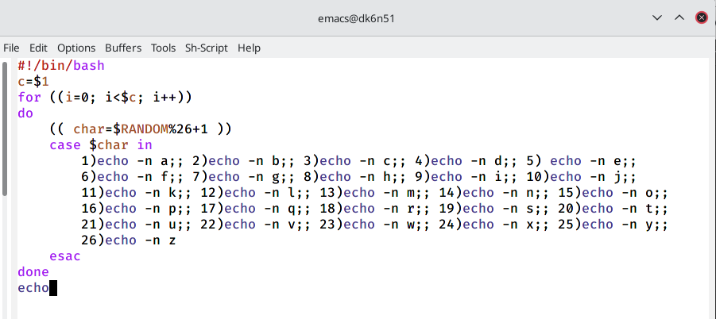{ #fig:014 width=40% }

## Шаг 4.2

Дала права доступа на исполнение и затем проверила работу скрипта (рис. [-@fig:015]).

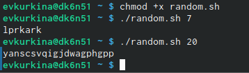{ #fig:015 width=70% }

## Вывод

Во время выполнения данной лабораторной работы я изучила основы программирования в оболочке OC UNIX. Научилась писать более сложные командные файлы с использованием логических управляющих конструкций и циклов.

## {.standout}

