---
## Front matter
title: "Отчет по лабораторной работе 12"
subtitle: "Лабораторная работа 12"
author: "Куркина Евгения Вячеславовна"

## Generic otions
lang: ru-RU
toc-title: "Содержание"

## Bibliography
bibliography: bib/cite.bib
csl: pandoc/csl/gost-r-7-0-5-2008-numeric.csl

## Pdf output format
toc: true # Table of contents
toc-depth: 2
lof: true # List of figures
lot: true # List of tables
fontsize: 12pt
linestretch: 1.5
papersize: a4
documentclass: scrreprt
## I18n polyglossia
polyglossia-lang:
  name: russian
  options:
	- spelling=modern
	- babelshorthands=true
polyglossia-otherlangs:
  name: english
## I18n babel
babel-lang: russian
babel-otherlangs: english
## Fonts
mainfont: PT Serif
romanfont: PT Serif
sansfont: PT Sans
monofont: PT Mono
mainfontoptions: Ligatures=TeX
romanfontoptions: Ligatures=TeX
sansfontoptions: Ligatures=TeX,Scale=MatchLowercase
monofontoptions: Scale=MatchLowercase,Scale=0.9
## Biblatex
biblatex: true
biblio-style: "gost-numeric"
biblatexoptions:
  - parentracker=true
  - backend=biber
  - hyperref=auto
  - language=auto
  - autolang=other*
  - citestyle=gost-numeric
## Pandoc-crossref LaTeX customization
figureTitle: "Рис."
tableTitle: "Таблица"
listingTitle: "Листинг"
lofTitle: "Список иллюстраций"
lotTitle: "Список таблиц"
lolTitle: "Листинги"
## Misc options
indent: true
header-includes:
  - \usepackage{indentfirst}
  - \usepackage{float} # keep figures where there are in the text
  - \floatplacement{figure}{H} # keep figures where there are in the text
---

# Цель работы

Здесь приводится формулировка цели лабораторной работы. Формулировки
цели для каждой лабораторной работы приведены в методических
указаниях.

Цель данной лабораторной работы --- Изучить основы программирования в оболочке OC UNIX. Научиться писать более сложные командные файлыс использованием логических управляюзих конструкций и циклов.

# Задание

Написать необходимые командные файлы.

# Выполнение лабораторной работы

1) Создала отдельный файл sem.sh(рис. [-@fig:001]). Написала командный файл, который реализует упращенный механизм семафоров.Команда должна дожидаться освобождения ресурса, выдавая об этом сообщение, а затем использовать его в течении некторого времени, также выдавая информацию об этом (рис. [-@fig:002]).Затем дала права на выполнение, а затем проверила результат работы файла (рис. [-@fig:003]).

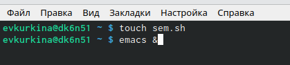{ #fig:001 width=70% }

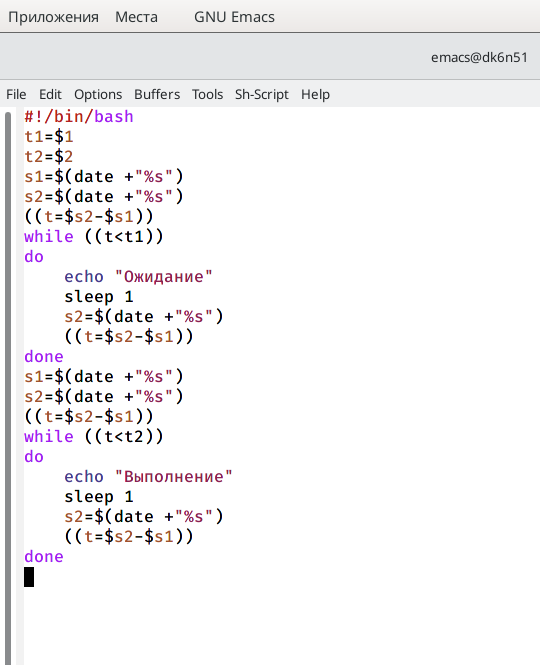{ #fig:002 width=70% }

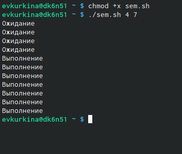{ #fig:003 width=70% }

1.2) Изменила текст скрипта так, чтобы его можно было выполнять сразу в нескольких терминалах (рис. [-@fig:004])(рис. [-@fig:005]), затем проверила его работу (нет прав доступа для данной команды) (рис. [-@fig:006]).

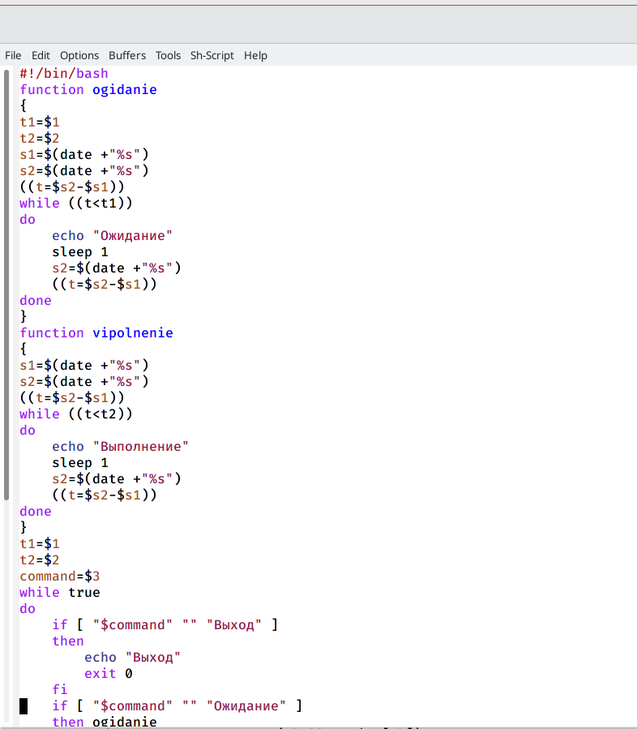{ #fig:004 width=70% }

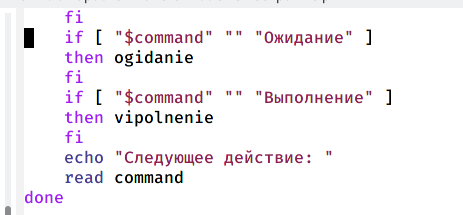{ #fig:005 width=70% }

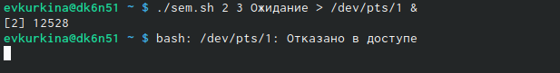{ #fig:006 width=70% }

2) Перешла в каталог man1 (рис. [-@fig:007]), и командой ls просмотрела содержимое (рис. [-@fig:008]). Далее создала файл man.sh (рис. [-@fig:009]). Написала текст скрипта, который получает в виде аргументаназвание команды, и выдавать справку об этой команде или сообщение о том, что справка отсутствует (рис. [-@fig:010]). Затем дала права на исполнение и проверила работу командного файла,получив справку о команде rm (рис. [-@fig:011]) (рис. [-@fig:012]).

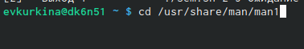{ #fig:007 width=70% }

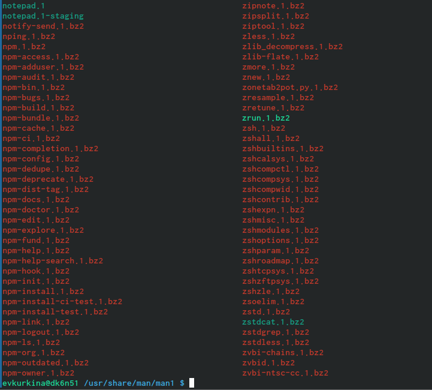{ #fig:008 width=70% }

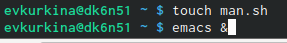{ #fig:009 width=70% }

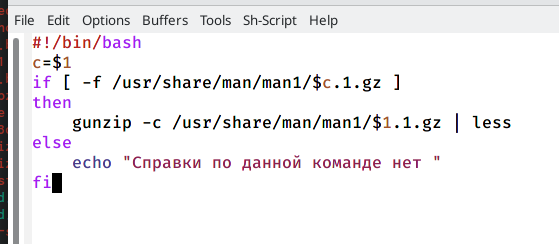{ #fig:010 width=70% }

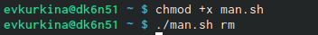{ #fig:011 width=70% }

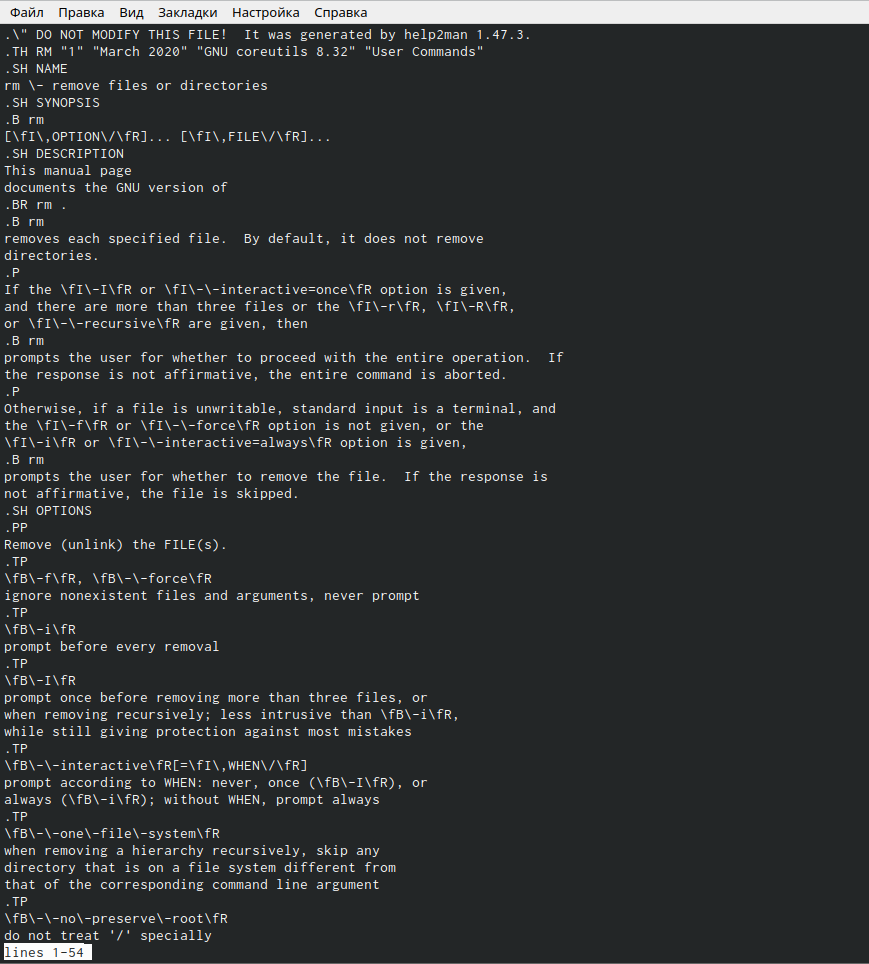{ #fig:012 width=70% }

3) Создала новый файл с названием random.sh (рис. [-@fig:013]). Написала текст командного файла, кторой с помощью встроенной переменной $RANDOM генерирует случайную последовательностьбукв латинского алфавита (рис. [-@fig:014]). Дала права доступа на исполнение и затем проверила работу скрипта (рис. [-@fig:015]).

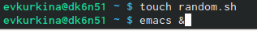{ #fig:013 width=70% }

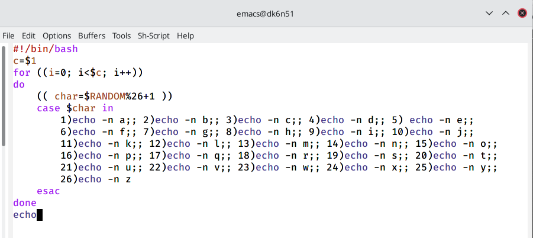{ #fig:014 width=70% }

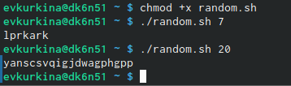{ #fig:015 width=70% }

4) Контрольные вопросы:

1). while [$1 != "exit"]

В данной строчке допущены следующие ошибки:

    не хватает пробелов после первой скобки [и перед второй скобкой ]

    выражение $1 необходимо взять в “”, потому что эта переменная может содержать пробелы.

Таким образом, правильный вариант должен выглядеть так: while [“$1”!= "exit"]

2). Чтобы объединить несколько строк в одну, можно воспользоваться несколькими способами:

    Первый:

VAR1="Hello,

"VAR2=" World"

VAR3="$VAR1$VAR2"

echo "$VAR3"

Результат: Hello, World

    Второй:

VAR1="Hello, "

VAR1+=" World"

echo "$VAR1"

Результат: Hello, World

3). Команда seq в Linux используется для генерации чисел от ПЕРВОГО до ПОСЛЕДНЕГО шага INCREMENT.

Параметры:

    seq LAST: если задан только один аргумент, он создает числа от 1 до LAST с шагом шага, равным 1. Если LAST меньше 1, значение is не выдает.

    seq FIRST LAST: когда заданы два аргумента, он генерирует числа от FIRST до LAST с шагом 1, равным 1. Если LAST меньше FIRST, он не выдает никаких выходных данных.

    seq FIRST INCREMENT LAST: когда заданы три аргумента, он генерирует числа от FIRST до LAST на шаге INCREMENT . Если LAST меньше, чем FIRST, он не производит вывод.

    seq -f «FORMAT» FIRST INCREMENT LAST: эта команда используется для генерации последовательности в форматированном виде. FIRST и INCREMENT являются необязательными.

    seq -s «STRING» ПЕРВЫЙ ВКЛЮЧЕНО: Эта команда используется для STRING для разделения чисел. По умолчанию это значение равно /n. FIRST и INCREMENT являются необязательными.

    seq -w FIRST INCREMENT LAST:эта команда используется для выравнивания ширины путем заполнения начальными нулями. FIRST и INCREMENT являются необязательными.

4). Результатом данного выражения $((10/3))будет 3, потому что это целочисленное деление без остатка.

5). Отличия командной оболочки zshот bash:

    В zsh более быстрое автодополнение для cdс помощью Тab

    В zsh существует калькулятор zcalc, способный выполнять вычисления внутри терминала

    В zsh поддерживаются числа с плавающей запятой

    В zsh поддерживаются структуры данных «хэш»

    В zsh поддерживается раскрытие полного пути на основе неполных данных

    В zsh поддерживаетсязаменачастипути

    В zsh есть возможность отображать разделенный экран, такой же как разделенный экран vim

6). for((a=1; a<= LIMIT; a++)) синтаксис данной конструкции верен, потому что, используя двойные круглые скобки, можно не писать $ перед переменными ().

7). Преимущества скриптового языка bash:

    Один из самых распространенных и ставится по умолчаниюв большинстве дистрибутивах Linux, MacOS

    Удобное перенаправление ввода/вывода

    Большое количество команд для работы с файловыми системами Linux

    Можно писать собственные скрипты, упрощающие работу в Linux

Недостатки скриптового языка bash:

    Дополнительные библиотеки других языков позволяют выполнить больше действий

    Bash не является языков общего назначения

    Утилиты, при выполнении скрипта, запускают свои процессы, которые, в свою очередь, отражаются на быстроте выполнения этого скрипта

    Скрипты, написанные на bash, нельзя запустить на других операционных системах без дополнительных действий.

# Выводы

Во время выполнения данной лабораторной работы я изучила основы программирования в оболочке OC UNIX. Научилась писать более сложные командные файлы с использованием логических управляющих конструкций и циклов.

# Список литературы{.unnumbered}

::: {#refs}
:::
