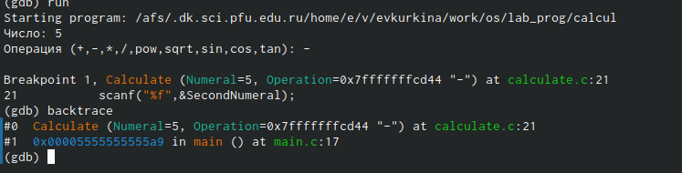

---
## Front matter
lang: ru-RU
title: Лабораторная работа 13
author: |
	Куркина ЕВгения Вячеславовна
institute: |
	\inst{1}RUDN University, Moscow, Russian Federation
	

## Formatting
toc: false
slide_level: 2
theme: metropolis
header-includes: 
 - \metroset{progressbar=frametitle,sectionpage=progressbar,numbering=fraction}
 - '\makeatletter'
 - '\beamer@ignorenonframefalse'
 - '\makeatother'
aspectratio: 43
section-titles: true
---

# Лабораторная работа 13

## Цель работы

Цель данной лабораторной работы  --- Приобрести простейшие навыки разработки, анализа, тестирования и отладки приложений в ОС типа UNIX/Linux на примере создания на языке программирования
С калькулятора с простейшими функциями.

## Шаг 1

В домашнем каталоге создаю подкаталог ~/work/os/lab_prog (рис. [-@fig:001]).

{ #fig:001 width=70% }

## Шаг 2

Создала файлы calculate.h, calculate.c, main.c. Написала текст  примитивнейшего калькулятора, который способный складывать, вычитать, умножать и делить, возводить число в степень, брать квадратный корень, вычислять sin, cos, tan.При запуске он будет запрашивать первое число, операцию, второе число. После этого программа выведет результат и остановится (рис. [-@fig:002]).

{ #fig:002 width=70% }

## Шаг 2.2

Далее написала интерфейсный файл calculate.h, описывающий формат вызова функции калькулятора (рис. [-@fig:003]), а также текст основного файла  main.c, реализующий интерфейс пользователя к калькулятору (рис. [-@fig:004]).

{ #fig:003 width=40% }

{ #fig:004 width=40% }

## Шаг 3

Выполнила компиляцию программы посредством gcc (рис. [-@fig:005]).

{ #fig:005 width=70% }

## Шаг 4

Создала Makefile переписала в него  данный текст (рис. [-@fig:006]), затем изменила его до рабочего состояния рис. [-@fig:007]).

{ #fig:006 width=40% }

{ #fig:007 width=40% }

## Шаг 4.2

 Данный файл необходим для автоматической компиляции файлов calculate.c. В переменную GLASS добавила опцию -g, утилита компиляции выбирается с помощью переменной СС. Далле я удалила файлы из каталога и выполнила компиляцию файлов (рис. [-@fig:008])(рис. [-@fig:009])
 
{ #fig:008 width=40% }

{ #fig:009 width=40% }
 

## Шаг 5

Запустила отладчик GDB, загрузив в него программу для отладки:gdb ./calcul(рис. [-@fig:010]).

{ #fig:010 width=70% }

## ШАг 6

Запустила программу внутри отладчика командой run (рис. [-@fig:011]).

{ #fig:011 width=70% }

## Шаг 7

Для постраничного (по 9 строк) просмотра исходного код использовала команду list(рис. [-@fig:012]).

{ #fig:012 width=70% }

## Шаг 8

Для просмотра строк с 12 по 15 основного файла используйте list с параметрами: list 12,15(рис. [-@fig:013]).
  Для просмотра определённых строк не основного файла используйте list с параметрами: list calculate.c:20,29(рис. [-@fig:014]).
  
{ #fig:013 width=40% }

{ #fig:014 width=40% }

## Шаг 9

Установила точку отановки на 21 строке:list calculate.c:20,27  break 21 (рис. [-@fig:015]).

{ #fig:015 width=70% }

## ШАг 10

Вывела информацию об имеющихся точках останова:info breakpoints (рис. [-@fig:016]).

{ #fig:016 width=70% }

## Шаг 11

Запустила программу внутри отладчика и убедилась, что программа остановится в момент прохождения точки останова: run 5 - backtrace
Отладчик выдал следующую информацию:
1 #0 Calculate (Numeral=5, Operation=0x7fffffffd280 "-")
2 at calculate.c:21
3 #1 0x0000000000400b2b in main () at main.c:17(рис. [-@fig:017]).

{ #fig:017 width=70% }

## Шаг 12

Просмотрела, чему равно на этом этапе значение переменно Numeral: print Numeral (рис. [-@fig:018]).

{ #fig:018 width=70% }

## Шаг 13

Сравнила с результатом вывода на экран после использования команды: display Numeral (рис. [-@fig:019]).

{ #fig:019 width=70% }

## Шаг 14

Убрала точку останова info breakpoints  delete (рис. [-@fig:020]).

{ #fig:020 width=70% }

## Шаг 15

С помощью утилиты splint проанализировала коды файлов calculate.c и main.c (рис. [-@fig:021]).(рис. [-@fig:022]).

{ #fig:021 width=40% }

{ #fig:022 width=40% }

## Вывод

Во время выполнения данной лабораторной работы, я приобрела простейшие навыки разработки, анализа, тестирования и отладки приложений OC UNIX/LINUX на примере создания на языке программирования С калькулятора с простейшими функциями.

## {.standout}

