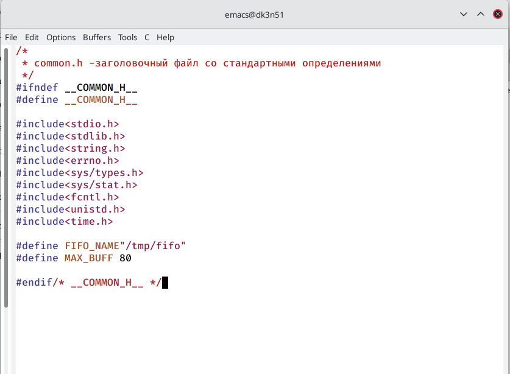

---
## Front matter
lang: ru-RU
title: Лабораторная работа 14
author: |
	Куркина Евгения Вячеславовна
institute: |
	\inst{1}RUDN University, Moscow, Russian Federation
	

## Formatting
toc: false
slide_level: 2
theme: metropolis
header-includes: 
 - \metroset{progressbar=frametitle,sectionpage=progressbar,numbering=fraction}
 - '\makeatletter'
 - '\beamer@ignorenonframefalse'
 - '\makeatother'
aspectratio: 43
section-titles: true
---

# Лабораторная работа 14

## Цель работы 

Цель данной лабораторной работы --- Приобрести прктические навыки работы с именованными каналами.

## Шаг 1

Создала необходымие файлы для дальнейшей работы команндой  touch common.h server.c client.c Makefile, а затем перешла в emacs. (рис. [-@fig:001]). 

{ #fig:001 width=70% }

## Шаг 2

Я изменила коды программ , которые были представлены в указание к работе. В файл  common.h  добавила стандартные заголовочные файлы unistd.h и time.h,которые необходимы для работы кодов других файлов. Common.h предназначен для заголовочных файлов (рис. [-@fig:002]) .

{ #fig:002 width=70% }

## Шаг 3

Далее в файле server.c объявила цикл wile для контроля работы времени сервера. Разница во времени текущем и временем началы работы не должна быть более 30 секунд (рис. [-@fig:003])(рис. [-@fig:004]) .

{ #fig:003 width=40% }

{ #fig:004 width=40% }

## Шаг 4

В файл client.c добавила цикл, отвечающий за колличество сообщений о текущем времени, которое получается в результате выполнениякоманд (рис. [-@fig:005])(рис. [-@fig:006]).

{ #fig:005 width=40% }

{ #fig:006 width=40% }

## Шаг 5

Makefile оставила без изменений (рис. [-@fig:007]).

{ #fig:007 width=70% }

## Шаг 6

После того, как написала все коды, с помощью команды make all, скомпилировала необходимые файлы (рис. [-@fig:008]) .

{ #fig:008 width=70% }

## Шаг 7

Далее я открыла 3 консоли и проверила работу написанного кода. В первом окне запустила сервер, а в двух других клиент, убедилась в корректной работе кода (рис. [-@fig:009]).

{ #fig:009 width=70% }

## Шаг 8

После, убедилась в том, что код работает не более 30 секунд, отдельно запустила команду ./server (рис. [-@fig:010]).

{ #fig:010 width=70% }

## Вывод 

Во время выполнения данной лабораторной работы я приобрела практические навыки работы с именованными каналами.

## {.standout}

