---
## Front matter
title: "Персональный проект этап 1"
subtitle: "Отчет 1 этапа персонального проекта"
author: "Куркина Евгения ВЯчеславовна"

## Generic otions
lang: ru-RU
toc-title: "Содержание"

## Bibliography
bibliography: bib/cite.bib
csl: pandoc/csl/gost-r-7-0-5-2008-numeric.csl

## Pdf output format
toc: true # Table of contents
toc-depth: 2
lof: true # List of figures
lot: true # List of tables
fontsize: 12pt
linestretch: 1.5
papersize: a4
documentclass: scrreprt
## I18n polyglossia
polyglossia-lang:
  name: russian
  options:
	- spelling=modern
	- babelshorthands=true
polyglossia-otherlangs:
  name: english
## I18n babel
babel-lang: russian
babel-otherlangs: english
## Fonts
mainfont: PT Serif
romanfont: PT Serif
sansfont: PT Sans
monofont: PT Mono
mainfontoptions: Ligatures=TeX
romanfontoptions: Ligatures=TeX
sansfontoptions: Ligatures=TeX,Scale=MatchLowercase
monofontoptions: Scale=MatchLowercase,Scale=0.9
## Biblatex
biblatex: true
biblio-style: "gost-numeric"
biblatexoptions:
  - parentracker=true
  - backend=biber
  - hyperref=auto
  - language=auto
  - autolang=other*
  - citestyle=gost-numeric
## Pandoc-crossref LaTeX customization
figureTitle: "Рис."
tableTitle: "Таблица"
listingTitle: "Листинг"
lofTitle: "Список иллюстраций"
lotTitle: "Список таблиц"
lolTitle: "Листинги"
## Misc options
indent: true
header-includes:
  - \usepackage{indentfirst}
  - \usepackage{float} # keep figures where there are in the text
  - \floatplacement{figure}{H} # keep figures where there are in the text
---

# Цель работы

Здесь приводится формулировка цели лабораторной работы. Формулировки
цели для каждой лабораторной работы приведены в методических
указаниях.

Цель данного этапа --- Размещение на Github pagers заготовки для персонального сайта

# Задание

1).Установить необходимое программное обеспечение.
2).Скачать шаблон темы сайта.
3).Разместить его на хостинге git.
4).Установить параметр для URLs сайта.
5).Разместить заготовку сайта на Github pages.

# Выполнение лабораторной работы

1)Скачала  версию hugo_extended_0.98.0_Linux-64bit.tar.gz(рис. [-@fig:001])

{ #fig:001 width=70% }

2).Создала папку bin, и после разархивации установочный файл переместила в данную папку(рис. [-@fig:002]) (рис. [-@fig:003])

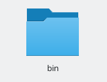{ #fig:002 width=70% }

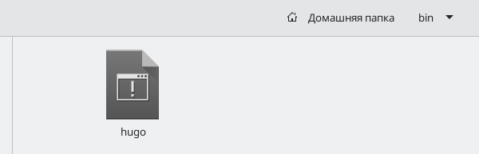{ #fig:003 width=70% }

3).Перешла по ссылке в репозиторий (рис. [-@fig:004]), после создала новый репозиторий с именем blog (рис. [-@fig:005]), скопировала его ссылку (рис. [-@fig:006])

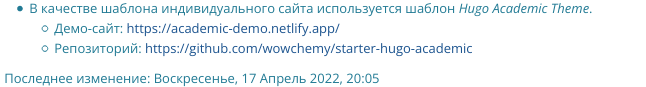{ #fig:004 width=70% }

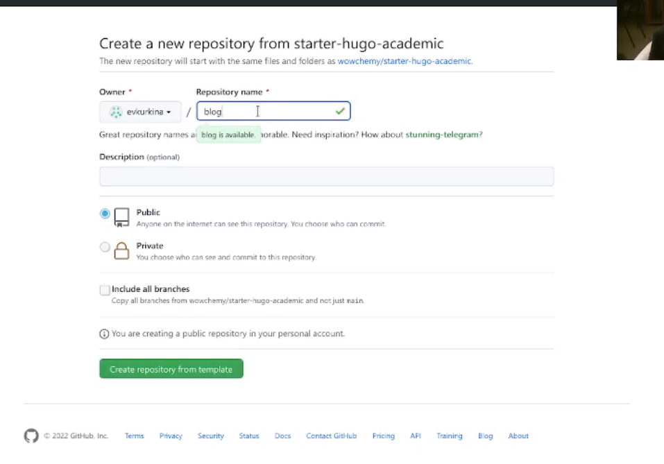{ #fig:005 width=70% }

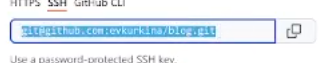{ #fig:006 width=70% }

4).Перешла в консоль и выполнила команду клонирования.(рис. [-@fig:007])

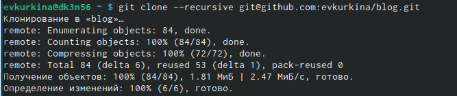{ #fig:007 width=70% }

5). Перешла в каталог blog и просмотрела список файлов в нем. Затем выполнила команду:~/bin/hugo server -для получения ссылки на сайт.(рис. [-@fig:008])

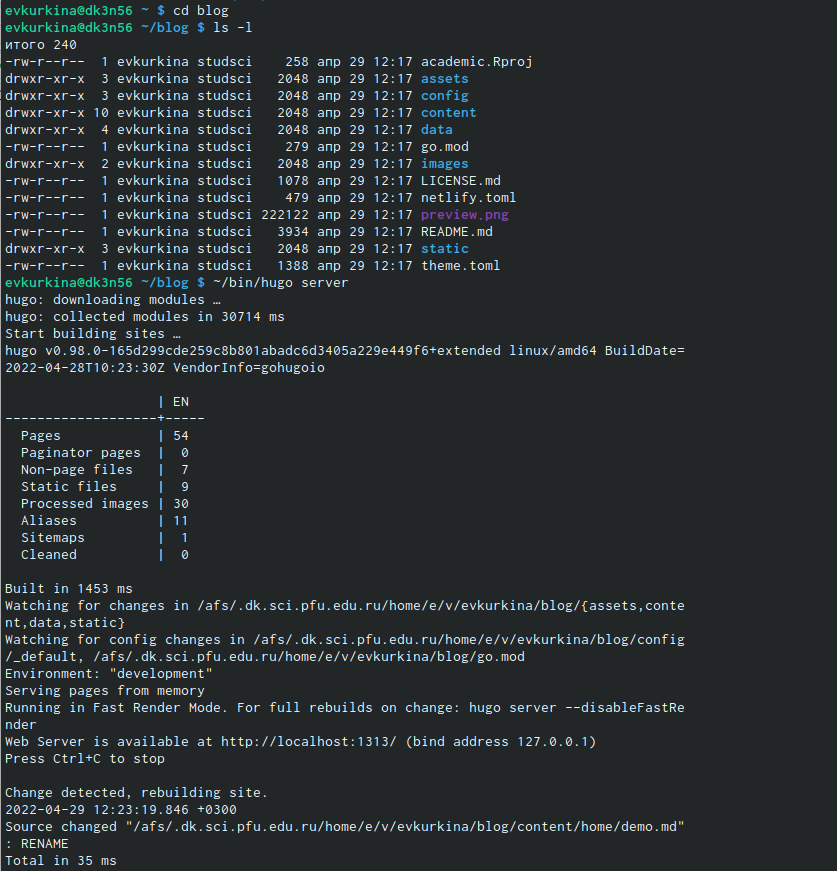{ #fig:008 width=70% }

6).Скопировала ссылку на сайт из консоли (рис. [-@fig:009]), ввела ее в поисковую строку и перешла на сайт (рис. [-@fig:010])

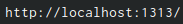{ #fig:009 width=70% }

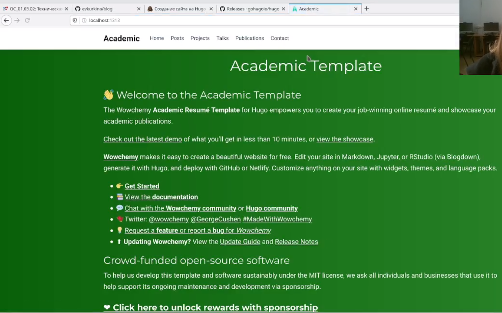{ #fig:010 width=70% }

7).Перешла каталог content/home и удалила файл demo.md, чтобы пропала зеленое ознокомительное уведомление (рис. [-@fig:011]) (рис. [-@fig:012])

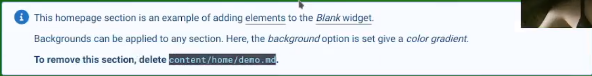{ #fig:011 width=70% }

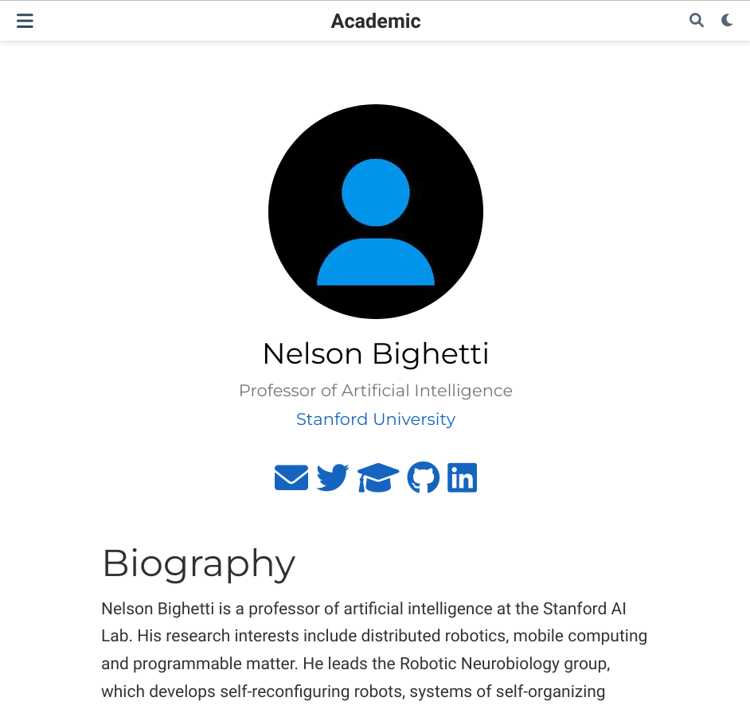{ #fig:012 width=70% }

8).Создала новый репозиторий с названием evkurkina.github.io (рис. [-@fig:013])

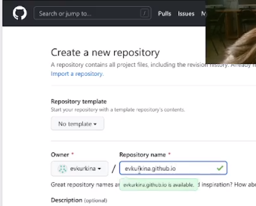{ #fig:013 width=70% }

9). Скопировала ссылку на только что созданный репозиторий,перешла в консоль и выполнила комнаду клонирования, а затем командой ls проверила, что все клонировалось успешно. (рис. [-@fig:014])

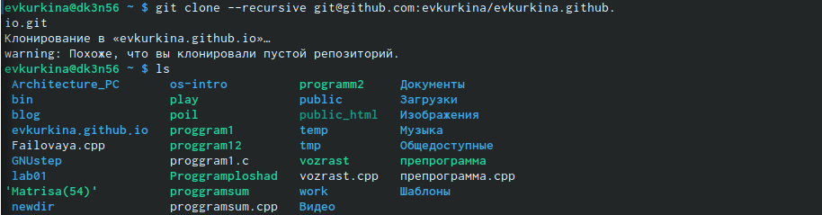{ #fig:014 width=70% }

10). Перешла в катлог evkurkina.github.io, и выполнила команду git checkout -b main
Переключено на новую ветку «main». После создала пустой файл README, добавила его в папку и командой git push выгрузила на github.(рис. [-@fig:015]) (рис. [-@fig:016])

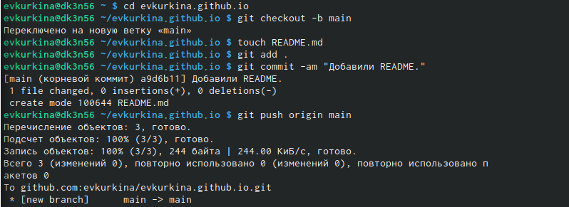{ #fig:015 width=70% }

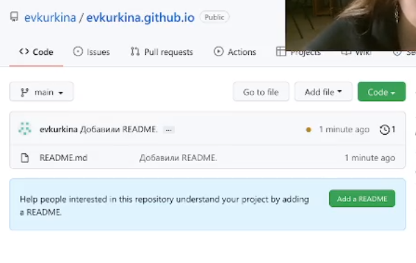{ #fig:016 width=70% }

11). Перешла в каталог blog, с помощью команды git submodule add -b main git@github.com:evkurkina/evkurkina.github.io.git public, подключила репозиторий. (рис. [-@fig:017])

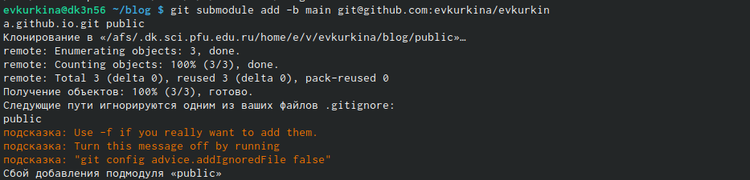{ #fig:017 width=70% }

12). Используя команду mc, перешла в файл .giignore , и закоментировала public, после проверила через команду cat.(рис. [-@fig:018])

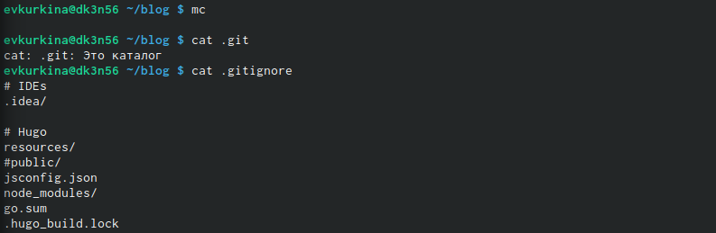{ #fig:018 width=70% }

13). Выполинила команды git submodule add -b main git@github.com:evkurkina/evkurkina.github.io.git public и ~/bin/hugo  (рис. [-@fig:019]), после чего в нашей папке появилдись необходимые файлы.

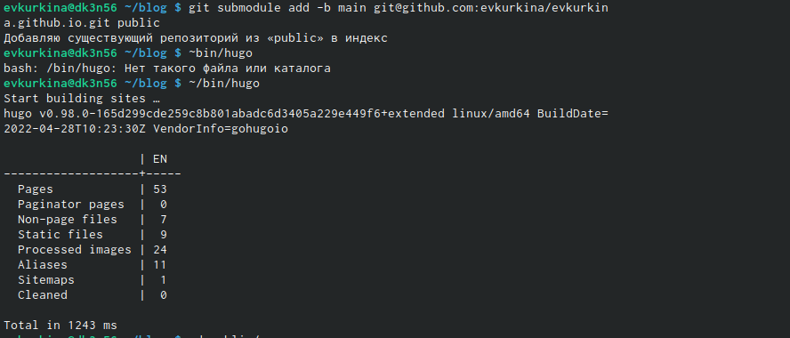{ #fig:019 width=70% }

14). Перешла в каталог /public. Выполнила проверку. И выполнила команды  git add, git commit  и git push.(рис. [-@fig:020]) (рис. [-@fig:021])

{ #fig:020 width=70% }

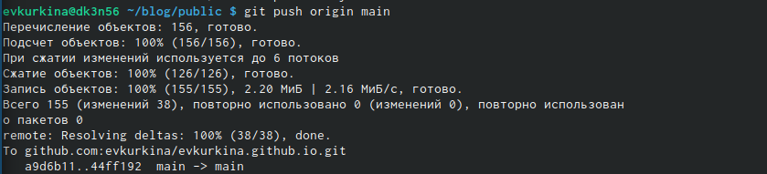{ #fig:021 width=70% }

15). Обновили страницу с сайтом.
# Выводы

В ходе выполнения первого этапа я разместила на Github pagers заготовки для моего персонального сайта.

# Список литературы{.unnumbered}

::: {#refs}
:::
