---
## Front matter
lang: ru-RU
title: 2ой этап персонального проекта
author: |
	Куркина Евгения Вячеславовна
institute: |
	\inst{1}RUDN University, Moscow, Russian Federation
	

## Formatting
toc: false
slide_level: 2
theme: metropolis
header-includes: 
 - \metroset{progressbar=frametitle,sectionpage=progressbar,numbering=fraction}
 - '\makeatletter'
 - '\beamer@ignorenonframefalse'
 - '\makeatother'
aspectratio: 43
section-titles: true
---

# Ход работы

## Цель работы

- Цель данного этапа --- Добавить к сайту данные о себе.

## Задание

1)Разместить фотографию владельца сайта.
2)Разместить краткое описание владельца сайта (Biography).
3)Добавить информацию об интересах (Interests).
4)Добавить информацию от образовании (Education).
5)Добавить пост на тему: Управление версиями. Git.
6)Добавить пост по прошлой неделе 

## Шаг 1

- Перешла в консоль и вызвала команду ~/bin/hugo server.

## Шаг 2

- Выбрать подходящую фотографию, переместить ее в папку authors, с названием avatar.jpg (рис. [-@fig:001])(рис. [-@fig:002])

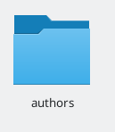{ #fig:001 width=40% }

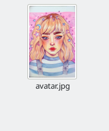{ #fig:002 width=40% }

## Шаг 3

В папке authors перейти в документ index.md, и изменила необходимую информацию о себе (рис. [-@fig:003])(рис. [-@fig:004]). Можем увидеть результат наших изменений (рис. [-@fig:005])

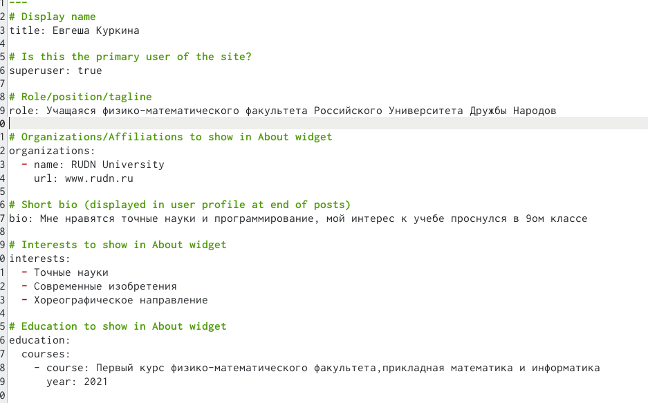{ #fig:003 width=25% }

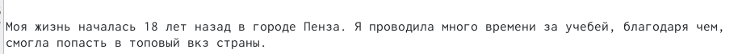{ #fig:004 width=25% }

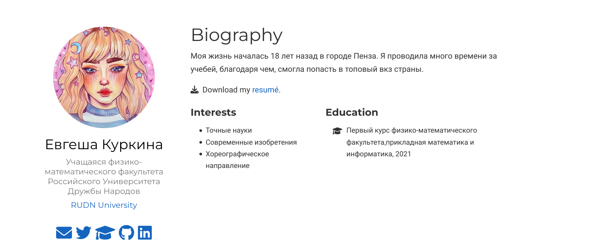{ #fig:005 width=25% }

## шаг 4

-Находясь тамже, изменяем поле interests (рис. [-@fig:006]), обновляем сайт и видим результат.(рис. [-@fig:007])

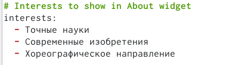{ #fig:006 width=40% }

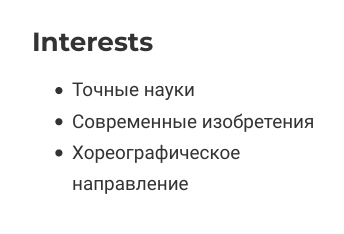{ #fig:007 width=40% }

## Шаг 5

- В документе index.md изменяем информацию Education на нужную нам.(рис. [-@fig:008]).После обновления на сайте, видим результат.(рис. [-@fig:009])

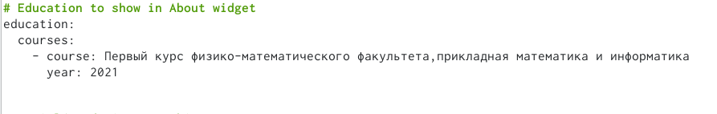{ #fig:008 width=40% }

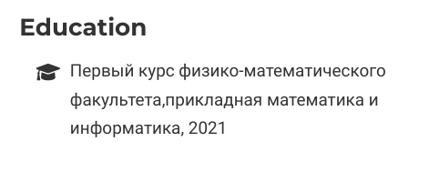{ #fig:009 width=40% }

## Шаг 6

Переходим в папку posts, создаем там папку с постом про мою прошлую неделю.(рис. [-@fig:010]).Заходим в только что созданную папку, добавляем туда нужную фотографию для поста(рис. [-@fig:0011]), после переходим в файл index.md, далее записываем в этот файл всю информацю.(рис. [-@fig:012])

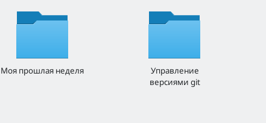{ #fig:010 width=25% }

{ #fig:011 width=25% }

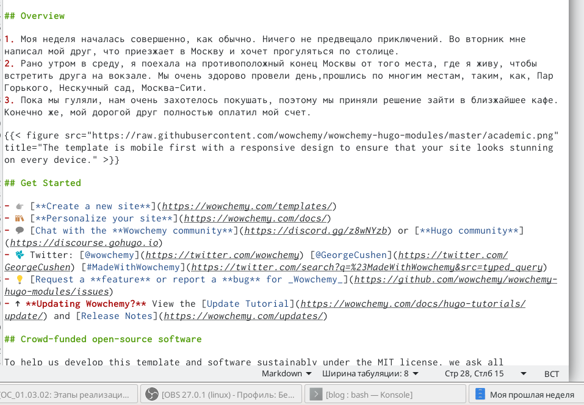{ #fig:012 width=25% }

## Шаг 7

- Взвращаемся в папку пост и переходим в другую папку для второго поста на тему управления версиями git..Добавляем фотографию (рис. [-@fig:013]). Затем переходим в файл с расширением md, и пишем тауда текст нашего сообщения.(рис. [-@fig:014]) После обновляем сайт и видим созданные нами посты.(рис. [-@fig:015])

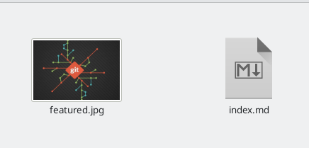{ #fig:013 width=25% }

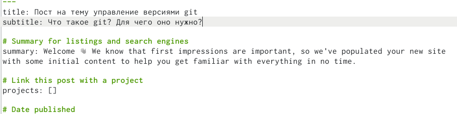{ #fig:014 width=25% }

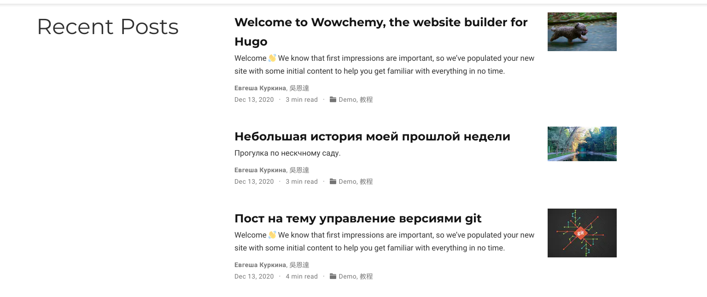{ #fig:015 width=25% }

## Вывод

- Во время выполнения данного этапа, я добавила к сайту данные о себе.

## {.standout}

