---
## Front matter
title: "Отчет 2го этапа персонального проекта"
subtitle: "Отчет по персональному проекту"
author: "Куркина Евгения Вячеславовна"

## Generic otions
lang: ru-RU
toc-title: "Содержание"

## Bibliography
bibliography: bib/cite.bib
csl: pandoc/csl/gost-r-7-0-5-2008-numeric.csl

## Pdf output format
toc: true # Table of contents
toc-depth: 2
lof: true # List of figures
lot: true # List of tables
fontsize: 12pt
linestretch: 1.5
papersize: a4
documentclass: scrreprt
## I18n polyglossia
polyglossia-lang:
  name: russian
  options:
	- spelling=modern
	- babelshorthands=true
polyglossia-otherlangs:
  name: english
## I18n babel
babel-lang: russian
babel-otherlangs: english
## Fonts
mainfont: PT Serif
romanfont: PT Serif
sansfont: PT Sans
monofont: PT Mono
mainfontoptions: Ligatures=TeX
romanfontoptions: Ligatures=TeX
sansfontoptions: Ligatures=TeX,Scale=MatchLowercase
monofontoptions: Scale=MatchLowercase,Scale=0.9
## Biblatex
biblatex: true
biblio-style: "gost-numeric"
biblatexoptions:
  - parentracker=true
  - backend=biber
  - hyperref=auto
  - language=auto
  - autolang=other*
  - citestyle=gost-numeric
## Pandoc-crossref LaTeX customization
figureTitle: "Рис."
tableTitle: "Таблица"
listingTitle: "Листинг"
lofTitle: "Список иллюстраций"
lotTitle: "Список таблиц"
lolTitle: "Листинги"
## Misc options
indent: true
header-includes:
  - \usepackage{indentfirst}
  - \usepackage{float} # keep figures where there are in the text
  - \floatplacement{figure}{H} # keep figures where there are in the text
---

# Цель работы

Здесь приводится формулировка цели лабораторной работы. Формулировки
цели для каждой лабораторной работы приведены в методических
указаниях.

Цель данного этапа --- Добавить к сайту данные о себе.

# Задание

1)Разместить фотографию владельца сайта.
2)Разместить краткое описание владельца сайта (Biography).
3)Добавить информацию об интересах (Interests).
4)Добавить информацию от образовании (Education).
5)Добавить пост на тему: Управление версиями. Git.
6)Добавить пост по прошлой неделе 

# Выполнение лабораторной работы

1)Перешла в консоль и вызвала команду ~/bin/hugo server.

2)Выбрать подходящую фотографию, переместить ее в папку authors, с названием avatar.jpg (рис. [-@fig:001])(рис. [-@fig:002])

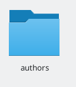{ #fig:001 width=70% }

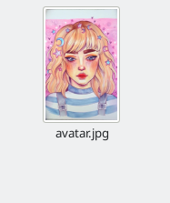{ #fig:002 width=70% }

2)В папке authors перейти в документ index.md, и изменила необходимую информацию о себе (рис. [-@fig:003])(рис. [-@fig:004]). Можем увидеть результат наших изменений (рис. [-@fig:005])

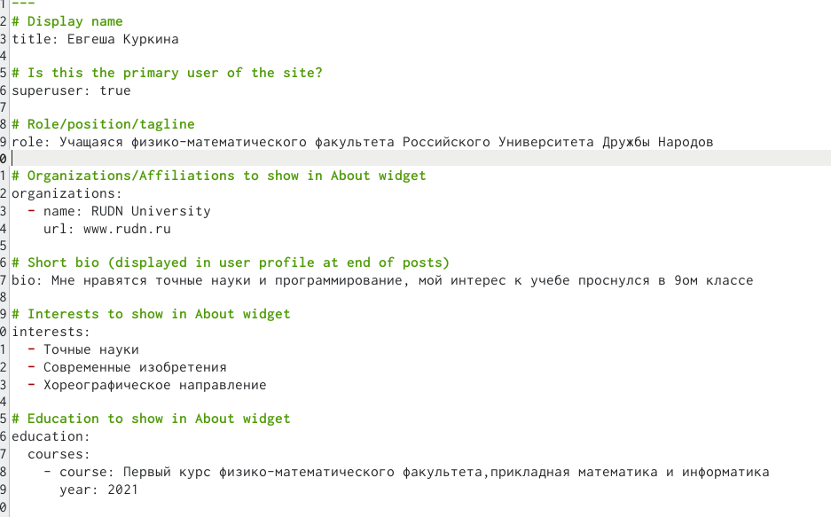{ #fig:003 width=70% }

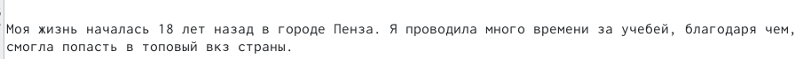{ #fig:004 width=70% }

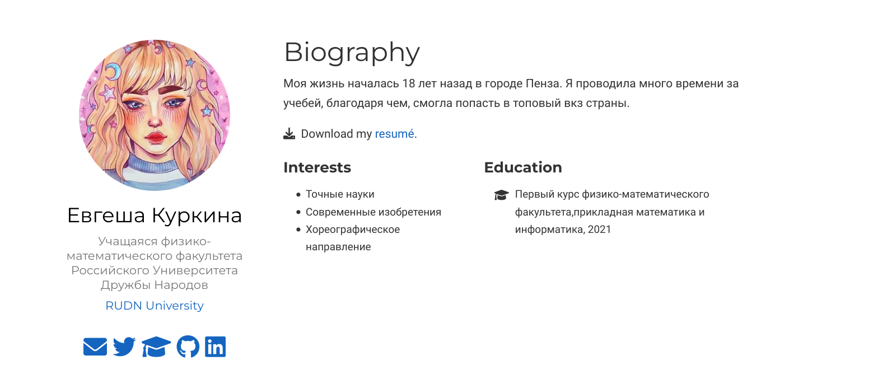{ #fig:005 width=70% }

3)Находясь тамже, изменяем поле interests (рис. [-@fig:006]), обновляем сайт и видим результат.(рис. [-@fig:007])

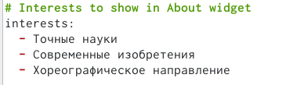{ #fig:006 width=70% }

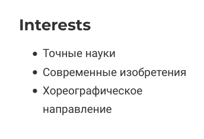{ #fig:007 width=70% }

4)В документе index.md изменяем информацию Education на нужную нам.(рис. [-@fig:008]).После обновления на сайте, видим результат.(рис. [-@fig:009])

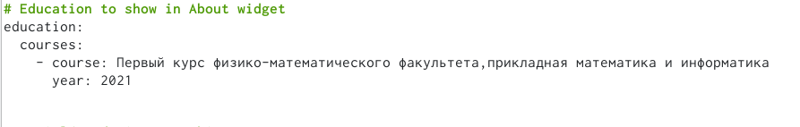{ #fig:008 width=70% }

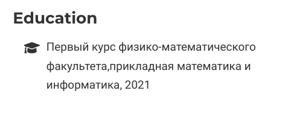{ #fig:009 width=70% }

5)Переходим в папку posts, создаем там папку с постом про мою прошлую неделю.(рис. [-@fig:010]).Заходим в только что созданную папку, добавляем туда нужную фотографию для поста(рис. [-@fig:0011]), после переходим в файл index.md, далее записываем в этот файл всю информацю.(рис. [-@fig:012])

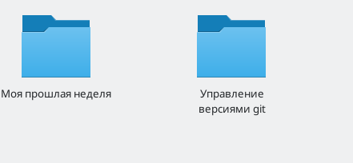{ #fig:010 width=70% }

{ #fig:011 width=70% }

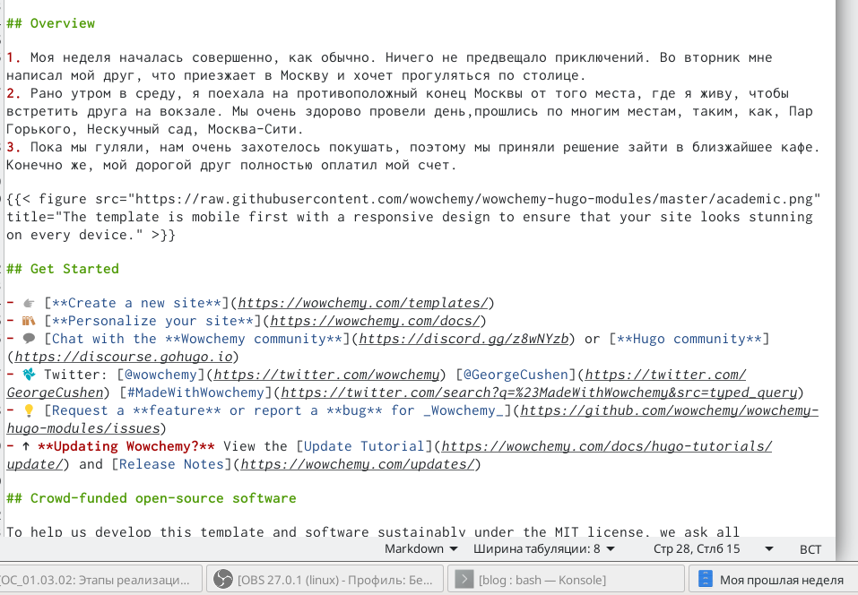{ #fig:012 width=70% }

6) Взвращаемся в папку пост и переходим в другую папку для второго поста на тему управления версиями git..Добавляем фотографию (рис. [-@fig:013]). Затем переходим в файл с расширением md, и пишем тауда текст нашего сообщения.(рис. [-@fig:014]) После обновляем сайт и видим созданные нами посты.(рис. [-@fig:015])

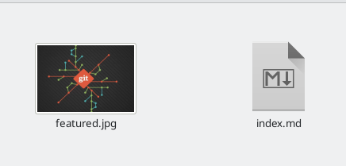{ #fig:013 width=70% }

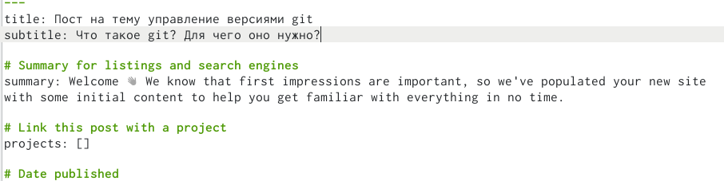{ #fig:014 width=70% }

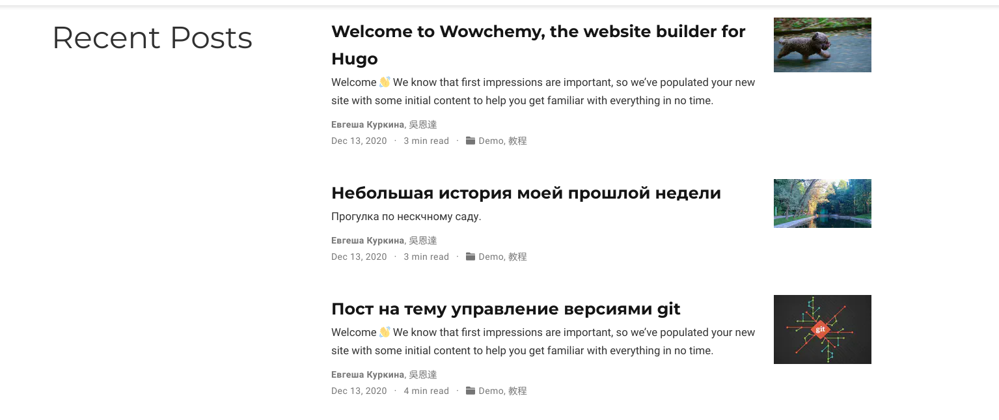{ #fig:015 width=70% }

# Выводы

Во время выполнения данного этапа, я добавила к сайту данные о себе.

# Список литературы{.unnumbered}

::: {#refs}
:::
