---
## Front matter
lang: ru-RU
title: третий этап создания сайта
author: |
	Куркина Евгения Вячеславовна
institute: |
	\inst{1}RUDN University, Moscow, Russian Federation
	

## Formatting
toc: false
slide_level: 2
theme: metropolis
header-includes: 
 - \metroset{progressbar=frametitle,sectionpage=progressbar,numbering=fraction}
 - '\makeatletter'
 - '\beamer@ignorenonframefalse'
 - '\makeatother'
aspectratio: 43
section-titles: true
---

# Ход работы

## Цель работы

- Цель данного этапа --- Дабавить на свой сайт личные достижения.

## Шаг 1

- Добавила информацию о навыках.Перешла в файл skills.md(рис. [-@fig:001])

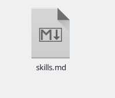{ #fig:001 width=70% }

## Шаг 2

- Изменила текст на нужный и изменила иконки изображений (рис. [-@fig:002])(рис. [-@fig:003])

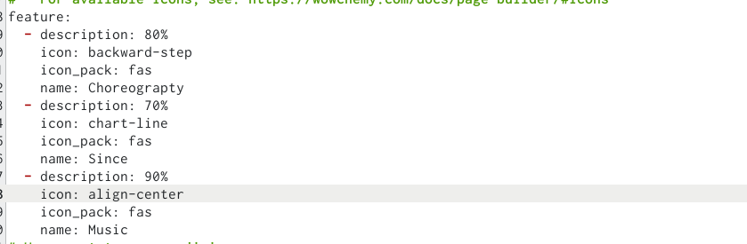{ #fig:002 width=40% }

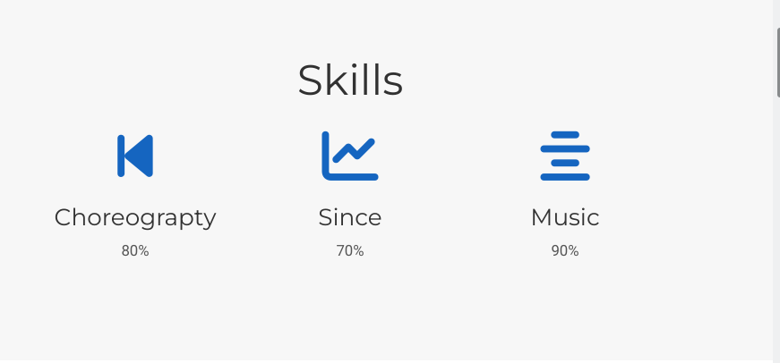{ #fig:003 width=40% }

## Шаг 3

- Добавила информацию об опыте.Перешла в файл Experience.md(рис. [-@fig:004])

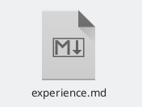{ #fig:004 width=70% }

## Шаг 4

-  Изменила информацию об опыте.(рис. [-@fig:005])(рис. [-@fig:006])

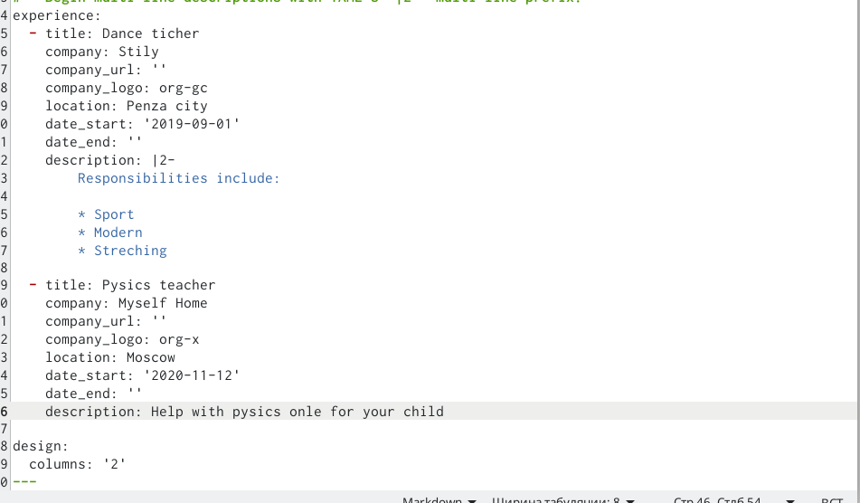{ #fig:005 width=40% }

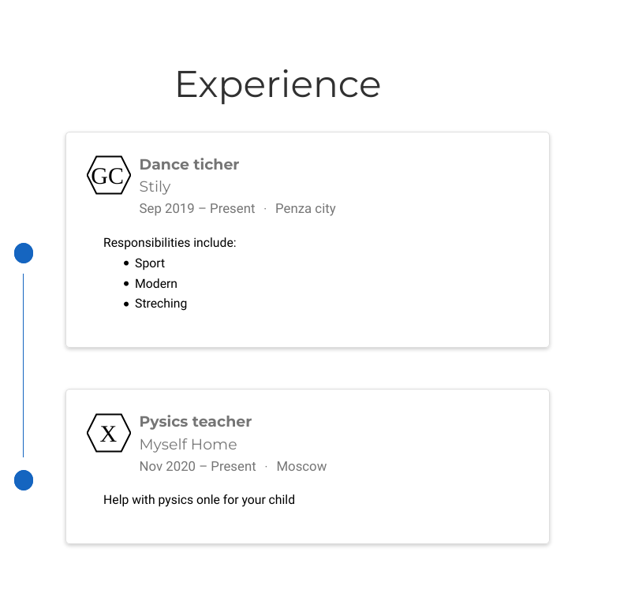{ #fig:006 width=40% }

## Шаг 5

- Добавила информацию о достижениях.(рис. [-@fig:007])(рис. [-@fig:008])

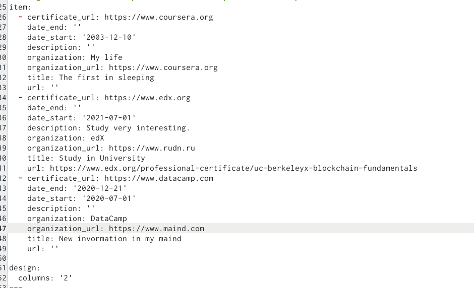{ #fig:007 width=40% }

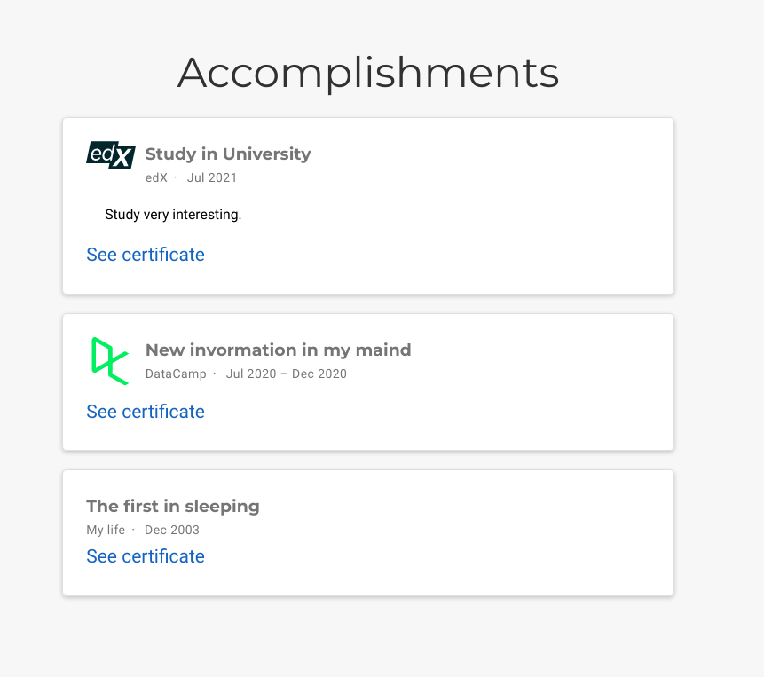{ #fig:008 width=40% }

## Шаг 6

- Написала пост по прошедшей недели и добавила картинку к нему.(рис. [-@fig:009])(рис. [-@fig:010])

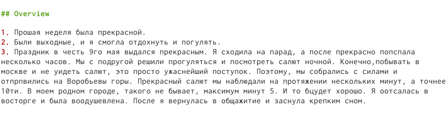{ #fig:009 width=40% }

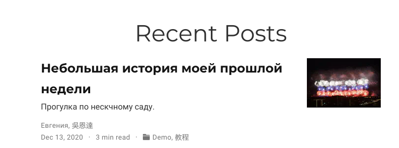{ #fig:010 width=40% }

## Шаг 7

- Написала пост на тему: Язык разметки MarkDown.(рис. [-@fig:011]) (рис. [-@fig:012])

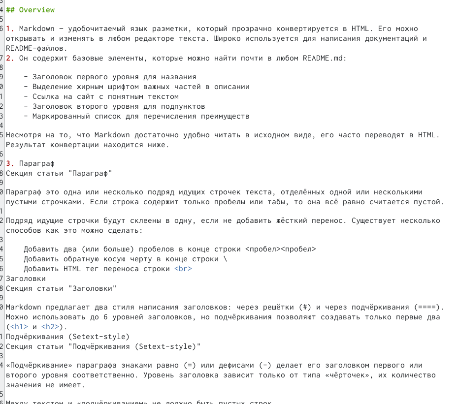{ #fig:011 width=40% }

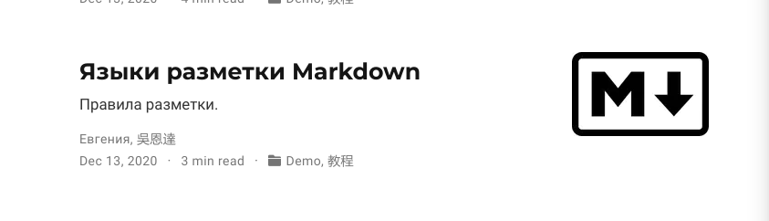{ #fig:012 width=40% }

## Вывод

На данном этапе создания сайта, я добавила информацию об опыте, навыках и достижениях на свой сайт, а также написала два новых поста.

## {.standout}

Wer's nicht glaubt, bezahlt einen Taler
