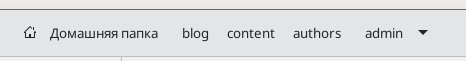
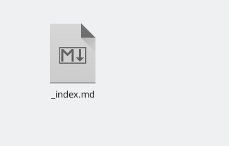
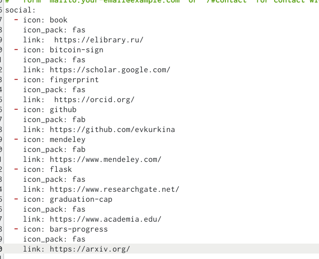
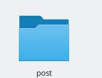
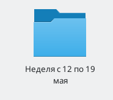
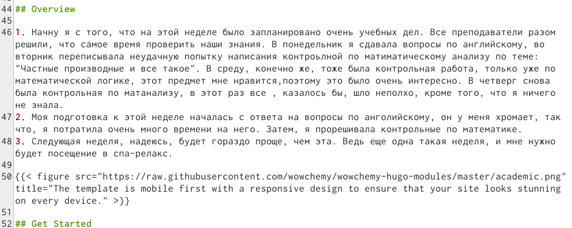
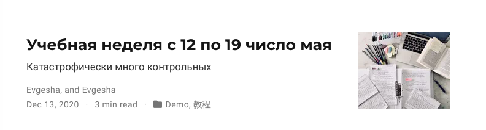

---
## Front matter
lang: ru-RU
title: Четвертый этап сайта
author: |
	Куркина Евгения Вячеславовна
institute: |
	\inst{1}RUDN University, Moscow, Russian Federation
	

## Formatting
toc: false
slide_level: 2
theme: metropolis
header-includes: 
 - \metroset{progressbar=frametitle,sectionpage=progressbar,numbering=fraction}
 - '\makeatletter'
 - '\beamer@ignorenonframefalse'
 - '\makeatother'
aspectratio: 43
section-titles: true
---

# 4 этап сайта

## Цель работы

Цель данного этапа --- Дабавить к сайту ссылки на научные и библиометрические ресурсы.

## Шаг 1

Я зарегестрировалась на всех нижеприведенных сайтах, а затем перешла в нужную папку(рис. [-@fig:001]), затем перешла в документ index.md(рис. [-@fig:002]), изменила ссылки, а также иконки ссылок на сайте (рис. [-@fig:003]). Результат, мы можем уивдеть на сайте (рис. [-@fig:004]).Список сайтов, на которые я довбавила ссылки:
 - eLibrary
 - Google Scholar 
 - ORCID
 - Mendeley 
 - ResearchGate
 - Academia.edu
 - arXiv 
 - github

{ #fig:001 width=70% }

## Шаг 1.2

{ #fig:002 width=40% }

{ #fig:003 width=40% }

## Шаг 1.3
Результат на сайте:

{ #fig:004 width=70% }

## Шаг 2

Перешла в папку post (рис. [-@fig:005]), создала папку для нового поста по прошедшей неделе (рис. [-@fig:006]). Написала текст поста (рис. [-@fig:007]), после обновила сайт,можем увидеть результат(рис. [-@fig:008]).

{ #fig:005 width=70% }

## Шаг 2.2

{ #fig:006 width=40% }

{ #fig:007 width=40% }

## Шаг 2.3

{ #fig:008 width=70% }

## Шаг 3

Создала еще одну новыую папку, для поста про создание презентаций,добавила в нее документ и нужную фотографию (рис. [-@fig:009]), написала пост про создание самой презентации в Mardown (рис. [-@fig:010]), после обновления сайта, увидела появившийся пост (рис. [-@fig:011]).

{ #fig:009 width=70% }

## Шаг 3.2

{ #fig:010 width=40% }

{ #fig:011 width=40% }

## Вывод

На данном этапе создания сайта, я добавила к своему сайту ссылки на научные и библиометрические ресурсы

## {.standout}

