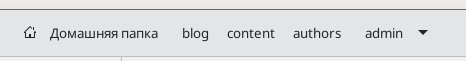
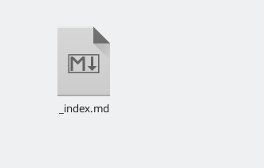
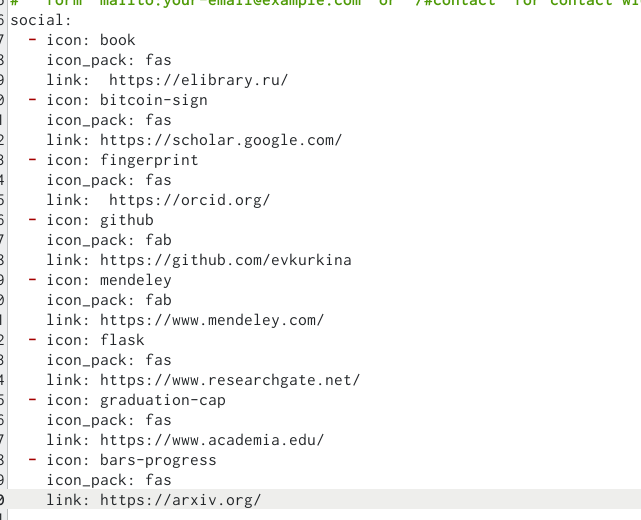
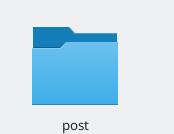
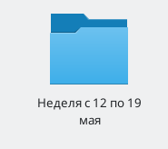
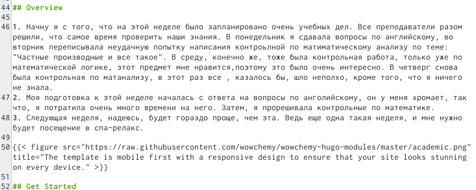
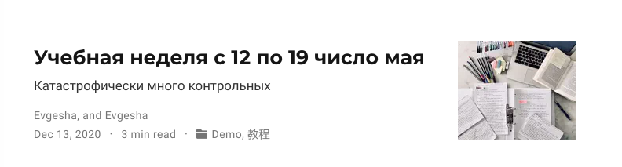
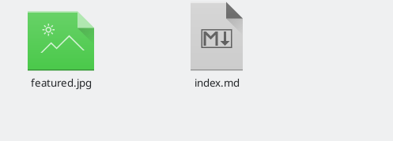
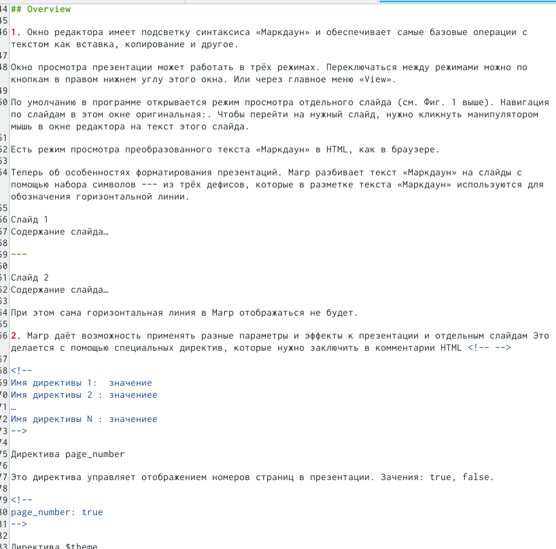

---
## Front matter
title: "Отчет четвертого этапа сайта"
subtitle: "Этап 4"
author: "Куркина Евгения Вячеславовна"

## Generic otions
lang: ru-RU
toc-title: "Содержание"

## Bibliography
bibliography: bib/cite.bib
csl: pandoc/csl/gost-r-7-0-5-2008-numeric.csl

## Pdf output format
toc: true # Table of contents
toc-depth: 2
lof: true # List of figures
lot: true # List of tables
fontsize: 12pt
linestretch: 1.5
papersize: a4
documentclass: scrreprt
## I18n polyglossia
polyglossia-lang:
  name: russian
  options:
	- spelling=modern
	- babelshorthands=true
polyglossia-otherlangs:
  name: english
## I18n babel
babel-lang: russian
babel-otherlangs: english
## Fonts
mainfont: PT Serif
romanfont: PT Serif
sansfont: PT Sans
monofont: PT Mono
mainfontoptions: Ligatures=TeX
romanfontoptions: Ligatures=TeX
sansfontoptions: Ligatures=TeX,Scale=MatchLowercase
monofontoptions: Scale=MatchLowercase,Scale=0.9
## Biblatex
biblatex: true
biblio-style: "gost-numeric"
biblatexoptions:
  - parentracker=true
  - backend=biber
  - hyperref=auto
  - language=auto
  - autolang=other*
  - citestyle=gost-numeric
## Pandoc-crossref LaTeX customization
figureTitle: "Рис."
tableTitle: "Таблица"
listingTitle: "Листинг"
lofTitle: "Список иллюстраций"
lotTitle: "Список таблиц"
lolTitle: "Листинги"
## Misc options
indent: true
header-includes:
  - \usepackage{indentfirst}
  - \usepackage{float} # keep figures where there are in the text
  - \floatplacement{figure}{H} # keep figures where there are in the text
---

# Цель работы

Здесь приводится формулировка цели лабораторной работы. Формулировки
цели для каждой лабораторной работы приведены в методических
указаниях.

Цель данного этапа --- Дабавить к сайту ссылки на научные и библиометрические ресурсы.

# Задание

1) Добавить ссылки.
2)Сделать два поста.

# Выполнение лабораторной работы

1) Я зарегестрировалась на всех нижеприведенных сайтах, а затем перешла в нужную папку(рис. [-@fig:001]), затем перешла в документ index.md(рис. [-@fig:002]), изменила ссылки, а также иконки ссылок на сайте (рис. [-@fig:003]). Результат, мы можем уивдеть на сайте (рис. [-@fig:004]).Список сайтов, на которые я довбавила ссылки:
 - eLibrary
 - Google Scholar 
 - ORCID
 - Mendeley 
 - ResearchGate
 - Academia.edu
 - arXiv 
 - github

{ #fig:001 width=70% }

{ #fig:002 width=70% }

{ #fig:003 width=70% }

{ #fig:004 width=70% }

2) Перешла в папку post (рис. [-@fig:005]), создала папку для нового поста по прошедшей неделе (рис. [-@fig:006]). Написала текст поста (рис. [-@fig:007]), после обновила сайт,можем увидеть результат(рис. [-@fig:008]).

{ #fig:005 width=70% }

{ #fig:006 width=70% }

{ #fig:007 width=70% }

{ #fig:008 width=70% }

3) Создала еще одну новыую папку, для поста про создание презентаций,добавила в нее документ и нужную фотографию (рис. [-@fig:009]), написала пост про создание самой презентации в Mardown (рис. [-@fig:010]), после обновления сайта, увидела появившийся пост (рис. [-@fig:011]).

{ #fig:009 width=70% }
 
{ #fig:010 width=70% }

{ #fig:011 width=70% }
 

# Выводы

На данном этапе создания сайта, я добавила к своему сайту ссылки на научные и библиометрические ресурсы

# Список литературы{.unnumbered}

::: {#refs}
:::
