---
## Front matter
lang: ru-RU
title: 6ой этап проекта
author: |
	Куркина Евгения Вячеславовна
institute: |
	\inst{1}RUDN University, Moscow, Russian Federation
	

## Formatting
toc: false
slide_level: 2
theme: metropolis
header-includes: 
 - \metroset{progressbar=frametitle,sectionpage=progressbar,numbering=fraction}
 - '\makeatletter'
 - '\beamer@ignorenonframefalse'
 - '\makeatother'
aspectratio: 43
section-titles: true
---

# 6ой этап сайта

## Цель этапа

Цель данного этапа --- размещение вуязычного сайта на Github.

## Шаг 1

В папке blog создала папку i18n (рис. [-@fig:001]), затем в ней создала текстовывй файл ru.yaml(рис. [-@fig:002]) и скопировала в него текст для перевода из инструкции.

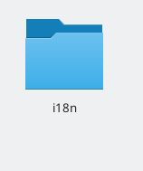{ #fig:001 width=40% }

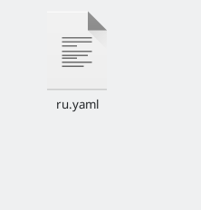{ #fig:002 width=40% }

## Шаг 2

В папке content создала две папки, одну для русского языка -ru-, вторую для английского языка -en-, и скопировала все файлы в эти папки (рис. [-@fig:003]).

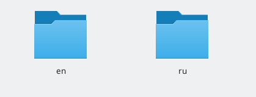{ #fig:003 width=70% }

## Шаг 3

Далее зашла в файл languages.yaml (рис. [-@fig:004]) и добавила блок для поддержки русского языка (рис. [-@fig:005]), после на сайте повилась иконка смены языка (рис. [-@fig:006]).

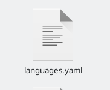{ #fig:004 width=40% }

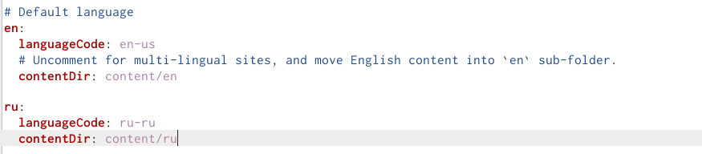{ #fig:005 width=40% }

## Шаг 3.2

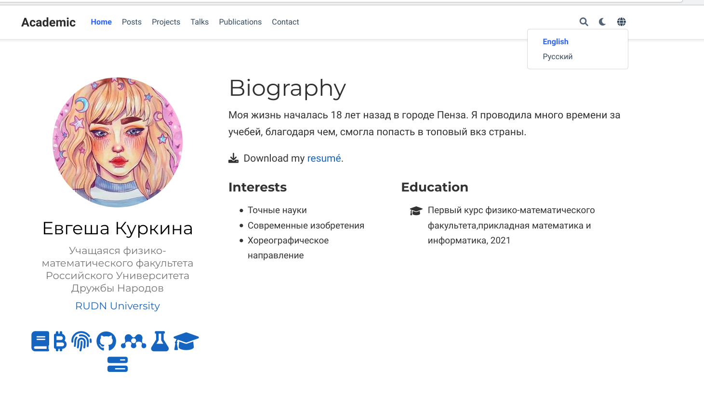{ #fig:006 width=70% }

## Шаг 4

В файле menus.ru.yaml (рис. [-@fig:007]),перевела названия иконок меню на русский язык(рис. [-@fig:008]). В результате все иконки меню стали на русском (рис. [-@fig:009]).

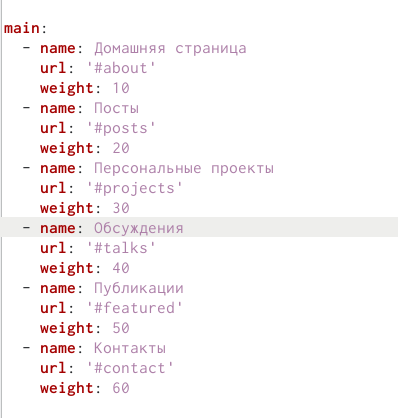{ #fig:007 width=40% }

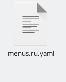{ #fig:008 width=40% }

## Шаг 4.2

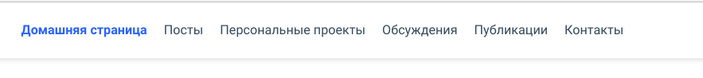{ #fig:009 width=70% }

## Шаг 5

Перевела свои умения на русский язык (рис. [-@fig:010]).

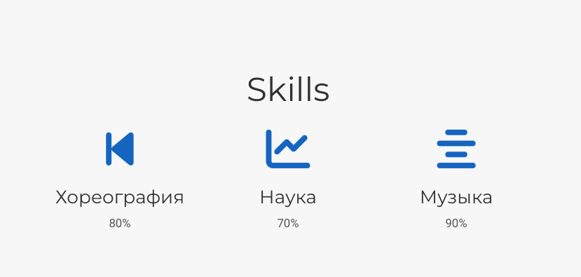{ #fig:010 width=70% }

## Шаг 6

Далее перевела свой опыт на русский язык (рис. [-@fig:011]).(рис. [-@fig:012]).

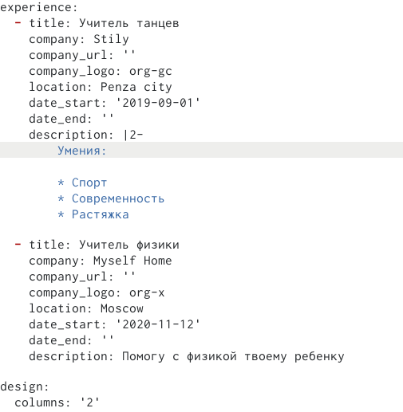{ #fig:011 width=40% }

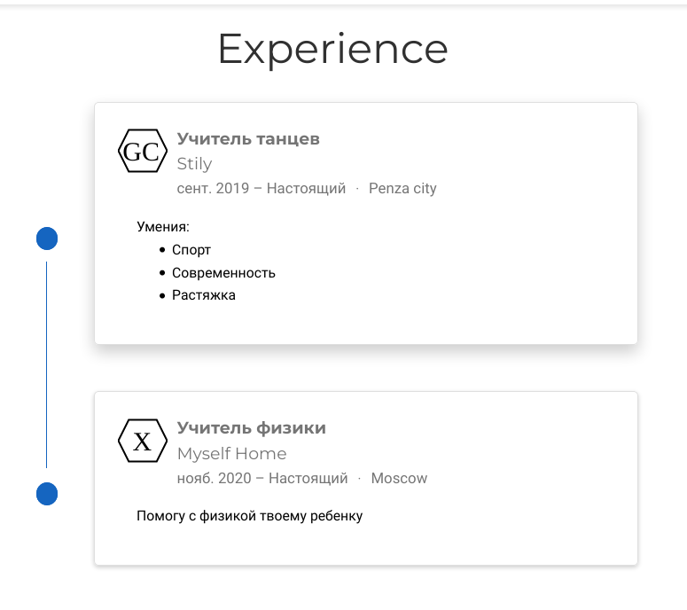{ #fig:012 width=40% }

## Шаг 7

Перевела свои достижения на русский язык (рис. [-@fig:013]).

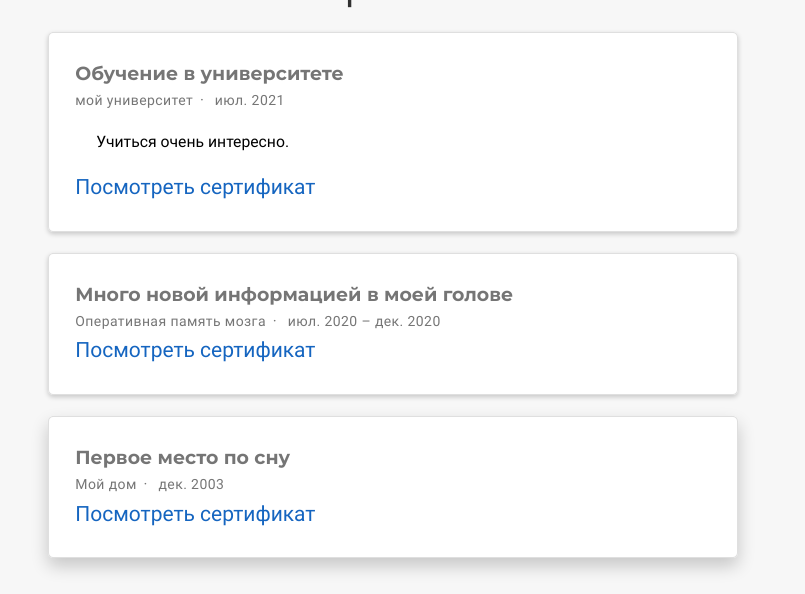{ #fig:013 width=70% }

## Шаг 8

 Перевела пост на английски язык (рис. [-@fig:014]).(рис. [-@fig:015]).

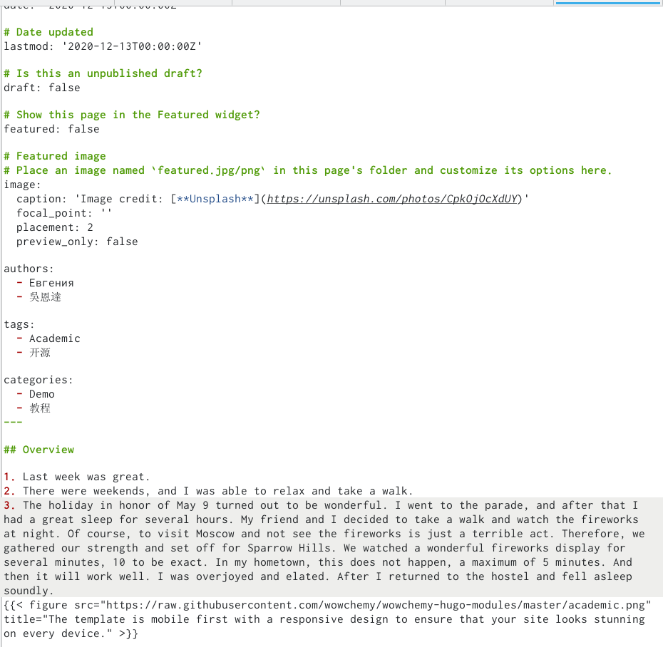{ #fig:014 width=40% }

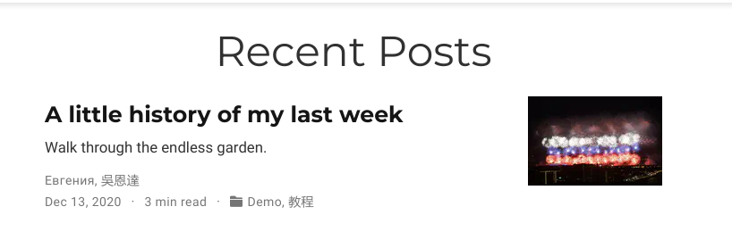{ #fig:015 width=40% }

## Шаг 9

Я перевела целиком домашнюю страницу на английский и русский(рис. [-@fig:016]).(рис. [-@fig:017]).

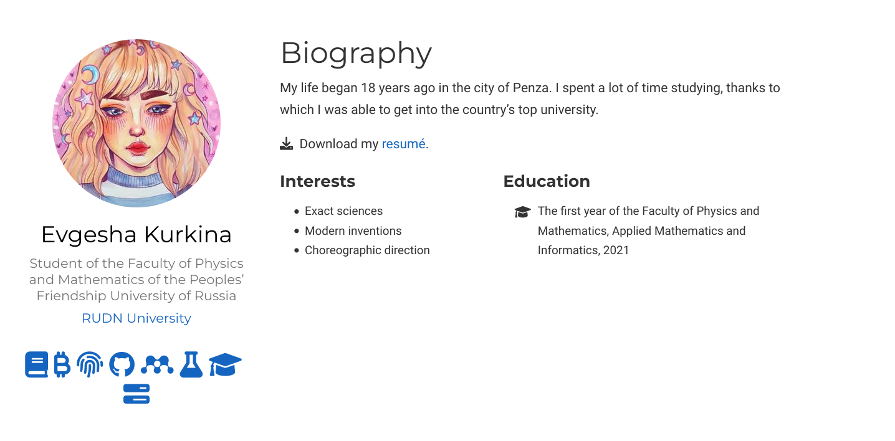{ #fig:016 width=40% }

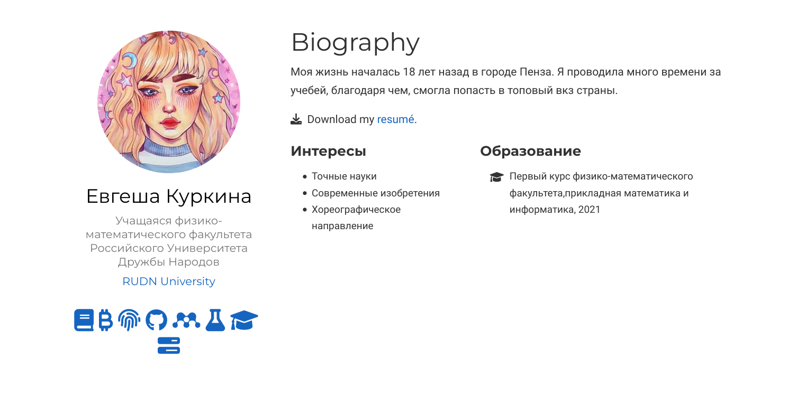{ #fig:017 width=40% }

## Шаг 10

Написала пост по прошедшей неделе на русском и английском(процесс работы видно на скриншотах)(рис. [-@fig:018]).(рис. [-@fig:019]).(рис. [-@fig:020]).(рис. [-@fig:021]).(рис. [-@fig:022]).

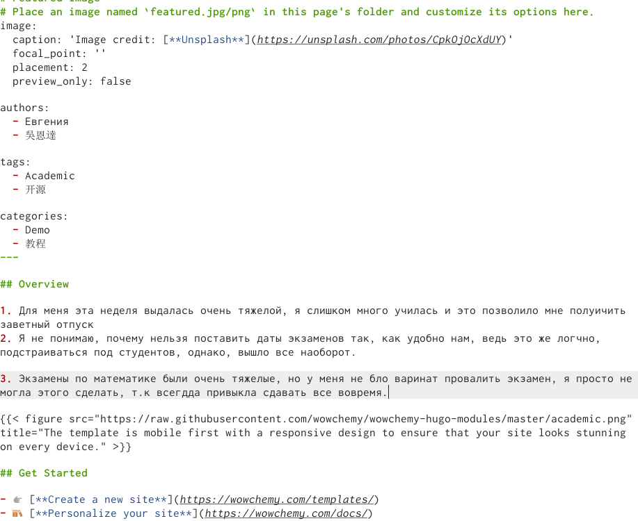{ #fig:018 width=40% }

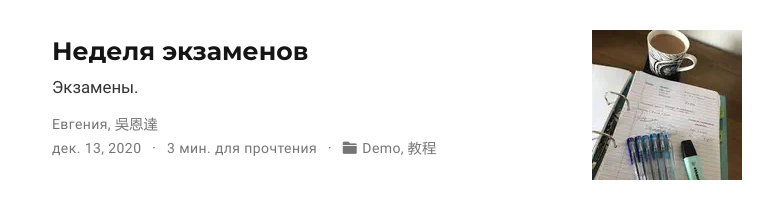{ #fig:019 width=40% }

## Шаг 10.2

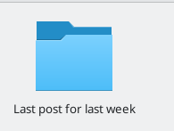{ #fig:020 width=40% }

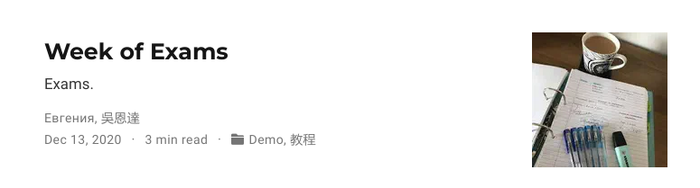{ #fig:021 width=40% }

## Шаг 10.3

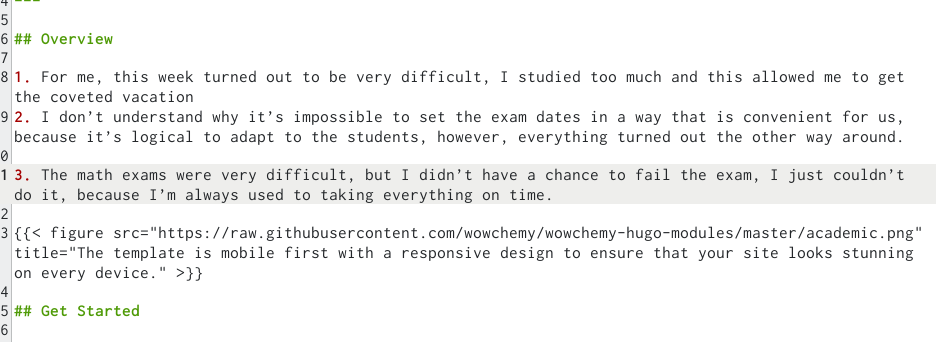{ #fig:022 width=70% }

## Шаг 11

Написала пост на тему: Создание сайтов на хъюго, на русском и англиском языках( процесс на скриншотах)(рис. [-@fig:023])(рис. [-@fig:024])(рис. [-@fig:025])

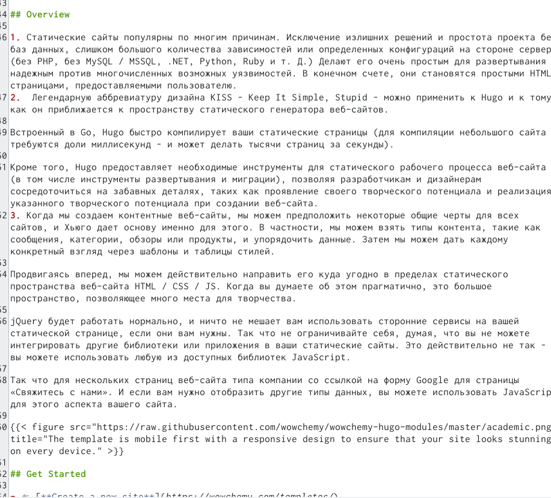{ #fig:023 width=40% }

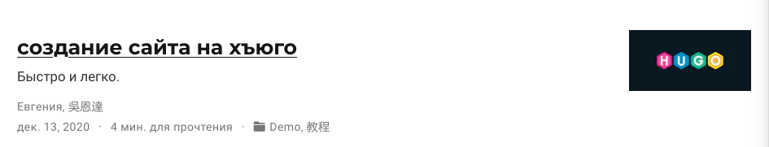{ #fig:024 width=40% }

## Шаг 11.2

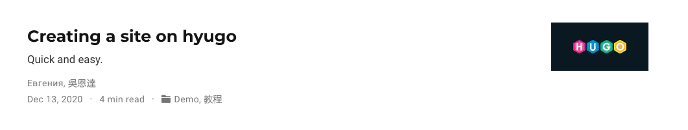{ #fig:025 width=70% }

## Вывод

Во время выполнения днной лабораторной работы, я разместила двуязычный сайт на Githab.

## {.standout}

